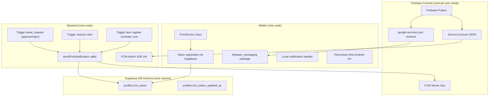
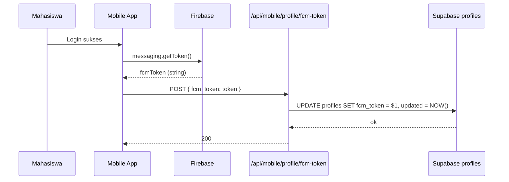
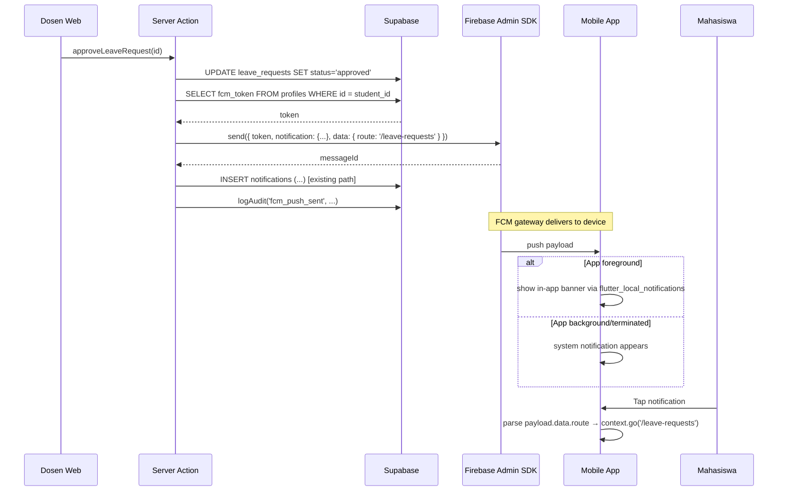

# Design Document: FCM Push Notification

> Phase P4-#4: Firebase Cloud Messaging untuk push notification real-time ke mobile mahasiswa. Trigger: leave request approve/reject, sesi baru dimulai, face register reminder. Mengganti polling untuk fitur kritis sambil tetap pertahankan polling endpoint sebagai fallback.

## Overview

Saat ini notifikasi mahasiswa polling `/api/mobile/notifications` setiap kali user buka tab Notifikasi. Polling efektif tapi:
- Lag (notif baru muncul saat user manual buka tab)
- Tidak ada notif saat app closed/background
- Drain baterai jika polling agresif (saat ini cuma on-demand, tidak interval)

**Solusi**: Setup Firebase Cloud Messaging (FCM) — server kirim push langsung ke device via Firebase, mobile terima notif di foreground/background/terminated state.

**Trigger points (3 + 1 reminder)**:
1. **Leave request approved/rejected** — server push saat dosen approve/reject di web
2. **New session started** — server push saat dosen "Mulai Sesi" untuk MK yang student enrolled
3. **Face register reminder** — server push 1 jam sebelum sesi pertama hari ini, kalau student belum face register
4. **Bonus**: General announcement — admin push manual ke semua mahasiswa

Effort estimasi: **1-2 hari** (pessimistic, real-world Firebase setup + 3 trigger flow + smoke test HP fisik).

## Architecture

### Scope & Boundaries



### Decisions Table

| ID | Keputusan | Rasional |
|----|-----------|---------|
| D1 | **Firebase Cloud Messaging (FCM)** sebagai backend, BUKAN OneSignal/Pusher Beams. | Free tier unlimited push, native Google Service Android, well-documented, paling familiar untuk Flutter. OneSignal gampang tapi vendor lock-in. |
| D2 | **Manual setup oleh user** untuk Firebase project + `google-services.json` + service account JSON. | Saya tidak bisa create Firebase project (butuh akun Google user). User akan ikuti dokumentasi step-by-step yang saya tulis. |
| D3 | **Storage token: kolom baru `profiles.fcm_token` + `profiles.fcm_token_updated_at`**. Migration baru tambah dua kolom dengan default null. | Per-device token (HP berbeda = token berbeda). Update kolom setiap login successful. Bisa null kalau permission ditolak. |
| D4 | **Token registration flow**: saat login sukses → mobile fetch FCM token → POST ke `/api/mobile/profile/fcm-token` → server update `profiles.fcm_token`. Saat token refresh (Firebase auto-rotates), repeat. | Standar pattern. Token registration butuh auth context (Bearer JWT), jadi POST endpoint baru. |
| D5 | **Backend SDK**: `firebase-admin` Node package. Init dengan service account JSON via env var (NEVER commit). | Server-side push dari Next.js API route. Service account JSON simpan di env var Vercel/local `.env.local`. |
| D6 | **Notification permission**: Android 13+ butuh runtime request `POST_NOTIFICATIONS`. Mobile minta saat first launch atau saat user buka tab Notifikasi (lazy). | Match Android 13 requirement. UX: minta lazy supaya user understand context (bukan terror minta permission saat splash). |
| D7 | **3 lifecycle handler di mobile**: foreground (app open) — show in-app banner, background (app minimized) — system notification, terminated (app closed) — system notification + deep-link saat dibuka. Pakai `firebase_messaging` package built-in handlers. | Standar Android lifecycle. Plus optional `flutter_local_notifications` untuk banner kustom di foreground (default tidak show notif kalau foreground). |
| D8 | **Deep link saat tap notif**: payload include `route` field. Mobile parse → `context.go(route)`. Contoh: leave approved → `/leave-requests` ; session start → `/scan` ; face reminder → `/face-register`. | UX standar push notification — tap = open relevant screen. |
| D9 | **Server trigger points** terintegrasi dengan existing server actions:
- `leaveRequestActions.ts` (existing) → after status update, call `sendPushNotification(student_id, payload)`
- `sessions.ts toggleSessionAction` → after `is_active = true`, fetch enrollments, push ke semua student MK tsb
- Cron job (Vercel Cron atau Supabase Edge Function pg_cron) → tiap jam cek sesi 1 jam ke depan, kalau student belum face register → push reminder | Reuse existing trigger points yang sudah punya audit log. Cron untuk reminder boleh defer fase ini, fokus 2 trigger utama dulu. |
| D10 | **Cron job untuk face reminder**: defer ke phase berikutnya. Untuk MVP cukup 2 trigger immediate (leave + session). | Cron infra (Vercel Cron requires Pro plan, atau Supabase pg_cron) butuh setup terpisah. YAGNI untuk MVP. |
| D11 | **Audit logging**: setiap `sendPushNotification` dipanggil → `logAudit` action `'fcm_push_sent'` dengan details `{ to: student_id, type, route }`. Failure tetap log dengan `success: false`. | Standar audit pattern. Help debug saat student bilang "saya tidak terima notif". |
| D12 | **Backward compat**: polling endpoint `/api/mobile/notifications` TETAP berfungsi. FCM TAMBAHAN, bukan pengganti. Notifikasi yang sama akan: (a) inserted ke `notifications` table (existing), (b) push ke FCM token. | Defense in depth — kalau FCM fail (token invalid, network drop saat push), polling fallback tetap kerja. |
| D13 | **Privacy**: payload notif TIDAK include sensitive data (face embedding, password, full PII). Hanya `route` + `title` + `body` text yang udah disanitasi. | Push notif lewat Google FCM gateway (third-party). Hindari leak data sensitif. |
| D14 | **Library lock**: `firebase_core` + `firebase_messaging` package Flutter. Tidak ada alternatif. Backend `firebase-admin` Node package. Tambah ke `pubspec.yaml` + `package.json`. Update rule `03-design-and-libraries.md` setelah selesai. | Wajib package untuk fitur ini. |
| D15 | **Verifikasi gate**: migration apply OK + `flutter analyze` clean + `npm run type-check` clean + manual smoke test HP fisik (emulator FCM unreliable). | Sesuai rule. |

### Library Compliance

| Aspect | Choice | Rule reference |
|--------|--------|----------------|
| Mobile FCM | `firebase_core: ^3.6.0`, `firebase_messaging: ^15.1.3` | New, akan di-update ke rule lock |
| Mobile local notif | `flutter_local_notifications: ^17.2.3` (untuk foreground banner) | New |
| Backend FCM | `firebase-admin` Node package | New |
| Permission | `permission_handler` (existing) | `21-mobile-android-platform.md` |

### Sequence Diagrams

#### Token Registration on Login



#### Push Notification Flow (e.g. Leave Approved)



## Components and Interfaces

### Component 1: Migration `022_profiles_fcm_token.sql`

```sql
-- Add fcm_token columns to profiles for push notification
ALTER TABLE public.profiles
ADD COLUMN IF NOT EXISTS fcm_token TEXT NULL,
ADD COLUMN IF NOT EXISTS fcm_token_updated_at TIMESTAMPTZ NULL;

CREATE INDEX IF NOT EXISTS idx_profiles_fcm_token
  ON profiles(id) WHERE fcm_token IS NOT NULL;

COMMENT ON COLUMN public.profiles.fcm_token IS
  'FCM device token untuk push notification. Null kalau permission ditolak atau belum login.';
```

### Component 2: Endpoint `/api/mobile/profile/fcm-token/route.ts`

POST endpoint untuk update token:

```typescript
// auth + Zod parse + UPDATE profiles SET fcm_token, updated_at = NOW()
```

### Component 3: Mobile `FcmService`

```dart
class FcmService {
  static Future<void> initialize() async {
    await Firebase.initializeApp();
    await _requestPermission();
    await _setupHandlers();
  }

  static Future<String?> getCurrentToken() async {
    return FirebaseMessaging.instance.getToken();
  }

  static Future<void> registerTokenWithBackend(String token) async {
    // POST to /api/mobile/profile/fcm-token
  }

  static void onTokenRefresh(void Function(String) callback) {
    FirebaseMessaging.instance.onTokenRefresh.listen(callback);
  }
}
```

### Component 4: Backend `lib/fcm-admin.ts`

```typescript
import * as admin from 'firebase-admin'

if (!admin.apps.length) {
  admin.initializeApp({
    credential: admin.credential.cert(JSON.parse(process.env.FIREBASE_SERVICE_ACCOUNT!)),
  })
}

export async function sendPushNotification(opts: {
  studentId: string
  title: string
  body: string
  route: string
  data?: Record<string, string>
}): Promise<{ success: boolean; messageId?: string; error?: string }>
```

### Component 5: Trigger Integration (existing actions modified)

- `app/lib/actions/leave-requests.ts` `approveLeaveRequestAction` + `rejectLeaveRequestAction` — call `sendPushNotification` setelah update status.
- `app/lib/actions/sessions.ts` `toggleSessionAction` — saat is_active=true, fetch enrolled students, push ke semua.

## Data Models

### New columns on `profiles`
- `fcm_token TEXT NULL`
- `fcm_token_updated_at TIMESTAMPTZ NULL`

### Push payload
```typescript
interface PushPayload {
  notification: { title: string; body: string }
  data: {
    route: string  // deep link path
    type: 'leave_status' | 'session_start' | 'face_reminder' | 'announcement'
    related_id?: string  // optional ID for context
  }
  token: string  // FCM device token
}
```

## Algorithmic Pseudocode

### Algorithm 1: Send Push to Single Student

```pascal
ALGORITHM sendPushToStudent(studentId, title, body, route, type)
INPUT: studentId UUID, title string, body string, route string, type string
OUTPUT: { success, messageId? | error? }

PRECONDITIONS:
  - Firebase Admin SDK initialized
  - profiles.fcm_token MAY be null (skip kalau null)

POSTCONDITIONS:
  - Audit logged dengan action 'fcm_push_sent'
  - Token invalid (expired) di-cleared dari DB

BEGIN
  fcmToken ← SELECT fcm_token FROM profiles WHERE id = studentId
  IF fcmToken IS NULL THEN
    logAudit('fcm_push_skipped', { studentId, reason: 'no_token' })
    RETURN { success: false, error: 'no_token' }
  END IF

  TRY
    messageId ← admin.messaging().send({
      token: fcmToken,
      notification: { title, body },
      data: { route, type }
    })
    logAudit('fcm_push_sent', { studentId, type, route, messageId })
    RETURN { success: true, messageId }
  CATCH error
    IF error.code = 'messaging/registration-token-not-registered' THEN
      // Token expired/invalid — clear from DB
      UPDATE profiles SET fcm_token = NULL WHERE id = studentId
      logAudit('fcm_token_invalid', { studentId, error: error.code })
    ELSE
      logAudit('fcm_push_failed', { studentId, error: error.message })
    END IF
    RETURN { success: false, error: error.message }
  END TRY
END
```

## Correctness Properties

1. **Token Privacy**: fcm_token TIDAK pernah di-return ke endpoint mobile lain (tidak di-leak via list/get profile).
2. **Audit Hardness**: Setiap call sendPushNotification (success or fail) menghasilkan exactly 1 audit log entry.
3. **Graceful Token Invalid**: Token expired → cleared dari DB pada retry berikutnya, no spam push attempts.
4. **Backward Compat**: Polling endpoint `/api/mobile/notifications` tetap return notifikasi bahkan saat FCM fail.

## Error Handling

### Token expired di server
Detected by FCM error code `messaging/registration-token-not-registered`. Clear from DB, await re-register on next mobile login.

### Permission denied user
Mobile minta permission lagi via dialog UX (jangan terror). User bisa enable manual via Settings.

### Network down saat push
FCM Admin SDK retry built-in. Kalau permanent fail, audit log dan UI continue (notification table tetap inserted).

## Testing Strategy

Manual smoke test HP fisik (emulator FCM unreliable):
1. Build APK debug → install ke HP
2. Login → check console "fcm_token registered: <token>"
3. Web admin approve leave_request → notif muncul di HP within seconds
4. Tap notif → app open, navigate /leave-requests
5. Test background/terminated state push

## Performance Considerations

- Single push <500ms p95 via FCM
- Bulk push (session start): use `sendEachForMulticast` API (max 500 tokens per call)

## Security Considerations

- Service account JSON: env var ONLY, never commit
- Token RLS: tetap protected (only owner SELECT). Update via service_role bypass.
- Payload tidak include sensitive data
- Token cleared saat logout

## Dependencies

**New (Mobile)**:
- `firebase_core`
- `firebase_messaging`
- `flutter_local_notifications`

**New (Backend)**:
- `firebase-admin`

## Migration Plan & Rollback

1. Migration 022 (DB schema)
2. Backend Firebase Admin SDK + endpoint
3. Mobile Firebase setup + FcmService
4. Trigger integration (leave + session)
5. Manual smoke test HP fisik

Rollback: per file via git, optional drop columns.
