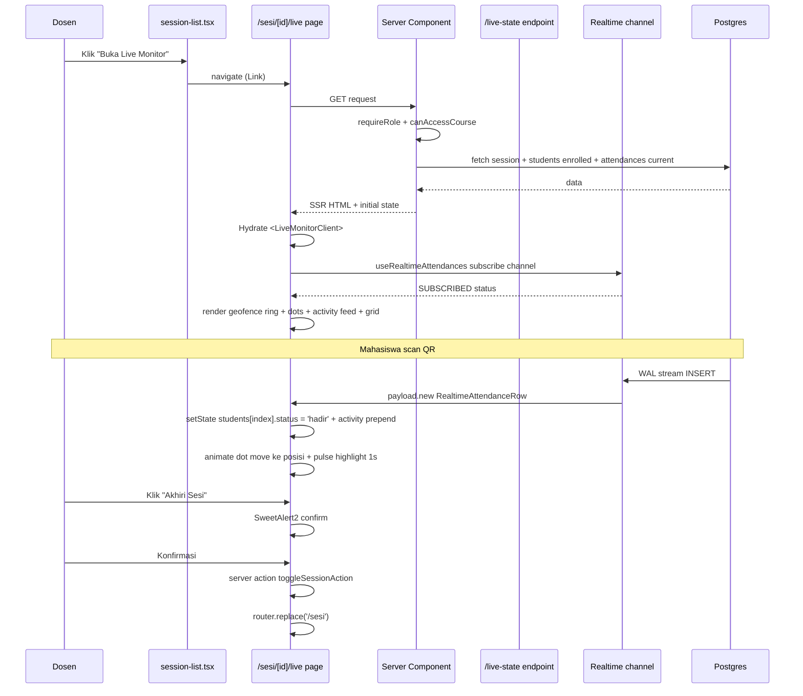
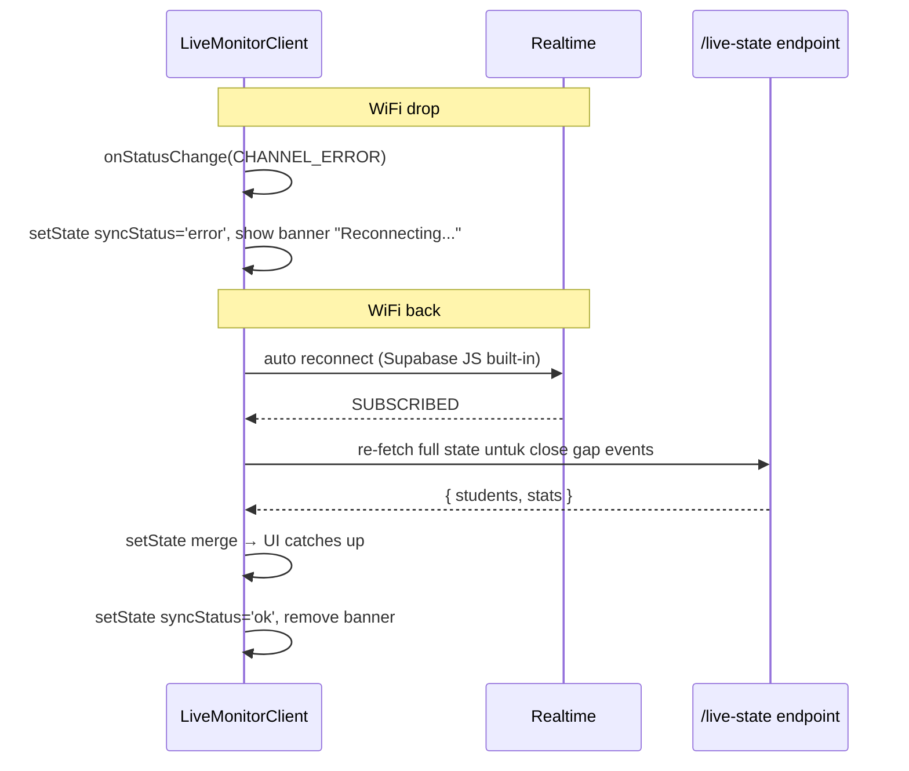

# Design Document: Live Monitor Dosen Web

> Phase B2: Halaman live monitor sesi presensi untuk dosen — geofence ring SVG stylized + dot mahasiswa real-time + activity feed + KPI cards + student grid dengan filter status. Reference visual: Stripe Atlas Live, Linear Insights, Supabase Realtime Dashboard.

## Overview

Mockup `docs/ui-research/mockups/live-monitor.html` adalah **fitur showcase terbesar** untuk MyPresensi PBL portfolio: dosen membuka halaman saat mengajar di kelas, melihat 30 mahasiswa terdaftar, dot mereka muncul di geofence ring saat scan QR dari kursi (real-time <2 detik), activity feed scroll dengan event terbaru. Untuk dosen pembimbing review PBL, ini fitur paling impressive.

Saat ini Phase B2 punya **2 prerequisite yang sudah selesai**:
- Phase B1: QR Display Fullscreen Web (route group `(qr-projector)`, endpoint `/live-stats`)
- Phase C1: Supabase Realtime channel attendances (migration 021, hook `useRealtimeAttendances`, type definitions)

Spec ini consume kedua prerequisite — tidak perlu setup ulang.

**Decisions sudah diputuskan user** (sebelum spec ini ditulis):
- D-User-1: Geofence ring = **SVG circle stylized** (seperti mockup, BUKAN real map dengan Leaflet) — match mockup, no new deps
- D-User-2: Akses = **sub-route `/sesi/[id]/live`** (per sesi spesifik), tombol di active session card di /sesi page (reuse pattern QR Display Phase B1)

Effort estimasi: **5-7 jam** (bukan 4-8 jam karena Realtime + auth pattern sudah siap dari B1+C1).

## Architecture

### Scope & Boundaries

```mermaid
graph TD
    subgraph "Existing — di-leverage dari Phase B1 + C1"
        E1[useRealtimeAttendances hook]
        E2[Realtime publication attendances]
        E3[(qr-projector) layout pattern]
        E4[/api/admin/sessions/id/live-stats endpoint]
        E5[requireRole + canAccessCourse]
        E6[QRCodeSVG qrcode.react]
        E7[refreshSessionCode action]
    end

    subgraph "New — scope spec ini"
        N1[Page server component fetch session + initial state]
        N2[Live monitor client component]
        N3[Endpoint GET /api/admin/sessions/id/live-state]
        N4[Sub-components GeofenceRing StudentDot ActivityFeed StudentGrid KpiBar]
        N5[Tombol Buka Live Monitor di session-list]
    end

    N1 --> E5
    N1 --> N3
    N1 --> N2
    N2 --> E1
    N2 --> N4
    N3 --> E5
    N3 --> E2
    N5 --> N1
```

### Decisions Table

| ID | Keputusan | Rasional |
|----|-----------|---------|
| D1 | **Sub-route `/sesi/[id]/live`** dengan layout-nya sendiri (bukan reuse `(qr-projector)` route group). | Live Monitor butuh sidebar + topbar dosen tetap visible (dosen lagi multitask, lihat sidebar untuk navigate ke sesi lain). QR Display Phase B1 fullscreen tanpa sidebar untuk projector mode — beda use case. |
| D2 | **Geofence ring = pure SVG concentric circles** (match mockup `.geofence-stage` + `.geo-ring`). 3 ring radius: 150m outer, 100m middle, 50m inner. | No new dependencies (Leaflet ~40KB + tile loading overhead untuk PBL scale = over-engineered). Match mockup design language. |
| D3 | **Dot mahasiswa positioned via polar coordinates dari Haversine bearing**: center = `sessions.location_lat/lng`, distance scaled ke radius ring (mahasiswa di 75m → 50% dari ring 150m). | Coords cukup dari `attendances.student_lat/lng` (existing). Math sederhana — atan2 untuk bearing, Haversine untuk distance. |
| D4 | **Mahasiswa di luar 150m radius**: dot tetap render di tepi ring 150m dengan styling berbeda (outline danger merah). Kalau distance >300m, render notification "X mahasiswa terlalu jauh, tidak ditampilkan". | UX guard: dosen tidak bingung dengan dot yang super jauh. Tetap visible bahwa ada attempt suspicious. |
| D5 | **Endpoint `GET /api/admin/sessions/[id]/live-state`** terpisah dari `/live-stats` (B1). Return: full state untuk initial paint + reconnect. Shape: `{ session, students: [{id, name, status, scanned_at, lat, lng, distance, is_mock}], stats: {hadir, terlambat, belum, ditolak, total} }`. | `/live-stats` (B1) hanya hadir+total — tidak cukup untuk Live Monitor. Bisa extend endpoint lama, tapi separate endpoint lebih clean (single responsibility). |
| D6 | **Realtime hook integration**: `useRealtimeAttendances({sessionId, onInsert})` untuk live updates. Initial state via SSR + endpoint baru (D5) untuk graceful refresh setelah Realtime reconnect. | Pattern: SSR for first paint → Realtime for live → endpoint state for reconnect (Phase C1 hook tidak buffer events selama disconnect). |
| D7 | **Activity feed**: list scrollable dengan 20 event terbaru. Setiap insert dari Realtime di-prepend di top (newest first). Animation slide-in 300ms untuk indicator visual "ada activity baru". | Standar pattern. 20 entries cukup, beyond itu user pakai page Riwayat. |
| D8 | **Filter chips student grid**: 5 chip (Semua / Hadir / Telat / Belum / Ditolak). State per-screen Riverpod-equivalent (just useState, ini React bukan Flutter). | Match mockup. "Ditolak" = `attendances.is_mock_location = true` count. |
| D9 | **KPI cards row 4 cards**: Hadir / Telat / Belum / Total. Animated counter saat update (count up dari old → new value). | Standar dashboard. Counter animation = library `react-spring` not allowed (no new deps), pakai useEffect manual increment dengan setInterval ms-stepping. |
| D10 | **Refresh OTP button** di header live monitor. Same action `refreshSessionCode` server action existing. | Reuse Phase B1 pattern. |
| D11 | **Auto-end session button**: dosen klik "Akhiri Sesi" → confirm modal SweetAlert2 → call `toggleSessionAction` server action existing → `router.replace('/sesi')` setelah success. | Existing pattern, tidak invent baru. Live Monitor jadi entry-point akhiri sesi yang convenient. |
| D12 | **Status badge top: "LIVE - Sesi Aktif"** dengan pulse-dot animasi (sama pattern Phase B1 QR Display). Berubah ke "Sesi Berakhir" + redirect /sesi setelah dosen toggle off. | Visual feedback critical untuk projector view. |
| D13 | **Tidak ada mode "presentation"** (fullscreen tanpa sidebar) di Live Monitor. Dosen yang butuh fullscreen pakai QR Display (Phase B1). | Live Monitor untuk dosen di laptop primary — sidebar perlu tetap untuk navigate. |
| D14 | **Mahasiswa belum hadir di student grid**: render dengan opacity 50% + status "Belum" warna textTertiary. Saat scan, transition ke status hadir/telat dengan animation pulse highlight 1 detik. | Visual feedback saat ada update real-time. |
| D15 | **Tidak ada chat / direct message** dosen → mahasiswa di Live Monitor. Out of scope. | Different feature scope, butuh notifikasi backend yang belum ada. |
| D16 | **Verifikasi gate**: `npm run type-check` exit 0 + `npm run lint` clean + `npm run build` exit 0 + manual smoke test 2-window real-time interaction. | Sesuai rule. |

### Library Compliance

| Aspect | Choice | Rule reference |
|--------|--------|----------------|
| Realtime hook | `useRealtimeAttendances` (existing Phase C1) | Reuse |
| Icons | `lucide-react` (existing) | `03-design-and-libraries.md` |
| Confirm modal | `@/lib/swal` (existing) | `03-design-and-libraries.md` |
| QR rendering | `qrcode.react` (existing) | `03-design-and-libraries.md` |
| Class merge | `cn()` from `@/lib/utils` (existing) | `10-web-conventions.md` |
| Auth | `requireRole` + `canAccessCourse` | `10-web-conventions.md` |

### Sequence Diagram

#### Live Monitor Flow



#### Reconnect after network blip



## Components and Interfaces

### Component 1: Page `app/(dashboard)/sesi/[id]/live/page.tsx`

**Purpose**: Server Component, auth + fetch initial state.

**Interface**:
```tsx
interface PageProps {
  params: Promise<{ id: string }>
}

export async function generateMetadata({ params }: PageProps): Promise<Metadata>
export default async function LiveMonitorPage({ params }: PageProps): Promise<JSX.Element>
```

**Responsibilities**:
- `requireRole(['admin', 'dosen'])` + `canAccessCourse(user.id, role, session.course_id)`
- Fetch session detail (sama pattern Phase B1 page.tsx — JOIN courses + dosen)
- Fetch initial students + attendances + stats via helper `fetchInitialLiveState()`
- Render `<LiveMonitorClient {...props} />` dengan props lengkap
- Generate metadata title

### Component 2: Client `live-monitor-client.tsx`

**Purpose**: Interactive UI — Realtime subscription + state management + render sub-components.

**Interface**:
```tsx
'use client'

interface LiveMonitorClientProps {
  sessionId: string
  sessionCode: string | null
  sessionCodeExpiresAt: string | null
  sessionNumber: number
  topic: string | null
  mode: string
  isActive: boolean
  startedAt: string | null
  courseCode: string
  courseName: string
  dosenName: string | null
  geofenceCenter: { lat: number; lng: number } | null
  geofenceRadius: number  // meters
  initialStudents: StudentLiveRow[]
  initialStats: LiveStats
}

interface StudentLiveRow {
  student_id: string
  full_name: string
  nim: string | null
  avatar_url: string | null
  status: 'belum' | 'hadir' | 'terlambat' | 'izin' | 'sakit' | 'alpa' | 'ditolak'
  scanned_at: string | null
  student_lat: number | null
  student_lng: number | null
  distance_meters: number | null
  is_mock_location: boolean | null
  face_confidence: number | null
}

interface LiveStats {
  hadir: number
  terlambat: number
  belum: number
  total: number
  ditolak: number  // is_mock_location = true count
}

type FilterChip = 'semua' | 'hadir' | 'telat' | 'belum' | 'ditolak'

// Sub-components private:
function MonitorTopbar({ courseName, sessionNumber, status, onEndSession }): JSX.Element
function MonitorKpiBar({ stats }): JSX.Element
function GeofenceRing({ centerLat, centerLng, radius, students }): JSX.Element
function StudentDot({ student, ringSize, ringRadius }): JSX.Element
function ActivityFeed({ events }): JSX.Element  // 20 latest events
function StudentGrid({ students, filter, onFilterChange }): JSX.Element
function StudentCard({ student }): JSX.Element
```

**Responsibilities**:
- `useRealtimeAttendances({ sessionId, onInsert })` subscribe channel
- State: students Map<student_id, StudentLiveRow>, stats, activityFeed (20 latest), filterChip, syncStatus
- onInsert callback: update student status, increment stat, prepend activity, animate dot transition
- Reconnect handler: re-fetch `/live-state` on `SUBSCRIBED` after error
- "Akhiri Sesi" button: SweetAlert confirm + `toggleSessionAction` + redirect

### Component 3: Endpoint `app/api/admin/sessions/[id]/live-state/route.ts`

**Purpose**: GET endpoint return full live state untuk initial fetch + reconnect refresh.

**Interface**:
```typescript
// Request: GET /api/admin/sessions/[id]/live-state
// Auth: cookie session admin/dosen + ownership
// Response 200: { students: StudentLiveRow[], stats: LiveStats }
// Errors: 401, 403, 404, 429, 500

interface RouteCtx { params: Promise<{ id: string }> }
export async function GET(req: NextRequest, ctx: RouteCtx): Promise<NextResponse>
```

**Algorithm**:
1. Auth + ownership (sama pattern B1 endpoint)
2. Rate limit 30 req/min per (user, session)
3. Fetch enrollments WHERE course_id = session.course_id JOIN profiles
4. Fetch attendances WHERE session_id JOIN profiles (untuk student_id matching)
5. Merge: setiap enrollment → cek attendance → status 'belum' kalau tidak ada
6. Compute stats from merged list

### Component 4: Modify `session-list.tsx` — Tombol Buka Live Monitor

Tambah tombol `<Link href="/sesi/${id}/live">` di action button row active session card. Pattern sama Phase B1 tombol Tampilkan Fullscreen.

## Data Models

Tidak ada model DB baru. Reuse:
- `enrollments` (existing)
- `attendances` (existing, RLS already applied)
- `profiles` (existing)
- `sessions` (existing)
- `courses` (existing)

**No migration needed.**

## Algorithmic Pseudocode

### Algorithm 1: Polar Position untuk Geofence Ring

```pascal
ALGORITHM computeDotPosition(centerLat, centerLng, studentLat, studentLng, ringSizePx, ringRadiusMeters)
INPUT:
  centerLat, centerLng — campus location (degrees)
  studentLat, studentLng — student GPS (degrees, may be null)
  ringSizePx — SVG canvas size (e.g. 380px)
  ringRadiusMeters — outer ring radius (e.g. 150m)
OUTPUT:
  { x: px, y: px, withinRange: bool }

PRECONDITIONS:
  - Coords valid lat/lng decimals or null

POSTCONDITIONS:
  - x, y in [0, ringSizePx]
  - withinRange = true if distance ≤ ringRadius

BEGIN
  IF studentLat = null OR studentLng = null THEN
    RETURN { x: ringSizePx/2, y: ringSizePx/2, withinRange: false }
  END IF

  // Haversine for distance
  distance ← haversineDistanceMeters(centerLat, centerLng, studentLat, studentLng)

  // Bearing (radians)
  dLng ← (studentLng - centerLng) × π / 180
  φ1 ← centerLat × π / 180
  φ2 ← studentLat × π / 180
  y1 ← sin(dLng) × cos(φ2)
  x1 ← cos(φ1) × sin(φ2) - sin(φ1) × cos(φ2) × cos(dLng)
  bearing ← atan2(y1, x1)  // radians

  // Scale distance to pixel
  scale ← min(distance / ringRadiusMeters, 1.0)
  pixelDist ← scale × (ringSizePx / 2)

  // Polar to cartesian (SVG: y inverted, north = up)
  centerPx ← ringSizePx / 2
  x ← centerPx + pixelDist × sin(bearing)
  y ← centerPx - pixelDist × cos(bearing)

  RETURN { x, y, withinRange: distance ≤ ringRadiusMeters }
END
```

### Algorithm 2: Insert Realtime Event Handler

```pascal
ALGORITHM handleRealtimeInsert(state, row)
INPUT:
  state: { students: Map, stats: LiveStats, activity: Array }
  row: RealtimeAttendanceRow
OUTPUT: newState

PRECONDITIONS:
  - row.session_id = current session
  - row.status ∈ {hadir, terlambat, izin, sakit, alpa}

POSTCONDITIONS:
  - students[row.student_id].status updated
  - stats incremented appropriately
  - activity prepended dengan event row
  - activity capped at 20 latest

BEGIN
  newStudents ← state.students.copy()
  oldStatus ← newStudents.get(row.student_id)?.status
  newStatus ← row.is_mock_location ? 'ditolak' : row.status

  newStudents.set(row.student_id, {
    ...newStudents.get(row.student_id),
    status: newStatus,
    scanned_at: row.scanned_at,
    student_lat: row.student_lat,
    student_lng: row.student_lng,
    distance_meters: row.distance_meters,
    is_mock_location: row.is_mock_location,
  })

  // Stats delta
  newStats ← state.stats.copy()
  IF oldStatus = 'belum' THEN newStats.belum -= 1
  IF newStatus = 'hadir' THEN newStats.hadir += 1
  IF newStatus = 'terlambat' THEN newStats.terlambat += 1
  IF newStatus = 'ditolak' THEN newStats.ditolak += 1

  // Activity prepend (cap 20)
  newActivity ← [{
    id: row.id,
    studentName: newStudents.get(row.student_id).full_name,
    status: newStatus,
    timestamp: row.scanned_at,
  }, ...state.activity].slice(0, 20)

  RETURN { students: newStudents, stats: newStats, activity: newActivity }
END
```

## Correctness Properties

### Property 1: Stats Conservation
*For any* state, `stats.hadir + stats.terlambat + stats.belum + stats.ditolak ≤ stats.total`. Equality holds when all students have been processed (no `belum`).

### Property 2: Realtime Filter Strictness
*Any* INSERT event delivered to `useRealtimeAttendances` callback has `row.session_id === sessionId` (filter server-side, Phase C1 design).

### Property 3: Activity Cap
*After* any sequence of INSERT events, `activity.length ≤ 20`.

### Property 4: Auth Hardness
*Any* request to `/api/admin/sessions/[id]/live-state` from non-admin/dosen returns 401 OR from dosen non-owner returns 403, never 200 with data leak.

### Property 5: Geofence Position Stability
*For any* fixed `(centerLat, centerLng, studentLat, studentLng, ringSize, ringRadius)`, `computeDotPosition` is deterministic — same input → same output (no time-based or random component).

## Error Handling

### Scenario 1: Realtime channel error (WiFi drop)
**Response**: Banner "Sync terganggu" + `useRealtimeAttendances` auto-reconnect. On `SUBSCRIBED` recovery, re-fetch full state via `/live-state` untuk close gap.

### Scenario 2: Student GPS missing (status `izin`/`sakit`/`alpa`)
**Response**: Dot di-render di list student grid tapi BUKAN di geofence ring. Student card show indicator "Tidak hadir di lokasi" (atau status badge sesuai).

### Scenario 3: Mahasiswa di luar 150m radius
**Response**: Dot di-render di tepi ring 150m dengan styling outline danger merah. Tooltip "Distance: Xm" muncul saat hover.

### Scenario 4: Distance > 300m (terlalu jauh)
**Response**: Banner "X mahasiswa terlalu jauh, tidak ditampilkan di peta" + masih di list student grid dengan indicator merah.

### Scenario 5: Session ended saat dosen masih di Live Monitor
**Response**: Status badge berubah "Sesi Berakhir" + tombol "Akhiri Sesi" hilang + tombol "Kembali ke /sesi" muncul. Realtime subscription tetap aktif untuk catat late submissions (jika ada).

## Testing Strategy

### Unit Testing
- `computeDotPosition` pure function — kandidat unit test (Property 5 deterministic).
- `handleRealtimeInsert` pure reducer — kandidat unit test.

### Manual Smoke Test
- Window A: dosen di /sesi/[id]/live
- Window B: 2-3 mahasiswa scan QR via mobile (atau emulator)
- Verify: dot muncul di geofence ring dalam <2 detik, activity feed prepend, stats counter update
- Test edge: mahasiswa scan dari Fake GPS (mock=true) → dot status 'ditolak' merah, banner danger

## Performance Considerations

- **Initial fetch**: 1 SSR query JOIN, 1 endpoint call. Total <500ms p95.
- **Realtime overhead**: 1 channel per Live Monitor open. Free tier 200 concurrent OK untuk 50 dosen.
- **Re-render optimization**: students Map (not array) untuk O(1) update by student_id. React keys = student_id.
- **SVG dot animation**: CSS `transition: cx 0.3s, cy 0.3s` untuk smooth move. 30 dots × 60fps = OK.

## Security Considerations

- **Auth**: Server Component + endpoint both `requireRole` + `canAccessCourse`.
- **No session_code in URL**: route `/sesi/[id]/live` — `[id]` = session UUID.
- **Tier 2 PII**: student GPS, device_os, ip_address di payload Realtime — JANGAN log ke console di production.
- **Rate limit**: endpoint `/live-state` 30 req/min per user.

## Dependencies

**Tidak ada dependency baru.**

## Migration Plan & Rollback

**Order**:
1. Endpoint `/live-state`
2. Route page server component
3. Client component
4. Sub-components
5. Tombol di session-list.tsx
6. Verification + smoke test

**Rollback**: per file via git, no DB changes.
