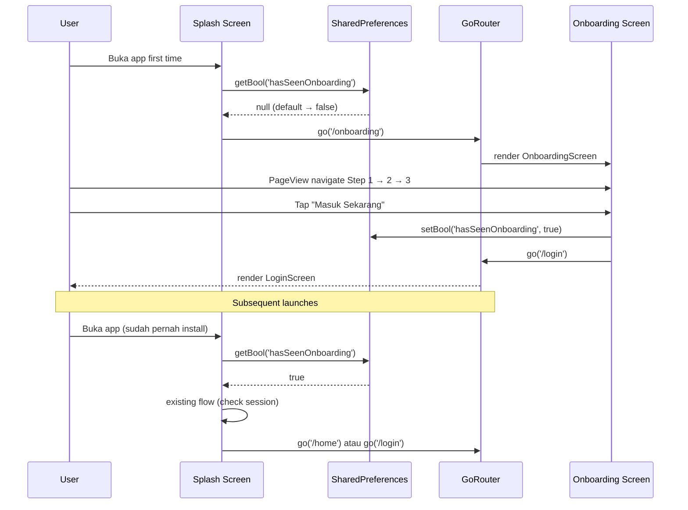
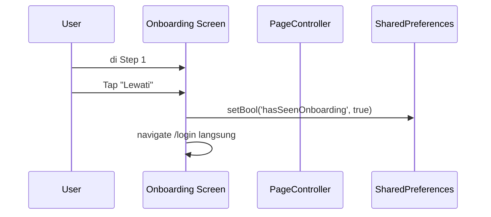

# Design Document: Onboarding Mobile 3-Step

> Phase B3: Welcome flow 3-step (Welcome → Cara Pakai → Get Started) saat first install aplikasi mobile MyPresensi. Tampilkan brand intro + edukasi 3-layer keamanan (QR + GPS + Face) + privacy summary + CTA Login.

## Overview

User feedback awalnya bilang "tidak perlu onboarding karena mahasiswa sudah disosialisasi kampus" — tapi setelah audit + user revisit, decision: **bikin onboarding 3-step** sebagai polish first-time user experience. Mockup HTML baru dibuat di `docs/ui-research/mockups/mobile-onboarding.html` (sebelumnya hanya splash di `mobile-splash-onboarding.html`).

Saat ini app membuka langsung ke splash → check session token → /home atau /login. Tidak ada edukasi awal untuk first install user. Solusi: tambah route `/onboarding` yang muncul **hanya sekali** saat `SharedPreferences.hasSeenOnboarding == false`.

User decisions:
- D-User-1: 3 step Welcome → Cara Pakai → Get Started (BUKAN versi 4-step atau 2-step)
- D-User-2: Visual style sesuai design system mobile (Iconsax Bold + #2D86FF gradient)
- D-User-3: TIDAK include consent UU PDP di onboarding — consent biometrik tetap di Face Register screen (existing rule 04-security)

Effort estimasi: **2 jam** (lebih cepat dari 2-3 jam karena scope kecil + design system sudah mature).

## Architecture

### Decisions Table

| ID | Keputusan | Rasional |
|----|-----------|---------|
| D1 | **Route GoRouter `/onboarding`** dengan check awal di splash via `SharedPreferences.hasSeenOnboarding`. Kalau false, redirect /onboarding sebelum /login. Kalau true, lanjut /login normal. | Standar pattern Flutter onboarding. Existing `app_router.dart` sudah pakai GoRouter — tinggal tambah route baru. |
| D2 | **Storage flag**: `shared_preferences` package (cek `pubspec.yaml`, kalau belum ada install). | `flutter_secure_storage` overkill untuk flag boolean non-sensitive. SharedPreferences = right tool. |
| D3 | **PageView Flutter** untuk navigasi 3 step. Animasi slide horizontal default (300ms ease-in-out). | Native pattern, tidak butuh library. PageController untuk programmatic navigation (Skip → page 3). |
| D4 | **Tombol "Lewati"** di top-right (kecuali step terakhir). Klik = set flag + navigate /login langsung (skip remaining steps). | Mainstream onboarding UX — user yang sudah tahu app boleh skip. Step indicator dot tetap ditampilkan agar user tahu posisi. |
| D5 | **Tombol "Lanjut"** di footer step 1-2, "Masuk Sekarang" di step 3. Action: PageController.nextPage atau set flag + go('/login'). | Variasi label CTA membantu user tahu step terakhir. |
| D6 | **Step indicator** = 3 dot di top center. Active dot = 8×24px primary, inactive = 8×8px primary 20% alpha. | Mockup pattern. Animasi width transition 300ms saat berpindah. |
| D7 | **Visual elements**: gradient illustration card 200×200 dengan icon Iconsax Bold besar (90-100px). Step 1 primary gradient + Hand-shake icon. Step 2 success light gradient + Shield icon. Step 3 amber gradient + Rocket icon. | Match mockup. Per step icon berbeda mood: welcome (greeting) → cara pakai (security) → get started (action). |
| D8 | **Iconsax Bold**: `iconsax_plus` package sudah lock di mobile (existing). Tetap pakai itu untuk konsistensi. Icon mockup pakai `solar:*` (web mockup), Flutter pakai equivalent Iconsax Bold. | Library lock per `03-design-and-libraries.md`. |
| D9 | **Step 2 feature list 3-item**: QR (info color) / GPS (warning color) / Face (success color). Match mockup duotone tint. | Visual hierarchy — semantic color membantu scannability. |
| D10 | **Step 3 privacy summary 2-point** (BUKAN consent formal): "Data kamu disimpan aman" + "Bisa hapus data wajah kapan saja". Gentle reassurance. | User decision D-User-3 explicit. |
| D11 | **Tidak ada animasi kompleks** — fade in saat first paint, PageView slide between, no Lottie. | YAGNI. Native Flutter sudah cukup, no new deps. |
| D12 | **State management**: ConsumerStatefulWidget local state (PageController + currentPage), TIDAK butuh Riverpod global provider untuk onboarding (single screen, no cross-feature state). | Lokal cukup. |
| D13 | **Splash redirect logic**: tambah cek di `splash_screen.dart` existing — sebelum cek session, cek `hasSeenOnboarding`. Kalau false → /onboarding. Kalau true → existing flow (cek session → /home atau /login). | Minimal invasive ke existing code. |
| D14 | **Tidak ada back button** di onboarding (pakai sistem back Android = tutup app, sama seperti splash). | Standar onboarding pattern — tidak ada konteks "kembali" karena ini first-time flow. |
| D15 | **Verification gate**: `flutter analyze` 0 issues + `flutter pub get` sukses kalau perlu install shared_preferences + manual smoke test cold install. | Sesuai rule 02-quality. |

### Library Compliance

| Aspect | Choice | Rule reference |
|--------|--------|----------------|
| Storage | `shared_preferences` (install kalau belum ada) | `03-design-and-libraries.md` (locked, sudah ada di mobile lib table) |
| Routing | `go_router` (existing) | `20-mobile-conventions.md` |
| State | `flutter_riverpod` ConsumerStatefulWidget (existing) | `20-mobile-conventions.md` |
| Icons | `iconsax_plus` Bold variant (existing) | `22-mobile-design-system.md` §C |
| Theme | `AppColors`, `AppShadows`, `AppRadius` tokens (existing) | `22-mobile-design-system.md` |

### Sequence Diagram

#### First Install Flow



#### Skip Flow



## Components and Interfaces

### Component 1: Route Setup `core/router/app_router.dart`

**Purpose**: Tambah `/onboarding` route ke GoRouter existing.

**Interface (delta)**:
```dart
GoRoute(
  path: '/onboarding',
  pageBuilder: (context, state) => _fadeTransition(
    state,
    const OnboardingScreen(),
  ),
),
```

### Component 2: Splash Modification `features/auth/screens/splash_screen.dart`

**Purpose**: Cek `hasSeenOnboarding` flag SEBELUM session check existing.

**Interface (delta in `_initialRouteCheck()`)**:
```dart
final prefs = await SharedPreferences.getInstance()
final hasSeenOnboarding = prefs.getBool('hasSeenOnboarding') ?? false

if (!hasSeenOnboarding) {
  if (mounted) context.go('/onboarding')
  return
}
// ...existing session check logic
```

### Component 3: Onboarding Screen `features/onboarding/screens/onboarding_screen.dart`

**Purpose**: 3-step wizard PageView dengan dot indicator + skip + CTA.

**Interface**:
```dart
class OnboardingScreen extends ConsumerStatefulWidget {
  const OnboardingScreen({super.key})

  @override
  ConsumerState<OnboardingScreen> createState()
}
```

**Sub-components private**:
```dart
class _OnboardingTopbar // skip + step indicator
class _OnboardingStep1 // welcome
class _OnboardingStep2 // cara pakai (3-layer feature list)
class _OnboardingStep3 // get started
class _StepDot // animated dot indicator
class _IllustrationCard // 200x200 gradient + icon
class _FeatureListItem // duotone icon + name + desc
class _PrivacyPoint // green check + text
class _OnboardingFooterButton // primary pill button
```

**Helpers**:
```dart
Future<void> _markOnboardingSeen() async {
  final prefs = await SharedPreferences.getInstance()
  await prefs.setBool('hasSeenOnboarding', true)
}

void _handleSkip(BuildContext context) async {
  await _markOnboardingSeen()
  if (context.mounted) context.go('/login')
}

void _handleFinish(BuildContext context) async {
  await _markOnboardingSeen()
  if (context.mounted) context.go('/login')
}

void _handleNext(int currentPage, PageController controller) {
  if (currentPage == 2) {
    _handleFinish(context)
    return
  }
  controller.nextPage(
    duration: const Duration(milliseconds: 300),
    curve: Curves.easeInOut,
  )
}
```

## Data Models

Tidak ada model DB. Hanya 1 boolean `hasSeenOnboarding` di SharedPreferences.

## Algorithmic Pseudocode

### Algorithm 1: Splash Routing Decision

```pascal
ALGORITHM splashRoutingDecision()
INPUT: SharedPreferences instance, session token
OUTPUT: navigate to onboarding | login | home

PRECONDITIONS:
  - SharedPreferences accessible (always true on Android/iOS)

POSTCONDITIONS:
  - User redirected to exactly one of: /onboarding, /login, /home
  - hasSeenOnboarding flag NOT modified by splash (only modified by onboarding screen)

BEGIN
  hasSeenOnboarding ← SharedPreferences.getBool('hasSeenOnboarding') ?? false

  IF NOT hasSeenOnboarding THEN
    navigate '/onboarding'
    RETURN
  END IF

  // Existing session check
  token ← SecureStorage.read('access_token')
  IF token = null OR isExpired(token) THEN
    navigate '/login'
  ELSE
    navigate '/home'
  END IF
END
```

## Correctness Properties

### Property 1: Onboarding Shown Once
*If* user completes onboarding (tap "Masuk Sekarang" at step 3 OR tap "Lewati" at any step), *then* `hasSeenOnboarding` flag SHALL be set to `true` in SharedPreferences. Subsequent app launches SHALL NOT redirect to /onboarding.

### Property 2: Skip Idempotency
*Tap* "Lewati" at any step has identical effect: set flag + navigate /login. Doesn't matter if at step 1 or step 2.

### Property 3: Flag Persistence
*After* onboarding completed, app uninstall + reinstall → flag = false again. App update via Play Store → flag persists (SharedPreferences survives app updates, NOT uninstalls).

## Error Handling

### Scenario 1: SharedPreferences read fail
**Response**: Default null → fallback false → onboarding shown. Acceptable.

### Scenario 2: Onboarding rendered while session valid (edge case)
**Condition**: User somehow di /onboarding tapi session masih valid.
**Response**: Tap "Masuk Sekarang" → /login. Login screen detect existing session via auth provider → auto-redirect /home.

## Testing Strategy

### Manual Smoke Test
1. Cold install (uninstall + reinstall): verify /onboarding muncul
2. Tap Lewati di step 1: verify navigate /login + flag set
3. Tap Lanjut step 1 → 2 → 3: verify PageView slide animation smooth
4. Tap "Masuk Sekarang" di step 3: verify navigate /login + flag set
5. Restart app: verify TIDAK lagi muncul onboarding (langsung /login atau /home)
6. Visual check: 3 step match mockup `mobile-onboarding.html`

## Performance Considerations

- PageView lazy build per page → smooth transition.
- Icon Iconsax Bold cached after first render.
- SharedPreferences read in async future, splash dwell already 2s — no UX impact.

## Security Considerations

- `hasSeenOnboarding` flag NON-sensitive, tidak butuh secure storage.
- Tidak ada data PII di onboarding screen.
- Privacy reassurance (step 3) gentle, BUKAN binding consent — consent biometrik tetap di Face Register (rule 04-security).

## Dependencies

- `shared_preferences` (cek `pubspec.yaml`, install kalau belum ada). Versi sesuai Flutter 3.11.x.
- Lainnya semua existing.

## Migration Plan & Rollback

**Order**:
1. Cek + install `shared_preferences` di pubspec
2. Buat `OnboardingScreen` + sub-components
3. Tambah route `/onboarding` di app_router.dart
4. Modify splash_screen.dart (add hasSeenOnboarding check)
5. Verification + smoke test

**Rollback**: Per file via git. Tidak ada DB changes.
