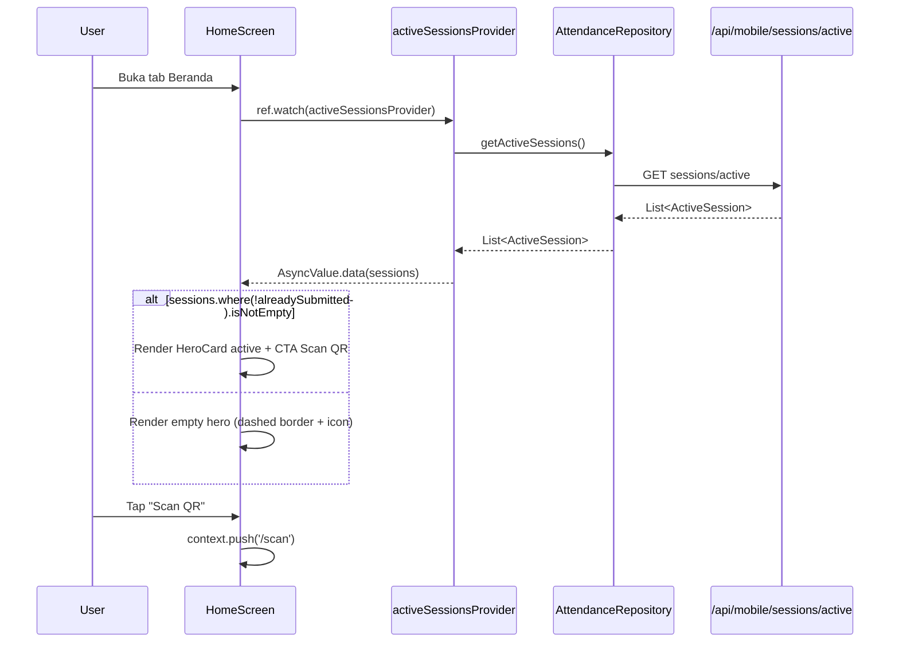
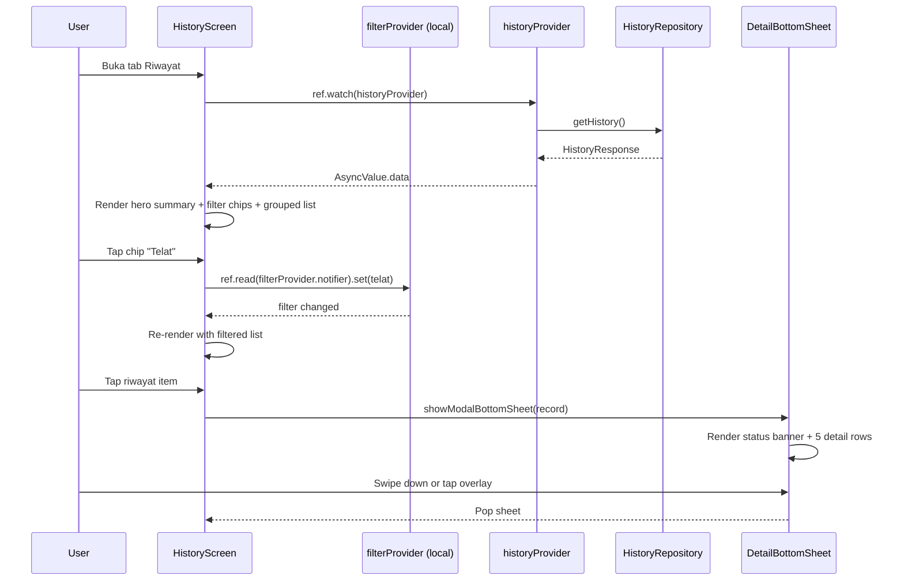
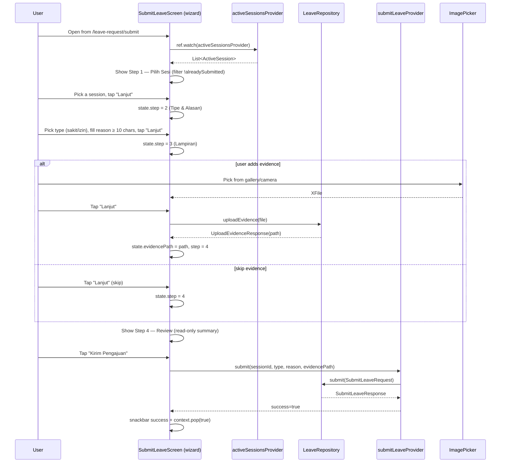

# Design Document: Phase 5 Mobile UI Rebuild

> Dokumen desain untuk menyelesaikan Phase 5 overhaul UI mobile MyPresensi (Flutter). Tiga screen mahasiswa terakhir dibangun ulang sesuai mockup Solar/Iconsax-style yang sudah final, ditambah satu task opsional sinkronisasi token web. Target: visual parity penuh dengan `docs/ui-research/mockups/mobile-*.html` sambil 100% mempertahankan business logic dan flow yang sudah berjalan.

## Overview

Phase 5 sebelumnya sudah menyelesaikan token migration (`#5483AD` → `#2D86FF`), helper widgets (`SemanticIcon`, `HeroCard`, `AppCard`, `KpiIconBox`), shell 5-tab v7 (Beranda · Riwayat · Izin · Notifikasi · Profil), serta tiga screen rebuild (Profile, MyLeaveRequests, Notifications). Tinggal **tiga screen + satu task opsional** yang menyelesaikan rangkaian:

1. **`home_screen.dart`** — Hero card sesi aktif (gradient + gold glow + pulse badge + CTA "Scan QR"), today summary 3-stat, quick action grid 4-item (Scan featured gold), activity feed duotone, plus dukungan 3-state (active/empty/loading) sesuai mockup `mobile-home.html`.
2. **`history_screen.dart`** — Hero summary 5-stat dengan progress bar, filter chip 6-status, smart-date grouping, dan bottom sheet detail dengan face thumb match indicator (close-via-swipe, no buttons inside).
3. **`submit_leave_request_screen.dart`** — Refactor dari single-form jadi **wizard 4-step** (Pilih Sesi · Tipe & Alasan · Lampiran · Review) dengan step bar di header dan footer CTA tunggal "Lanjut".
4. **(Opsional)** Sinkronisasi token primary di `mypresensi-web/app/globals.css` ke `#2D86FF` agar konsisten cross-platform.

Pendekatan: **UI-only refactor**. Provider (`HomeProvider`/`activeSessionsProvider`, `historyProvider`, `submitLeaveProvider`), repository, model data, endpoint backend — semuanya **tidak diubah**. Yang berubah hanyalah lapisan widget dan struktur visualnya. Setiap screen wajib lulus `flutter analyze` (No issues found) sebelum task selesai, dan diakhiri dengan smoke test manual oleh user.

Dokumen ini bersifat comprehensive — menggabungkan diagram arsitektur, sequence flow per screen, signature kode Dart untuk widget baru, formal spec algoritma (preconditions/postconditions/loop invariants) untuk wizard step machine dan filter logic, plus mapping mockup → Flutter widget yang granular.

## Architecture

### Scope & Boundaries

```mermaid
graph TD
    subgraph "Phase 5 — Already Done (frozen)"
        A1[app_colors.dart v7]
        A2[app_shadows.dart]
        A3[SemanticIcon]
        A4[HeroCard]
        A5[AppCard]
        A6[KpiIconBox]
        A7[app_shell.dart 5-tab]
        A8[profile_screen.dart]
        A9[my_leave_requests_screen.dart]
        A10[notification_screen.dart]
    end

    subgraph "Phase 5 — This Spec (rebuild UI only)"
        B1[home_screen.dart]
        B2[history_screen.dart]
        B3[submit_leave_request_screen.dart]
        B4[(optional) globals.css sync]
    end

    subgraph "Reused (NOT modified)"
        C1[activeSessionsProvider]
        C2[authProvider]
        C3[historyProvider]
        C4[submitLeaveProvider]
        C5[leaveRepositoryProvider]
        C6[Endpoint /api/mobile/*]
    end

    B1 --> A4
    B1 --> A6
    B1 --> A3
    B1 --> C1
    B1 --> C2

    B2 --> A4
    B2 --> A5
    B2 --> A3
    B2 --> C3

    B3 --> A5
    B3 --> A3
    B3 --> A6
    B3 --> C1
    B3 --> C4
    B3 --> C5

    A7 --> B1
    A7 --> B2
```

Visual: kotak biru = sudah ada, kotak hijau = scope spec ini, kotak abu-abu = direuse tanpa modifikasi.

### Decisions Table

| ID | Keputusan | Alasan |
|----|-----------|--------|
| D1 | **Canonical home mockup** = `docs/ui-research/mockups/mobile-home.html` (bukan `mobile-mockup.html`). | `mobile-home.html` cover 3 state lengkap (aktif/empty/loading) dengan pattern hero+summary+quickaction+activity. `mobile-mockup.html` adalah showcase preview multi-screen yang detail home-nya hanya 1 frame. Untuk implementasi state coverage wajib pakai yang 3-frame. |
| D2 | **AI FAB tetap dipertahankan di home** (sesuai mockup `mobile-home.html`). | Keputusan user: AI Chat harus accessible — boleh di home maupun profile (dual entry point). Implementasi: FAB bulat 56×56 di posisi bottom-right (di atas bottom nav, padding 16px) dengan icon `IconsaxPlusBold.message_question`, gradient `accent` (gold), `AppShadows.fab`. Tap → `context.push('/ai-chat')`. Menu "Asisten AI" di Profile_Screen tetap ada (sudah dibangun fase sebelumnya) — tidak menghilangkan akses lama. |
| D3 | **Hero session dipakai HANYA saat ada sesi aktif belum di-submit**, ditampilkan empty state hero dashed-border saat tidak ada. | Match Frame 1 vs Frame 2 mockup. `activeSessionsProvider` filter `where !s.alreadySubmitted` jadi sumber kebenaran. |
| D4 | **Today summary di home** dihitung dari list `activeSessions` (Hadir = `s.alreadySubmitted == true`, Sisa = `!s.alreadySubmitted`, Alpa = 0 statis dulu). | Dashboard endpoint khusus untuk activity feed/summary belum ada di backend. Hitung lokal dari data yang sudah dimuat — tidak perlu backend baru. Alpa diset 0 hingga endpoint dashboard hadir (deferred). |
| D5 | **Activity feed di home** dihilangkan untuk fase ini (atau diisi placeholder). | Endpoint `dashboard activity` belum ada. Mockup menampilkan 3 item dummy. Karena library lock dan rule "tidak boleh dead-end", lebih baik tidak munculkan section yang tidak punya data nyata. **Pilihan**: omit section atau tampilkan empty-friendly "Belum ada aktivitas". Pilih **omit** agar layout bersih. |
| D6 | **History filter chips 6 status**: `Semua / Hadir / Telat / Izin / Sakit / Alpa`. Label chip menggunakan **TELAT** (bukan TERLAMBAT), tetapi enum status DB tetap `terlambat`. | Konsisten dengan label di mockup (`mobile-riwayat.html`). Mapping label → enum dilakukan di lapisan UI. |
| D7 | **History bottom sheet detail tanpa tombol aksi**, ditutup via swipe-down handle atau tap overlay. | Sesuai annotation Frame 2 mockup `mobile-riwayat.html`: "untuk kebutuhan sengketa, mahasiswa bisa screenshot — informasinya sudah lengkap". Sheet murni informatif. |
| D8 | **History detail field rendering opsional** sesuai data dari `AttendanceRecord`: hanya render row Lokasi kalau `distanceMeters != null`, Wajah kalau `faceConfidence != null`. | Field `wifi_ssid`, `device_model`, `ip_address` belum di-expose di endpoint `GET /api/mobile/attendance/history` (model history hanya ekspose distance + face confidence + isLocationValid). Tidak buat endpoint baru — render sebatas data yang ada. |
| D9 | **Submit leave wizard step 1 menggunakan endpoint baru `GET /api/mobile/sessions/eligible-for-leave`** yang return 2 array (`active_sessions` + `recent_sessions`). | Match mockup 100% (Group A "Sedang berlangsung" + Group B "Belum sempat hadir" max 7 hari). Reuse `activeSessionsProvider` saja tidak cukup karena Group B butuh filter `is_active=false AND started_at >= NOW() - 7 days AND no attendance hadir AND no leave_request pending/approved` yang tidak di-cover endpoint manapun. Spec scope expand menjadi UI + 1 endpoint backend (~+1.5 jam effort). |
| D10 | **Step 1 grouping section** = "Sedang berlangsung" (Group A) dan "Belum sempat hadir" (Group B). Empty section auto-hidden. | Mockup menampilkan dua group dengan section header. UI render header hanya jika array group non-empty. |
| D11 | **Tombol back di Step 2/3/4** menggunakan AppBar back default (system back). Tidak ada tombol back custom di footer. | Match annotation mockup leave-request: "Tombol back custom dihapus, hanya CTA full-width 'Lanjut' dengan panah". Step backward state machine tetap perlu (lihat algoritma di §Algorithmic Pseudocode). |
| D12 | **Type tile Sakit pakai icon `IconsaxPlusBold.health`** (mendekati `solar:pills-bold-duotone`). | `iconsax_plus: ^1.0.0` package belum mendukung Bulk variant — Bold paling solid yang tersedia. `health` icon = pills/medical visual. Pilihan terdekat secara semantic. |
| D13 | **Step 4 Review dipakai sebagai konfirmasi sebelum submit**, bukan timeline post-submit. | Mockup punya 2 mode di Step 4: Review pre-submit + Timeline post-submit. Karena flow existing langsung pop screen setelah success (snackbar + invalidate list), kita pilih **Review only** untuk Step 4. Timeline status muncul di `MyLeaveRequestsScreen` (sudah dibangun Phase 5 sebelumnya). |
| D14 | **Evidence upload tetap dipertahankan** dengan integrasi ke `LeaveRepository.uploadEvidence()` — masuk ke Step 3 wizard. | Per spec `leave-evidence-upload`. Logic existing `_pickEvidence` / `_showEvidencePickerSheet` / `_removeEvidence` direuse, hanya UI dipindahkan ke step 3. |
| D15 | **Web globals.css sync** ditandai **opsional** (task `*` mark). | Cross-platform consistency nice-to-have, tapi bisa di-defer. Web sudah live dengan `#5483AD`, perubahan token mempengaruhi semua component web. Treatment: low priority dengan fallback documented. |
| D16 | **Verifikasi gate**: setiap screen wajib `flutter analyze` exit 0 SEBELUM task ditandai selesai. Smoke test manual dijadwalkan sebagai task user-action terakhir, tidak coding agent task. | Sesuai rule `02-quality-debugging-verification.md` Section C. Manual smoke test mengkonfirmasi visual parity yang tidak bisa di-verify oleh static analyzer. |

### Library & Token Compliance

| Aspek | Pilihan | Rule reference |
|-------|---------|----------------|
| Icon | `iconsax_plus: ^1.0.0` Bold variant (Bulk not available di v1.0.0) | `03-design-and-libraries.md` (lock) + `22-mobile-design-system.md` §C.1 |
| Color | `AppColors.*` (NEVER hardcode hex) | `22-mobile-design-system.md` §B |
| Shadow | `AppShadows.card / cardElevated / hero / fab` | `22-mobile-design-system.md` §D |
| State | Riverpod 3 NotifierProvider + immutable state class + `copyWith` | `20-mobile-conventions.md` |
| Route | GoRouter `context.push('/path')` (no `Navigator.pushNamed`) | `20-mobile-conventions.md` |
| Bottom sheet | `showModalBottomSheet` dengan handle drag bar 36×4px + radius top 24px | `22-mobile-design-system.md` §F (Border Radius `2xl`) |
| Pill button | Radius 999, padding 13×20, Plus Jakarta Sans w600 | `22-mobile-design-system.md` §E.4 |
| Bahasa | User-facing text Bahasa Indonesia, identifier English | `03-design-and-libraries.md` Bahasa |

### Sequence Diagrams

#### Home — Active Session Flow



#### History — List → Bottom Sheet Detail



#### Submit Leave — 4-Step Wizard



## Backend Endpoint Baru

### `GET /api/mobile/sessions/eligible-for-leave`

**Tujuan**: Mengembalikan dua list sesi yang eligible untuk diajukan izin oleh mahasiswa — sesi yang sedang aktif dan sesi yang sudah lewat (max 7 hari) tapi mahasiswa belum hadir/belum punya izin.

**Kenapa endpoint baru, bukan extend `/sessions/active`?**
- Single responsibility: `/active` murni untuk submit presensi (butuh GPS + face), tidak perlu data 7-hari-lalu.
- Filter dan business rule berbeda: `/eligible-for-leave` exclude sesi yang sudah ada `attendances.status='hadir'` ATAU `leave_requests pending/approved` — `/active` cuma exclude `attendances` apapun status-nya.
- Cache strategy berbeda: `/active` short-lived (refresh tiap menit), `/eligible-for-leave` lebih lama (5 menit OK).

**Auth**: `authenticateRequest()` — Bearer JWT, role mahasiswa, `is_active=true`.

**Rate limit**: 30 req / 5 menit per (user+device) — endpoint read, lebih longgar dari endpoint write.

**Request**: tidak ada body. Tidak ada query param.

**Response shape**:

```typescript
{
  active_sessions: Array<EligibleSession>,   // is_active=true, belum ada attendance/leave
  recent_sessions: Array<EligibleSession>    // sudah lewat <= 7 hari, belum ada attendance/leave
}

interface EligibleSession {
  id: string                  // session UUID
  course_code: string
  course_name: string
  session_number: number
  topic: string | null
  started_at: string          // ISO 8601
  ended_at: string | null
  dosen_name: string | null   // join dari course → dosen
  // status_label: tidak di-return — UI yang format ("AKTIF" / "KEMARIN" / "N HARI LALU")
}
```

**Algoritma server-side (single round-trip ke Supabase)**:

```typescript
// 1. Auth (existing helper)
const auth = await authenticateRequest(req)
if (auth.error) return errorResponse(auth.error, auth.status)
const user = auth.user!

// 2. Ambil enrolled course_ids
const { data: enrollments } = await admin
  .from('enrollments')
  .select('course_id')
  .eq('student_id', user.id)
const courseIds = enrollments?.map(e => e.course_id) ?? []
if (courseIds.length === 0) {
  return successResponse({ active_sessions: [], recent_sessions: [] })
}

// 3. Cutoff 7 hari ke belakang
const sevenDaysAgo = new Date(Date.now() - 7 * 24 * 60 * 60 * 1000).toISOString()

// 4. Ambil semua sesi (aktif + recent) dalam SATU query
const { data: sessions } = await admin
  .from('sessions')
  .select(`
    id, course_id, session_number, topic,
    started_at, ended_at, is_active,
    course:courses!sessions_course_id_fkey(
      code, name, dosen:profiles!courses_dosen_id_fkey(full_name)
    )
  `)
  .in('course_id', courseIds)
  .gte('started_at', sevenDaysAgo)
  .order('started_at', { ascending: false })

// 5. Ambil exclusion sets — attendances 'hadir' + leave_requests pending/approved
const sessionIds = sessions?.map(s => s.id) ?? []
const [{ data: attended }, { data: leaved }] = await Promise.all([
  admin.from('attendances')
    .select('session_id')
    .eq('student_id', user.id)
    .eq('status', 'hadir')
    .in('session_id', sessionIds),
  admin.from('leave_requests')
    .select('session_id')
    .eq('student_id', user.id)
    .in('status', ['pending', 'approved'])
    .in('session_id', sessionIds),
])
const excludedSet = new Set([
  ...(attended ?? []).map(a => a.session_id),
  ...(leaved ?? []).map(l => l.session_id),
])

// 6. Partition ke active vs recent
const active: EligibleSession[] = []
const recent: EligibleSession[] = []
for (const s of sessions ?? []) {
  if (excludedSet.has(s.id)) continue
  const item = mapToEligibleSession(s)
  if (s.is_active) active.push(item)
  else recent.push(item)
}

return successResponse({ active_sessions: active, recent_sessions: recent })
```

**Database performance considerations**:

| Aspect | Treatment |
|---|---|
| FK indexes existing | `enrollments.student_id` ✓, `attendances(student_id, session_id)` unique ✓, `leave_requests.student_id` ✓, `sessions.course_id` ✓ — semua sudah ada dari migration 010 |
| Partial index baru | `CREATE INDEX IF NOT EXISTS idx_sessions_started_at ON sessions(started_at DESC)` — untuk filter `started_at >= sevenDaysAgo` cepat. Migration baru `020_sessions_started_at_index.sql` |
| RLS impact | Pakai `createAdminClient()` setelah auth check (bypass RLS) — pattern existing di `/active` route |
| N+1 prevention | Single query JOIN courses+dosen via Supabase join syntax. Exclusion sets diambil 2 query terpisah pakai `Promise.all` (parallel) |

**Threat model checklist** (per rule `04-security-and-privacy.md` Section D):

| Question | Answer |
|---|---|
| Siapa yang boleh akses? | Mahasiswa role + `is_active=true` |
| Layer auth | `authenticateRequest()` + Bearer JWT validation di `_lib/auth.ts` |
| IDOR risk? | Tidak — `student_id` ambil dari `auth.user.id`, bukan body/query |
| Mass assignment? | Tidak ada — pure GET, no body |
| Rate limit? | Ya, 30 req / 5 menit per (user+device) |
| Data exposure? | Tidak ada Tier 1 (no session_code, no embeddings, no JWT) |
| Audit logging? | TIDAK perlu — read-only endpoint, tidak ada mutasi. (Pattern: read endpoint tidak audit untuk hindari log spam.) |
| Data integrity? | N/A — read-only |
| Tier 2 exposure | `dosen.full_name` di response — already public via course list di mobile |

**Compliance dengan steering rules**:

- ✅ `14-web-supabase-patterns.md` Section A: pakai partial index + parallel exclusion set + no `SELECT *`
- ✅ `14-web-supabase-patterns.md` Section B: defense-in-depth (Bearer JWT → endpoint role check → admin client)
- ✅ `04-security-and-privacy.md` D.2: `student_id` ignore dari client, ambil dari `auth.user.id`
- ✅ `13-web-nextjs-patterns.md` E: pakai helper `authenticateRequest()` + `successResponse/errorResponse`
- ✅ `02-quality-debugging-verification.md`: `npm run type-check` exit 0 sebelum klaim selesai


### Component 1: `HomeScreen` (rebuild)

**Purpose**: Dashboard utama mahasiswa dengan hero session dinamis, summary hari ini, quick action grid, dan placeholder activity feed (atau omit per D5).

**Mockup mapping**:

| Mockup section | Flutter widget | State coverage |
|----------------|---------------|----------------|
| `.home-appbar` (brand + bell + avatar) | `_HomeAppBar` | semua |
| `.home-greeting` (Halo + cuaca + tanggal) | `_GreetingHeader` | semua |
| `.hero-session` Frame 1 | `_HeroSessionActive` (wrap `HeroCard`) | active |
| `.hero-empty` Frame 2 | `_HeroSessionEmpty` (dashed border + next session) | empty |
| `.skel-hero` Frame 3 | `_HeroSkeleton` (shimmer container) | loading |
| `.today-summary` 3-stat | `_TodaySummaryRow` | active + empty |
| `.quick-actions` 4-grid | `_QuickActionGrid` | active + empty |
| `.activity-list` | **OMITTED per D5** | — |
| `.fab-ai` (FAB AI Chat) | `_AiChatFab` (FAB bulat gold) | semua |
| Bottom nav (in `AppShell`) | `AppShell._NavItem` | (already done) |

**Interface (signatures)**:

```dart
class HomeScreen extends ConsumerStatefulWidget {
  const HomeScreen({super.key});

  /// Reset welcome toast flag — panggil saat logout (preserved API).
  static void resetWelcome();

  @override
  ConsumerState<HomeScreen> createState();
}

// Sub-widgets (private):
class _HomeAppBar extends StatelessWidget {
  const _HomeAppBar({required this.userInitials, this.unreadBadge = false});
  final String userInitials;
  final bool unreadBadge;
}

class _GreetingHeader extends StatelessWidget {
  const _GreetingHeader({required this.firstName, required this.dateLabel, required this.weatherIcon});
  final String firstName;       // "Riki"
  final String dateLabel;       // "Selamat siang — Rabu, 15 Mei 2026"
  final IconData weatherIcon;   // resolved from hour-of-day
}

class _HeroSessionActive extends StatelessWidget {
  const _HeroSessionActive({required this.session, required this.onScanTap});
  final ActiveSession session;
  final VoidCallback onScanTap;
}

class _HeroSessionEmpty extends StatelessWidget {
  const _HeroSessionEmpty({this.nextSession});  // null = no next info
  final ActiveSession? nextSession;
}

class _HeroSkeleton extends StatelessWidget {
  const _HeroSkeleton();
}

class _TodaySummaryRow extends StatelessWidget {
  const _TodaySummaryRow({required this.hadir, required this.sisa, required this.alpa, required this.totalToday});
  final int hadir;
  final int sisa;
  final int alpa;
  final int totalToday;
}

class _QuickActionGrid extends StatelessWidget {
  const _QuickActionGrid({required this.onScanTap, required this.onHistoryTap, required this.onLeaveTap, required this.onProfileTap});
  // 4 quick actions, Scan QR pakai KpiColor.featured (gold)
}

class _AiChatFab extends StatelessWidget {
  const _AiChatFab({required this.onTap});
  final VoidCallback onTap;
  // FAB 56x56, gradient accent (gold), shadow AppShadows.fab,
  // icon IconsaxPlusBold.message_question, posisi Stack bottom-right padding 16
}
```

**Responsibilities**:
- Watch `activeSessionsProvider`, `authProvider`
- Map list `activeSessions` → hero variant (active/empty)
- Resolve greeting label dari `DateTime.now().hour`
- Compute today summary (hadir/sisa/alpa) dari list lokal
- Trigger `context.push('/scan')` untuk Scan, `currentTabProvider.setTab(N)` untuk navigasi internal tab

### Component 2: `HistoryScreen` (rebuild)

**Purpose**: Riwayat kehadiran dengan hero summary 5-stat (Hadir/Telat/Izin/Sakit/Alpa) + progress bar kehadiran, filter chip 6-status, list dikelompokkan smart-date, dan bottom sheet detail informational.

**Mockup mapping**:

| Mockup section | Flutter widget |
|----------------|---------------|
| `.appbar` (Riwayat + subtitle "Semester Genap") | `_HistoryAppBar` |
| `.riwayat-hero` (gradient + 5-stat detail + bar) | `_HistoryHero` (wrap `HeroCard`) |
| `.filter-row` 6 chips | `_HistoryFilterChips` |
| `.date-group` smart-date header | `_DateGroupHeader` |
| `.riwayat-item` card | `_HistoryItemCard` (wrap `AppCard`) |
| `.detail-sheet` bottom sheet | `_HistoryDetailSheet` |
| `.face-thumb` di sheet | `_FaceMatchThumb` |

**Smart-date grouping rule** (UTC offset client local):
- "Hari Ini · {hari}, {tgl} {bulan}" — `record.scannedAt.toLocal().day == DateTime.now().day`
- "Kemarin · {hari}, {tgl} {bulan}" — selisih 1 hari
- "Minggu Ini" — selisih 2-7 hari
- "Bulan Ini" — selisih 8-30 hari
- "Lebih Lama" — > 30 hari

**Filter mapping** (label → enum):

| Chip label | Filter predicate |
|-----------|-----------------|
| Semua | `(_) => true` |
| Hadir | `(r) => r.status == 'hadir'` |
| Telat | `(r) => r.status == 'terlambat'` |
| Izin | `(r) => r.status == 'izin'` |
| Sakit | `(r) => r.status == 'sakit'` |
| Alpa | `(r) => r.status == 'alpa'` |

**Interface (signatures)**:

```dart
class HistoryScreen extends ConsumerWidget {
  const HistoryScreen({super.key});
}

// Local filter state (per-screen Riverpod Notifier)
enum _HistoryFilter { semua, hadir, telat, izin, sakit, alpa }

final _historyFilterProvider =
    NotifierProvider<_HistoryFilterNotifier, _HistoryFilter>(_HistoryFilterNotifier.new);

class _HistoryFilterNotifier extends Notifier<_HistoryFilter> {
  @override _HistoryFilter build() => _HistoryFilter.semua;
  void set(_HistoryFilter v);
}

// Sub-widgets:
class _HistoryHero extends StatelessWidget {
  const _HistoryHero({required this.summary});
  final AttendanceSummary summary;
}

class _HistoryFilterChips extends ConsumerWidget {
  const _HistoryFilterChips({required this.counts});
  final Map<_HistoryFilter, int> counts;
}

class _DateGroupHeader extends StatelessWidget {
  const _DateGroupHeader({required this.label, required this.count});
  final String label;     // "Hari Ini · Jumat, 15 Mei"
  final int count;        // 2
}

class _HistoryItemCard extends StatelessWidget {
  const _HistoryItemCard({required this.record, required this.onTap});
  final AttendanceRecord record;
  final VoidCallback onTap;
}

class _HistoryDetailSheet extends StatelessWidget {
  const _HistoryDetailSheet({required this.record});
  final AttendanceRecord record;
}

class _FaceMatchThumb extends StatelessWidget {
  const _FaceMatchThumb({required this.confidence, required this.threshold});
  final double confidence;
  final double threshold;
}
```

**Responsibilities**:
- Watch `historyProvider` + local `_historyFilterProvider`
- Compute group buckets via smart-date algorithm
- Compute chip counts dari `summary` (hadir/terlambat/izin/sakit/alpa) + total dari `summary.totalSessions`
- Trigger `showModalBottomSheet` saat tap item

### Component 3: `SubmitLeaveRequestScreen` (refactor → wizard)

**Purpose**: Form pengajuan izin/sakit yang sebelumnya single-form di-refactor jadi wizard 4-step dengan step bar di header dan footer CTA tunggal.

**Mockup mapping**:

| Mockup section | Flutter widget |
|----------------|---------------|
| `.appbar` (back button system + judul "Pengajuan Izin") | `AppBar` default (no custom action) |
| `.step-bar` (4 circles + connector lines) | `_StepBar` |
| Step 1: `.session-pick-item` list | `_StepPickSession` |
| Step 2: `.selected-session-card` + `.type-grid` + textarea + counter | `_StepTypeAndReason` |
| Step 3: `.upload-zone` / `.file-preview` | `_StepEvidence` (reuse `_pickEvidence` logic) |
| Step 4: `.review-card` (summary read-only) | `_StepReview` |
| `.form-foot` (CTA "Lanjut" / "Kirim Pengajuan") | `_WizardFooter` |

**Wizard state** (step machine, see §Algorithmic Pseudocode for formal spec):

```dart
enum WizardStep { pickSession, typeAndReason, evidence, review }

class WizardState {
  final WizardStep step;
  final ActiveSession? selectedSession;
  final LeaveType selectedType;
  final String reason;
  final File? pickedImage;          // local file before upload
  final String? evidencePath;       // path returned from upload
  final bool isUploadingEvidence;
  final String? evidenceErrorText;

  WizardState copyWith({...});
  bool get canAdvance;              // computed per step
}

class _SubmitLeaveWizardNotifier extends ChangeNotifier {
  // State machine: next() validates current step → advance, prev() → step-1, etc.
}
```

**Interface (signatures)**:

```dart
class SubmitLeaveRequestScreen extends ConsumerStatefulWidget {
  const SubmitLeaveRequestScreen({super.key});
}

// Sub-widgets:
class _StepBar extends StatelessWidget {
  const _StepBar({required this.currentStep});
  final WizardStep currentStep;
}

class _StepPickSession extends ConsumerWidget {
  const _StepPickSession({required this.selected, required this.onPick});
  final ActiveSession? selected;
  final ValueChanged<ActiveSession> onPick;
}

// New provider to consume the new backend endpoint:
final eligibleSessionsForLeaveProvider =
    FutureProvider.autoDispose<EligibleSessionsResponse>((ref) async {
  final repo = ref.watch(attendanceRepositoryProvider);
  return repo.getEligibleSessionsForLeave();
});

// New model in attendance_models.dart:
class EligibleSessionsResponse {
  final List<ActiveSession> activeSessions;
  final List<ActiveSession> recentSessions;
  const EligibleSessionsResponse({
    required this.activeSessions,
    required this.recentSessions,
  });
}

class _SessionPickItem extends StatelessWidget {
  const _SessionPickItem({
    required this.session,
    required this.selected,
    required this.onTap,
    this.statusBadge,           // "AKTIF" / "KEMARIN" / "4 HARI LALU"
  });
  final ActiveSession session;
  final bool selected;
  final VoidCallback onTap;
  final String? statusBadge;
}

class _SelectedSessionBadge extends StatelessWidget {
  // Read-only card di Step 2 menampilkan sesi yang dipilih
  const _SelectedSessionBadge({required this.session});
  final ActiveSession session;
}

class _StepTypeAndReason extends StatelessWidget {
  const _StepTypeAndReason({
    required this.session,
    required this.type,
    required this.reason,
    required this.onTypeChanged,
    required this.onReasonChanged,
  });
  // ...
}

class _TypeTile extends StatelessWidget {
  const _TypeTile({
    required this.icon,
    required this.label,
    required this.selected,
    required this.onTap,
  });
}

class _StepEvidence extends StatelessWidget {
  const _StepEvidence({
    required this.pickedImage,
    required this.errorText,
    required this.isUploading,
    required this.onPick,
    required this.onRemove,
  });
}

class _StepReview extends StatelessWidget {
  const _StepReview({
    required this.session,
    required this.type,
    required this.reason,
    required this.evidencePath,
  });
}

class _WizardFooter extends StatelessWidget {
  const _WizardFooter({
    required this.label,
    required this.icon,
    required this.enabled,
    required this.loading,
    required this.onTap,
  });
}
```

**Responsibilities**:
- Manage wizard step state (advance/back via system back-button untuk step > 1)
- Validate per-step requirements (see formal spec)
- Reuse `_pickEvidence`, `_showEvidencePickerSheet`, `_removeEvidence` logic dari existing screen
- Reuse `submitLeaveProvider.submit()` untuk final submission
- Call `LeaveRepository.uploadEvidence()` saat advance dari Step 3 ke Step 4 jika ada file

## Data Models

Tidak ada data model baru. Semua model existing direuse:

- **`ActiveSession`** (`lib/features/attendance/data/attendance_models.dart`)
- **`AttendanceRecord`, `AttendanceSummary`, `HistoryResponse`** (`lib/features/history/data/history_models.dart`)
- **`LeaveType`, `SubmitLeaveRequest`, `LeaveRepository.uploadEvidence()`** (`lib/features/leave_requests/data/`)
- **`UserModel`** via `authProvider` (di `home_screen` untuk greeting nama dan inisial avatar)

**Validation rules** (yang sudah ada di server, dipantulkan di UI):

| Field | Rule |
|-------|------|
| `reason` | Min 10 char, max 500 char (trim whitespace) |
| `evidencePath` | Optional. Format: `<userId>/<random>.<jpg\|jpeg\|png\|webp>`. UI tidak perlu validate format (server sudah). |
| `sessionId` | Wajib non-empty. UI gate via wizard step 1 selection. |
| `type` | Enum `izin` / `sakit`. Default `izin` di state initial. |

## Algorithmic Pseudocode

### Algorithm 1: Wizard Step Machine

```pascal
ALGORITHM advanceWizardStep(state)
INPUT: state of type WizardState
OUTPUT: nextState of type WizardState

PRECONDITIONS:
  - state.step ∈ {pickSession, typeAndReason, evidence, review}
  - state.selectedSession is set when step ≥ typeAndReason
  - state.reason length ≥ 10 when step ≥ evidence
  - state.isUploadingEvidence = false (no concurrent upload)

POSTCONDITIONS:
  - nextState.step = next step in linear order, OR submit completes
  - nextState.evidencePath set if step was evidence AND pickedImage not null
  - state mutations are atomic (no partial advance on upload error)

LOOP INVARIANTS: N/A (linear state machine, no loops in advance)

BEGIN
  CASE state.step OF
    pickSession:
      ASSERT state.selectedSession ≠ null
      RETURN state.copyWith(step ← typeAndReason)

    typeAndReason:
      ASSERT state.reason.trim().length ∈ [10, 500]
      ASSERT state.selectedType ∈ {izin, sakit}
      RETURN state.copyWith(step ← evidence)

    evidence:
      IF state.pickedImage ≠ null AND state.evidencePath = null THEN
        TRY
          state ← state.copyWith(isUploadingEvidence ← true, evidenceErrorText ← null)
          uploadResult ← LeaveRepository.uploadEvidence(state.pickedImage)
          state ← state.copyWith(
            evidencePath ← uploadResult.path,
            isUploadingEvidence ← false,
            step ← review
          )
          RETURN state
        CATCH error:
          RETURN state.copyWith(
            isUploadingEvidence ← false,
            evidenceErrorText ← friendlyErrorMessage(error)
          )
        END TRY
      ELSE
        // No image OR already uploaded — just advance
        RETURN state.copyWith(step ← review)
      END IF

    review:
      // From review, "advance" = submit. Caller handles via submitLeaveProvider.
      // This algorithm returns unchanged state; submission is separate path.
      RETURN state
  END CASE
END
```

**Preconditions**:
- `state` is a valid WizardState instance (no null fields beyond the optionals declared)
- For `evidence` step: `LeaveRepository` instance is available via Riverpod
- Network is available when uploading (failure is captured, not crashed)

**Postconditions**:
- `nextState.step` strictly follows `pickSession → typeAndReason → evidence → review`
- `nextState.evidencePath` is set only after successful upload
- On upload failure, `nextState.evidenceErrorText` is set with a Bahasa Indonesia message; step stays at `evidence`

### Algorithm 2: Step Backward Machine (System Back Button)

```pascal
ALGORITHM goBackWizardStep(state)
INPUT: state of type WizardState
OUTPUT: (newState, shouldPopRoute) tuple

PRECONDITIONS:
  - state.isUploadingEvidence = false (cannot back during upload)

POSTCONDITIONS:
  - If state.step > pickSession: newState.step = state.step − 1, shouldPopRoute = false
  - If state.step = pickSession: newState = state, shouldPopRoute = true (let route pop)
  - User-entered data (reason, selectedSession, pickedImage, evidencePath) is preserved
    across backward navigation (so user can review their work)

BEGIN
  IF state.isUploadingEvidence THEN
    // Block back during upload to prevent orphaned file states
    RETURN (state, false)
  END IF

  CASE state.step OF
    pickSession:
      RETURN (state, true)  // pop route entirely

    typeAndReason:
      RETURN (state.copyWith(step ← pickSession), false)

    evidence:
      RETURN (state.copyWith(step ← typeAndReason), false)

    review:
      RETURN (state.copyWith(step ← evidence), false)
  END CASE
END
```

### Algorithm 3: History Smart-Date Grouping

```pascal
ALGORITHM groupHistoryBySmartDate(records)
INPUT: records: List<AttendanceRecord>, sorted by scannedAt DESC
OUTPUT: groups: List<{label: String, items: List<AttendanceRecord>}>

PRECONDITIONS:
  - records is sorted by scannedAt DESC (newest first) — server already returns sorted
  - DateTime.now() is reasonable system time (within ±1 day of server)

POSTCONDITIONS:
  - groups preserves order of records within each bucket
  - Each record appears in exactly one group
  - Group order: hari_ini → kemarin → minggu_ini → bulan_ini → lebih_lama
  - Empty groups are omitted from output

LOOP INVARIANTS:
  - currentBucket is monotonically non-increasing (we only move "older")
  - All previously-bucketed records belong to a bucket ≥ currentBucket

BEGIN
  now ← DateTime.now()
  today_start ← DateTime(now.year, now.month, now.day)
  yesterday_start ← today_start − Duration(days: 1)
  week_start ← today_start − Duration(days: 7)
  month_start ← today_start − Duration(days: 30)

  buckets ← {hari_ini: [], kemarin: [], minggu_ini: [], bulan_ini: [], lebih_lama: []}

  FOR EACH r IN records DO
    ASSERT all_previously_bucketed_records_have_correct_bucket(buckets, r)

    scanned ← parseToLocal(r.scannedAt)

    IF scanned ≥ today_start THEN
      buckets.hari_ini.append(r)
    ELSE IF scanned ≥ yesterday_start THEN
      buckets.kemarin.append(r)
    ELSE IF scanned ≥ week_start THEN
      buckets.minggu_ini.append(r)
    ELSE IF scanned ≥ month_start THEN
      buckets.bulan_ini.append(r)
    ELSE
      buckets.lebih_lama.append(r)
    END IF
  END FOR

  result ← []
  IF buckets.hari_ini.isNotEmpty THEN
    result.append({label: formatHariIni(now), items: buckets.hari_ini})
  END IF
  IF buckets.kemarin.isNotEmpty THEN
    result.append({label: formatKemarin(now), items: buckets.kemarin})
  END IF
  IF buckets.minggu_ini.isNotEmpty THEN
    result.append({label: "Minggu Ini", items: buckets.minggu_ini})
  END IF
  IF buckets.bulan_ini.isNotEmpty THEN
    result.append({label: "Bulan Ini", items: buckets.bulan_ini})
  END IF
  IF buckets.lebih_lama.isNotEmpty THEN
    result.append({label: "Lebih Lama", items: buckets.lebih_lama})
  END IF

  RETURN result
END
```

**Loop invariant proof sketch**: Karena `records` sudah DESC-sorted, setiap iterasi memproses record yang `scannedAt ≤` record sebelumnya. Bucket assignment hanya bergantung pada `scanned vs today_start/yesterday_start/...` — fungsi monoton terhadap waktu. Jadi assignment sebelumnya tetap konsisten saat record baru di-bucket.

### Algorithm 4: Today Summary Computation (Home)

```pascal
ALGORITHM computeTodaySummary(activeSessions, todayDate)
INPUT: activeSessions: List<ActiveSession>, todayDate: DateTime (today)
OUTPUT: summary: {hadir: int, sisa: int, alpa: int, total: int}

PRECONDITIONS:
  - activeSessions returned from /api/mobile/sessions/active
  - alreadySubmitted reflects whether mahasiswa sudah absen/izin di sesi tsb

POSTCONDITIONS:
  - summary.hadir = count(s where alreadySubmitted = true)
  - summary.sisa  = count(s where alreadySubmitted = false)
  - summary.alpa  = 0 (placeholder hingga backend dashboard endpoint hadir — D5)
  - summary.total = activeSessions.length

LOOP INVARIANTS:
  - hadir + sisa = number of sessions iterated so far
  - alpa = 0 throughout

BEGIN
  hadir ← 0
  sisa ← 0
  total ← 0

  FOR EACH s IN activeSessions DO
    ASSERT hadir + sisa = total
    total ← total + 1
    IF s.alreadySubmitted THEN
      hadir ← hadir + 1
    ELSE
      sisa ← sisa + 1
    END IF
  END FOR

  RETURN {hadir, sisa, alpa: 0, total}
END
```

### Algorithm 5: Filter Predicate (History)

```pascal
ALGORITHM filterByStatus(records, filter)
INPUT: records: List<AttendanceRecord>, filter: _HistoryFilter
OUTPUT: filteredRecords: List<AttendanceRecord>

PRECONDITIONS:
  - filter ∈ {semua, hadir, telat, izin, sakit, alpa}

POSTCONDITIONS:
  - filter = semua  ⟹ filteredRecords = records (identity)
  - filter = hadir  ⟹ ∀ r ∈ filteredRecords: r.status = "hadir"
  - filter = telat  ⟹ ∀ r ∈ filteredRecords: r.status = "terlambat"  // label TELAT, enum terlambat
  - filter = izin   ⟹ ∀ r ∈ filteredRecords: r.status = "izin"
  - filter = sakit  ⟹ ∀ r ∈ filteredRecords: r.status = "sakit"
  - filter = alpa   ⟹ ∀ r ∈ filteredRecords: r.status = "alpa"
  - Order is preserved (filter is order-stable)

LOOP INVARIANTS:
  - filteredRecords is a subsequence of records seen so far that matches predicate

BEGIN
  predicate ← CASE filter OF
    semua: (_) → true
    hadir: (r) → r.status = "hadir"
    telat: (r) → r.status = "terlambat"
    izin:  (r) → r.status = "izin"
    sakit: (r) → r.status = "sakit"
    alpa:  (r) → r.status = "alpa"
  END CASE

  RETURN [r FOR r IN records IF predicate(r)]
END
```

## Example Usage

### Example 1: Home — render hero session active

```dart
// In _HomeScreenState.build():
final sessionsAsync = ref.watch(activeSessionsProvider);
final user = ref.watch(authProvider).user;

return CustomScrollView(
  slivers: [
    SliverToBoxAdapter(child: _HomeAppBar(userInitials: user?.initials ?? '?')),
    SliverToBoxAdapter(child: _GreetingHeader(
      firstName: (user?.fullName ?? 'Mahasiswa').split(' ').first,
      dateLabel: _resolveDateLabel(DateTime.now()),
      weatherIcon: _resolveWeatherIcon(DateTime.now().hour),
    )),
    SliverToBoxAdapter(
      child: sessionsAsync.when(
        data: (sessions) {
          final active = sessions.where((s) => !s.alreadySubmitted).toList();
          if (active.isEmpty) {
            return const _HeroSessionEmpty();
          }
          return _HeroSessionActive(
            session: active.first,
            onScanTap: () => context.push('/scan'),
          );
        },
        loading: () => const _HeroSkeleton(),
        error: (e, _) => ErrorState(
          title: 'Gagal memuat sesi',
          message: friendlyErrorMessage(e),
          onRetry: () => ref.invalidate(activeSessionsProvider),
        ),
      ),
    ),
    SliverToBoxAdapter(
      child: sessionsAsync.maybeWhen(
        data: (sessions) {
          final summary = _computeTodaySummary(sessions);
          return _TodaySummaryRow(
            hadir: summary.hadir,
            sisa: summary.sisa,
            alpa: summary.alpa,
            totalToday: summary.total,
          );
        },
        orElse: () => const SizedBox.shrink(),
      ),
    ),
    SliverToBoxAdapter(
      child: _QuickActionGrid(
        onScanTap: () => context.push('/scan'),
        onHistoryTap: () => ref.read(currentTabProvider.notifier).setTab(1),
        onLeaveTap: () => ref.read(currentTabProvider.notifier).setTab(2),
        onProfileTap: () => ref.read(currentTabProvider.notifier).setTab(4),
      ),
    ),
  ],
);
```

### Example 2: History — show bottom sheet detail

```dart
// In _HistoryItemCard onTap:
onTap: () {
  showModalBottomSheet<void>(
    context: context,
    isScrollControlled: true,
    backgroundColor: AppColors.surface,
    shape: const RoundedRectangleBorder(
      borderRadius: BorderRadius.vertical(top: Radius.circular(24)),
    ),
    builder: (sheetCtx) => _HistoryDetailSheet(record: record),
  );
},
```

### Example 3: Submit Leave — wizard advance from Step 3 with upload

```dart
Future<void> _onAdvanceFromEvidence() async {
  if (_state.pickedImage == null || _state.evidencePath != null) {
    setState(() => _state = _state.copyWith(step: WizardStep.review));
    return;
  }

  setState(() => _state = _state.copyWith(
    isUploadingEvidence: true,
    evidenceErrorText: null,
  ));

  try {
    final repo = ref.read(leaveRepositoryProvider);
    final result = await repo.uploadEvidence(_state.pickedImage!);
    if (!mounted) return;
    setState(() => _state = _state.copyWith(
      isUploadingEvidence: false,
      evidencePath: result.path,
      step: WizardStep.review,
    ));
  } catch (e) {
    if (!mounted) return;
    setState(() => _state = _state.copyWith(
      isUploadingEvidence: false,
      evidenceErrorText: friendlyErrorMessage(e),
    ));
  }
}
```

## Correctness Properties

*A property is a characteristic or behavior that should hold true across all valid executions of a system — essentially, a formal statement about what the system should do. Properties serve as the bridge between human-readable specifications and machine-verifiable correctness guarantees.*

> **Catatan classification**: Phase 5 ini adalah **UI rebuild murni**, jadi mayoritas (≈ 80%+) acceptance criteria masuk klasifikasi **EXAMPLE** (visual fidelity / single-case rendering) atau **SMOKE** (manual integration / verification gate). PBT (property-based testing) hanya cocok untuk **pure-logic helpers** yang deterministic-transform-able. Setelah prework analysis dan property reflection, 7 properti universal disusun di bawah ini — setiap properti menambah validasi unik tanpa overlap. Properti yang dapat di-subsume oleh properti lain telah dikonsolidasikan (mis. order-stable bucket grouping → digabung ke partition property).

### Property 1: Today Summary Conservation

*For any* list `sessions: List<ActiveSession>`, the result of `computeTodaySummary(sessions, DateTime.now())` satisfies `summary.hadir + summary.sisa == sessions.length` AND `summary.alpa == 0` AND `summary.total == sessions.length`.

**Validates: Requirements 5.2, 5.3, 5.4**

### Property 2: History Filter Correctness

*For any* list `records: List<AttendanceRecord>` and *any* filter `f ∈ _HistoryFilter`, the result of `filterByStatus(records, f)` is a subsequence of `records` (relative order preserved) where every element satisfies the predicate associated with `f`. In particular: `f = semua` ⇒ result equals `records`; `f = telat` ⇒ every element has `status == "terlambat"`; analogous mappings for `hadir` / `izin` / `sakit` / `alpa`.

**Validates: Requirements 10.4, 10.5**

### Property 3: Smart-Date Grouping Partition and Stability

*For any* list `records: List<AttendanceRecord>` already sorted by `scannedAt` DESC, the result of `groupHistoryBySmartDate(records)` is a list of non-empty groups such that: (a) every input record appears in exactly one group's `items` (partition property — no record duplicated, no record dropped), (b) the relative order of records within each group matches their order in the input (order-stable), AND (c) groups appear in fixed order `[hari_ini, kemarin, minggu_ini, bulan_ini, lebih_lama]`, with empty buckets omitted from output.

**Validates: Requirements 11.1, 11.2, 11.4, 11.5**

### Property 4: Wizard Advance Linearity

*For any* initial `WizardState` with `step = pickSession` and all preconditions met before each advance, the sequence of `step` values produced by repeated `advanceWizardStep` calls is exactly `[pickSession → typeAndReason → evidence → review]`, with no step skipped, repeated, or reached out-of-order. Once at `review`, further advance is a no-op for step (submit is a separate path).

**Validates: Requirements 14.1**

### Property 5: Wizard Step Reversibility and Data Preservation

*For any* `WizardState` `s` with `s.step > pickSession` and `s.isUploadingEvidence == false`, calling `goBackWizardStep(s)` returns a tuple `(s', false)` where `s'.step == previousStep(s.step)` and ALL user-entered fields (`selectedSession`, `selectedType`, `reason`, `pickedImage`, `evidencePath`) equal those in `s`. *For any* `WizardState` `s` with `s.step == pickSession`, `goBackWizardStep(s)` returns `(s, true)` (route pop signaled). Furthermore, `advanceWizardStep(goBackWizardStep(s).state)` returns a state with `step == s.step` and identical user fields (round-trip identity for backward-then-forward navigation).

**Validates: Requirements 14.5, 14.6, 19.1, 19.2**

### Property 6: Wizard Back Blocked During Upload

*For any* `WizardState` `s` with `s.step == evidence` AND `s.isUploadingEvidence == true`, the result of `goBackWizardStep(s)` is the tuple `(s, false)` (state unchanged, no route pop). The wizard MUST NOT permit backward navigation while an evidence upload is in flight.

**Validates: Requirement 17.7**

### Property 7: Wizard Advance Idempotent on Pre-Uploaded Evidence

*For any* `WizardState` `s` with `s.step == evidence` AND `s.evidencePath != null` (i.e., evidence already successfully uploaded in a prior advance), calling `advanceWizardStep(s)` does NOT invoke `LeaveRepository.uploadEvidence` and produces a new state with `step == review` and `evidencePath` unchanged.

**Validates: Requirement 19.3**

---

> **Properties yang tidak ditulis sebagai PBT** (di-cover oleh EXAMPLE / SMOKE per prework analysis): visual fidelity (warna, shadow, layout), navigation behavior (`context.push` per quick action), state-driven rendering (loading skeleton / empty card / error state), copy correctness (Bahasa Indonesia per mockup), code-style constraint (no `Color(0xFF…)` literal, no `Border.all` as separation), file structure (`flutter analyze` pass per screen). Verifikasi-nya dilakukan via manual smoke test (Requirement 28) dan static analyzer (Requirement 26).

## Error Handling

### Scenario 1: `activeSessionsProvider` returns error (Home)

**Condition**: Network failure, 5xx server error, or auth expired triggering 401.
**Response**: Render `ErrorState` widget (existing shared widget) dengan message dari `friendlyErrorMessage(e)` dan tombol "Coba Lagi".
**Recovery**: Tombol "Coba Lagi" → `ref.invalidate(activeSessionsProvider)`. Hero card area re-fetch otomatis.

### Scenario 2: `historyProvider` returns error (History)

**Condition**: Sama dengan Scenario 1 untuk endpoint history.
**Response**: Full-screen error state (replace hero + list).
**Recovery**: Tombol retry → invalidate provider.

### Scenario 3: Evidence upload fails di Step 3 wizard

**Condition**: Upload bukti dari Step 3 gagal (network, file too large, invalid mime, rate-limit).
**Response**: Step 3 tetap aktif, footer button kembali aktif (tidak loading), `_evidenceErrorText` ditampilkan di bawah file picker button. Pesan dalam Bahasa Indonesia via `friendlyErrorMessage`. State `pickedImage` dipertahankan agar user bisa retry tanpa pilih ulang.
**Recovery**: User tap "Lanjut" lagi → retry upload, atau tap X untuk hapus file dan submit tanpa lampiran.

### Scenario 4: Submit gagal di Step 4 wizard

**Condition**: `submitLeaveProvider.submit()` return false (server reject, conflict, validation server).
**Response**: Snackbar danger dengan `errorMessage`, wizard tetap di Step 4. User bisa back ke step sebelumnya untuk koreksi.
**Recovery**: Tap "Kirim Pengajuan" lagi (idempotent dari sisi UI; server idempotency by `(student_id, session_id)` unique constraint).

### Scenario 5: User press system back saat upload evidence sedang berjalan

**Condition**: `state.isUploadingEvidence == true` dan user tap back.
**Response**: `goBackWizardStep` return tuple `(state, false)` — back di-block. Optional: show transient snackbar "Tunggu unggah selesai".
**Recovery**: Tunggu upload finish (success → auto-advance ke Step 4, atau error → state cleared, back unblocked).

### Scenario 6: Empty active sessions di Step 1 wizard

**Condition**: User buka submit leave wizard tapi `activeSessions.where(!alreadySubmitted)` kosong.
**Response**: Step 1 menampilkan info-banner "Sesi muncul di sini begitu dosen membukanya." (mockup pattern), footer button **disabled**.
**Recovery**: User tap back / tutup wizard. Tidak ada path forward dari step 1 ketika list kosong.

## Testing Strategy

### Unit Testing Approach

Pure functions yang dideklarasikan di §Algorithmic Pseudocode adalah kandidat unit test (lokal di `test/` Flutter):

1. **`groupHistoryBySmartDate`** — fixture list records dengan beragam `scannedAt` → assert grouping tepat per bucket.
2. **`filterByStatus`** — fixture mixed-status records → assert hasil filter sesuai per chip.
3. **`computeTodaySummary`** — fixture activeSessions dengan campuran `alreadySubmitted` → assert hadir+sisa = total, alpa = 0.
4. **Wizard step machine** — sequence `advance → advance → back → advance` → assert state transitions konsisten.

Pakai `flutter_test` (sudah di pubspec dev_dependencies). **Optional task** — main scope spec ini adalah UI rebuild, jadi unit test ditandai `*` di tasks.md.

### Property-Based Testing Approach

**Property Test Library**: tidak akan dipakai di Phase 5 ini.

**Rationale**: Per `22-mobile-design-system.md` testing guidance & PBT decision matrix, screen UI Flutter dengan integrasi infrastruktur (Riverpod, GoRouter, Image Picker, ML Kit downstream, Network) bukan kandidat ideal PBT. Properties di §Correctness Properties di-cover oleh kombinasi: (a) static analyzer (`flutter analyze`) untuk Property 6/7/8/9, (b) manual visual inspection untuk visual properties, (c) opsional unit test untuk pure helpers (Property 1-5).

### Integration Testing Approach

Tidak ada integration test automated direncanakan untuk spec ini. Manual smoke test oleh user (task terakhir tasks.md) berperan sebagai integration verification:

- Login akun mahasiswa demo → tab Beranda → cek hero state
- Trigger sesi aktif via web admin (akun dosen) → mobile refresh → hero berubah ke active
- Tab Riwayat → verify hero summary numbers + filter chips → tap item → bottom sheet
- Tab Izin → FAB "Ajukan Izin" → wizard 4-step (test happy path + skip-evidence + with-evidence)
- Verify navigation tidak dead-end, semua state (loading/empty/error) tampil sesuai mockup

Manual smoke test menggunakan emulator atau HP fisik dengan akun di `mypresensi-web/.dev-accounts.md`.

## Performance Considerations

- **Animation duration**: ikuti pattern existing (200-400ms), gunakan `AnimatedSwitcher` / `AnimatedContainer` yang sudah dipakai di `app_shell.dart`.
- **List rendering**: history list dapat banyak (50+ records). Gunakan `SliverList` + `SliverChildBuilderDelegate` (existing pattern) — lazy build per viewport.
- **Image picker**: parameter `imageQuality: 75, maxWidth: 1920, maxHeight: 1920` (existing config) dipertahankan — balance kualitas vs ukuran.
- **Hero card glow gradient**: `RadialGradient` di stack atas hero card adalah render-ringan (single Container per layer). Tidak ada concern.
- **Skeleton loading**: pakai shimmer effect via `AnimatedContainer` color shift atau import `shimmer` package (currently NOT in pubspec). Spec ini **tidak menambah dependency baru** — gunakan plain skeleton container (background sunken color + animated opacity 0.5↔1.0). Kalau user ingin shimmer asli, itu separate dependency request (rule `03-design-and-libraries.md` Cara Tambah Dependency Baru).

## Security Considerations

Phase 5 ini **tidak menyentuh business logic security**. Yang relevan:

- **Evidence upload path**: continue to use `LeaveRepository.uploadEvidence()` yang sudah hardened (`spec leave-evidence-upload`). Path returned `<userId>/<random>.<ext>` dijaga oleh server, UI hanya passing string.
- **Avatar URL render**: `Image.network(user.avatarUrl)` di hero appbar → bucket avatars public, OK.
- **Audit log**: tidak ada mutation di home/history beyond yang sudah ada. Submit leave wizard masih invoke endpoint same `/api/mobile/leave-requests/submit` yang sudah audit-logged.
- **Mock GPS / face**: tidak relevan — semua validation di server tetap berfungsi karena `AttendanceRepository.submitAttendance()` payload sama.
- **Client-side input validation duplication**: client-side `reason.length ∈ [10, 500]` dan `selectedSession != null` dilakukan untuk UX (gating button), tetapi server tetap revalidate via Zod (defense in depth — `04-security-and-privacy.md` D.2).

## Dependencies

**No new package dependencies introduced.** All consumed packages already in `pubspec.yaml`:

| Package | Version | Use case |
|---------|---------|----------|
| `flutter_riverpod` | `^3.3.1` | State management |
| `go_router` | `^17.2.0` | Navigation (`context.push`/`context.pop`) |
| `iconsax_plus` | `^1.0.0` | Icon Bold variant |
| `image_picker` | `^1.1.0` | Evidence upload picker (existing) |
| `dio` (transitive via repo) | `^5.9.2` | HTTP for upload/submit (existing) |
| `flutter_test` | sdk | Optional unit test (Phase 5) |

**Web (optional task)**:
- Update `mypresensi-web/app/globals.css` token `--color-primary` value only — no new package.

## Migration Plan & Rollback

### Order of Implementation
1. **History rebuild** (D6/D7/D8) — paling self-contained, tidak menyentuh wizard/hero. Quick win.
2. **Home rebuild** (D2/D3/D4/D5) — mid complexity, depends on `_HeroSessionActive`/`_HeroSessionEmpty` patterns.
3. **Submit leave wizard rebuild** (D9-D14) — paling kompleks, refactor terbesar (single form → 4-step state machine + reuse evidence logic).
4. **(Optional)** Web globals.css sync — touch web codebase, separate concern.
5. Manual smoke test (user-action).

Per task: read mockup → scaffold widget → wire provider → 3-state rendering → `flutter analyze` exit 0 → mark done.

### Rollback Strategy
Setiap screen rebuild akan dilakukan via single-file replacement. Karena git-tracked, rollback per screen = `git checkout HEAD~1 -- lib/features/<feat>/screens/<screen>.dart`. Tidak ada migration DB, tidak ada provider/repo changes, jadi rollback tidak ada side effect cross-feature.

### Compatibility & Versioning
- `version` di `pubspec.yaml` tetap `1.0.0+1`. UI rebuild tidak butuh version bump.
- `CHANGELOG.md` akan dapat 3-4 entries (`[MOD]` per screen + `[STYLE]` opsional web).
- Hot-restart dari debug build cukup untuk lihat perubahan; tidak butuh `flutter clean` kecuali ada anomaly.
