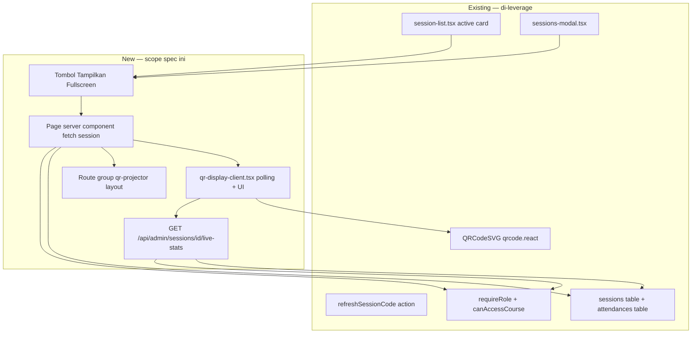
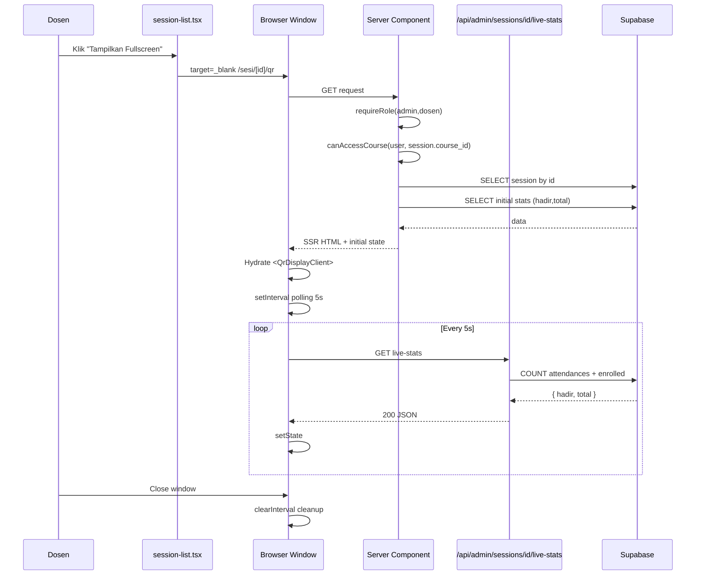
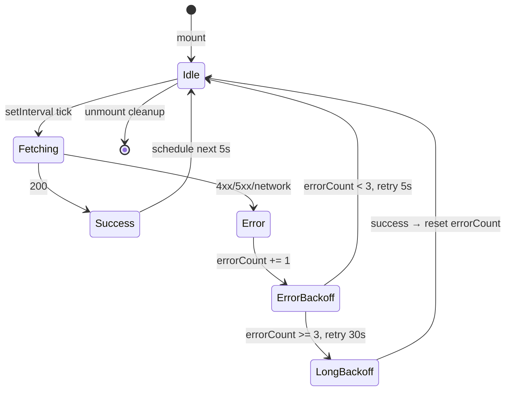

# Design Document: QR Display Fullscreen Web

> Mode presentasi fullscreen QR sesi presensi untuk projector kelas. Dosen colok laptop ke proyektor, klik tombol "Tampilkan Fullscreen" di card sesi aktif, browser buka window terpisah dengan QR 360px + OTP 88pt monospace + countdown bar gold + stats hadir/total live polling 5 detik. Reference visual: Slido / Kahoot / Mentimeter event projector mode.

## Overview

Saat ini QR sesi presensi hanya tampil **inline** di dua tempat:
- `app/(dashboard)/sesi/session-list.tsx` (active session card, QR size 160px)
- `app/(dashboard)/matakuliah/sessions-modal.tsx` (modal MK detail, QR size 180px)

Ukuran tersebut **tidak terbaca dari kursi mahasiswa belakang** saat dosen mengajar di ruang kelas dengan proyektor. Spec ini menambah **fullscreen presentation mode** dalam route terpisah `/sesi/[id]/qr` yang dibuka di window/tab baru, sehingga dosen bisa drag window itu ke layar proyektor sambil tetap punya kontrol di laptop primary.

Lingkup terbatas pada **visual + polling 5 detik untuk stats hadir/total**. Tidak menyentuh:
- QR rolling 5 detik dinamis (Phase 3 separate spec)
- Supabase Realtime (Phase C1 separate spec — bisa upgrade nanti)
- Activity feed siapa scan barusan (Phase B2 Live Monitor)
- Geofence ring visualization (Phase B2)

Effort estimasi: **2-3 jam**.

## Architecture

### Scope & Boundaries



### Decisions Table

| ID | Keputusan | Rasional |
|----|-----------|---------|
| D1 | **Route group `(qr-projector)/sesi/[id]/qr/page.tsx`** dengan `layout.tsx` minimal sendiri, BUKAN nested di `(dashboard)`. | Route `/sesi/[id]/qr` butuh layout fullscreen tanpa sidebar/topbar. Nested di `(dashboard)` akan inherit `app/(dashboard)/layout.tsx` yang punya wrapper sidebar. Route group baru memungkinkan layout terisolasi tanpa mengubah path URL. |
| D2 | **Payload QR tetap `{sid, code, exp}`** — reuse dari `session-list.tsx` line 407-410. | Mahasiswa scanner di mobile (`scan_qr_screen.dart`) sudah parse format ini. Mengubah payload = breaking change mobile. Spec ini UI-only di server side. |
| D3 | **Endpoint baru `GET /api/admin/sessions/[id]/live-stats`** — pattern admin namespace, BUKAN mobile. | Konsumer adalah dashboard web admin/dosen. `/api/mobile/*` namespace di-reserve untuk Bearer JWT auth dari Flutter app. Web SSR + cookie pakai auth pattern admin. Folder existing `app/api/admin/ai/` jadi precedent. |
| D4 | **Polling interval 5 detik** dengan **`AbortController` cleanup on unmount** + **exponential backoff** pada error consecutive 3x → 30 detik. | 5 detik = 12 req/menit per tab open. Tidak bombarding tapi cukup responsif. Backoff melindungi dari hot-loop saat network down. Cleanup mencegah memory leak saat dosen tutup window. |
| D5 | **Dark theme scope: inline Tailwind `dark` class pada root container `(qr-projector)/layout.tsx`** + custom CSS untuk gradient bg yang tidak bisa dicapai pure Tailwind. | JANGAN apply `dark` ke whole app — itu merusak `(dashboard)/*` yang light theme. Layout terisolasi via route group sudah memberi scope per-route. |
| D6 | **Countdown timer reuse pattern existing** (`session-list.tsx` line 109-138): `setInterval(1000ms)` recompute dari `new Date(session_code_expires_at).getTime() - Date.now()`. | Sudah battle-tested. Tidak ada motif untuk re-invent. Cleanup interval di unmount. |
| D7 | **Expired state UI**: tampilkan banner besar "Kode Sesi Sudah Expired" + tombol "Refresh Kode" yang trigger `refreshSessionCode` server action lalu re-fetch session. QR tetap visible tapi blur/dim 50% sampai refresh sukses. | Match flow existing `session-list.tsx` line 195-205. Dosen di kelas perlu refresh cepat tanpa keluar dari fullscreen mode. |
| D8 | **Error handling polling**: silent retry dengan backoff (D4). 401 → redirect ke `/login`. 403 → tampilkan banner "Tidak ada akses" + auto-close window after 3s. 5xx → tampilkan badge "Gagal sync" di stats area, tetap tampilkan stats terakhir cached. | Production-ready resilience. Dosen tidak boleh kehilangan QR display di tengah kelas karena flicker network. |
| D9 | **Rate limit endpoint stats: 60 req/menit per (user+session_id)**. Polling normal = 12 req/menit. Margin 5x untuk multiple windows / refresh manual. | In-memory `Map` pattern existing `attendance/submit/route.ts`. Sliding window 60s. |
| D10 | **Tombol "Tampilkan Fullscreen" di**: (a) `session-list.tsx` active session card, (b) `sessions-modal.tsx` active session card. **Format**: `<a href="/sesi/${id}/qr" target="_blank" rel="noopener noreferrer">` — bukan `window.open()` programmatic agar Ctrl+Click pengguna kompatibel (open in new tab). | Anchor-based open in new tab adalah pattern semantic-html. `noopener noreferrer` mencegah window.opener leak (security best practice). |
| D11 | **SEO/og: noindex meta** di route ini. | Halaman admin-only, tidak boleh ke-index search engine. Pakai `metadata: { robots: 'noindex,nofollow' }` di page.tsx. |
| D12 | **Page title** sesuai active session, mis. `"Pemrograman Web · Pertemuan 7 — QR Presensi"`. Membantu dosen identify window di Alt+Tab saat multi-tab. | UX kecil tapi penting saat dosen punya banyak tab terbuka. |
| D13 | **Stats query: 1 round-trip** — `SELECT COUNT(*) FILTER (WHERE attendances.session_id = $id AND status IN ('hadir', 'terlambat'))` + enrolled count via JOIN `enrollments` ON `course_id`. | Single query lebih cepat dari 2 separate queries. Postgres `FILTER` clause efisien. Index `attendances(session_id)` dan `enrollments(course_id)` sudah ada. |
| D14 | **Tidak ada activity feed** "siapa scan barusan" di QR display ini. | Defer ke Phase B2 Live Monitor yang butuh Realtime channel. Polling 5s per nama tidak scalable. |
| D15 | **Mobile responsive: TIDAK** — explicit non-goal. Asumsi viewport ≥1280px landscape (projector / monitor besar). Phone < 1280px boleh tampilkan banner "Buka di laptop untuk pengalaman terbaik" tapi konten tetap di-render fallback (degraded). | Match scope: ini fitur projector mode khusus, bukan all-device. |
| D16 | **Verifikasi gate**: `npm run type-check` exit 0, `npm run lint` clean. Smoke test manual oleh user (open di Chrome window 2, drag ke screen 2). | Sesuai rule `02-quality-debugging-verification.md`. |

### Library Compliance

| Aspect | Choice | Rule reference |
|--------|--------|----------------|
| QR rendering | `QRCodeSVG` from `qrcode.react` (existing) | `03-design-and-libraries.md` (lock) |
| Icons | `lucide-react` (existing) | `03-design-and-libraries.md` |
| Class merge | `clsx + tailwind-merge` (existing `cn()` util) | `10-web-conventions.md` |
| Toast / confirm | `@/lib/swal` (existing) | `03-design-and-libraries.md` |
| Auth | `requireRole` + `canAccessCourse` from `@/lib/auth-guard` | `10-web-conventions.md` |
| Bahasa | User-facing Bahasa Indonesia, identifier English | `03-design-and-libraries.md` |

### Sequence Diagrams

#### Dosen open fullscreen flow



#### Polling lifecycle with backoff



## Components and Interfaces

### Component 1: Layout `app/(qr-projector)/layout.tsx`

**Purpose**: Root layout untuk route group projector mode. Tanpa sidebar/topbar. Apply dark theme + base styling.

**Interface**:
```tsx
import type { Metadata } from 'next'
import './qr-projector.css'  // optional CSS file untuk gradient yang tidak achievable di Tailwind

export const metadata: Metadata = {
  robots: 'noindex, nofollow',
}

export default function QrProjectorLayout({
  children,
}: { children: React.ReactNode }) {
  return (
    <div className="qr-projector-root min-h-screen bg-[#050d1c] text-white">
      {children}
    </div>
  )
}
```

**Responsibilities**:
- Set `robots: noindex` metadata
- Provide dark gradient background base
- TIDAK render sidebar atau topbar
- TIDAK trigger middleware redirect (middleware.ts sudah cek auth via cookie)

### Component 2: Page `app/(qr-projector)/sesi/[id]/qr/page.tsx` (Server Component)

**Purpose**: Server-side auth + ownership check + initial data fetch + render client component.

**Interface**:
```tsx
import { notFound, redirect } from 'next/navigation'
import { requireRole, canAccessCourse } from '@/lib/auth-guard'
import { createAdminClient } from '@/lib/supabase/server'
import { QrDisplayClient } from './qr-display-client'
import type { Metadata } from 'next'

interface PageProps {
  params: Promise<{ id: string }>
}

export async function generateMetadata({ params }: PageProps): Promise<Metadata> {
  // Best-effort fetch untuk title — kalau gagal pakai fallback
  // ...
}

export default async function QrDisplayPage({ params }: PageProps) {
  const { id } = await params
  const user = await requireRole(['admin', 'dosen'])
  const supabase = createAdminClient()

  // Fetch session + course + dosen info
  const { data: session, error } = await supabase
    .from('sessions')
    .select(`
      id, course_id, session_number, topic, mode,
      session_code, session_code_expires_at,
      is_active, started_at,
      course:courses!sessions_course_id_fkey(
        code, name,
        dosen:profiles!courses_dosen_id_fkey(full_name)
      )
    `)
    .eq('id', id)
    .single()

  if (error || !session) notFound()

  // Ownership check (kalau dosen)
  const allowed = await canAccessCourse(user.id, user.role, session.course_id)
  if (!allowed) redirect('/sesi?error=no-access')

  // Fetch initial stats (1 query, will be re-fetched by client polling)
  const initialStats = await fetchInitialStats(supabase, session.id, session.course_id)

  return (
    <QrDisplayClient
      sessionId={session.id}
      sessionCode={session.session_code}
      sessionCodeExpiresAt={session.session_code_expires_at}
      sessionNumber={session.session_number}
      topic={session.topic}
      mode={session.mode}
      isActive={session.is_active}
      courseCode={course.code}
      courseName={course.name}
      dosenName={dosen.full_name}
      initialStats={initialStats}
    />
  )
}
```

**Responsibilities**:
- Auth gate via `requireRole`
- Ownership gate via `canAccessCourse`
- Fetch session + course + dosen via single JOIN query
- Fetch initial stats untuk avoid loading flash di client mount
- Pass everything as props ke client component
- Generate metadata title sesuai MK

### Component 3: Client `qr-display-client.tsx` (Client Component)

**Purpose**: Interactive UI — countdown, polling, fullscreen presentation.

**Interface (props + sub-widgets)**:

```tsx
'use client'

interface QrDisplayClientProps {
  sessionId: string
  sessionCode: string | null
  sessionCodeExpiresAt: string | null
  sessionNumber: number
  topic: string | null
  mode: string  // 'offline' | 'online'
  isActive: boolean
  courseCode: string
  courseName: string
  dosenName: string | null
  initialStats: { hadir: number; total: number }
}

interface LiveStats { hadir: number; total: number }
type PollState = 'idle' | 'fetching' | 'success' | 'error'

export function QrDisplayClient(props: QrDisplayClientProps): JSX.Element

// Sub-components (private)
function PresTopbar({ courseName, courseCode }: { ... }): JSX.Element  // brand + status pill + close button
function MkHeader({ courseName, courseCode, dosenName, sessionNumber }: { ... }): JSX.Element
function QrCard({ qrPayload }: { qrPayload: string }): JSX.Element  // 360px white card with gold glow
function OtpBlock({ code, countdownSec }: { code: string; countdownSec: number }): JSX.Element  // 88pt mono + countdown bar
function InstructionList(): JSX.Element  // 1-2-3 numbered instructions
function PresProgress({ stats, pollState }: { ... }): JSX.Element  // bottom strip with hadir/total + progress bar
function ExpiredOverlay({ onRefresh }: { ... }): JSX.Element  // full overlay saat code expired
```

**Responsibilities**:
- Countdown timer setInterval 1s, recompute dari `expiresAt - now`
- Polling interval 5s ke `/api/admin/sessions/[id]/live-stats`
- AbortController cleanup on unmount
- Exponential backoff on consecutive errors
- Refresh code button → call `refreshSessionCode` server action → re-fetch session
- Render expired overlay saat countdown hits 0

### Component 4: API `app/api/admin/sessions/[id]/live-stats/route.ts`

**Purpose**: Endpoint live stats untuk polling — return hadir count + total enrolled.

**Interface**:

```typescript
// Request: GET /api/admin/sessions/[id]/live-stats
// Auth: cookie session (web SSR / authenticated)
// Response 200: { hadir: number, total: number }
// Response 401: { error: 'Tidak terautentikasi' }
// Response 403: { error: 'Tidak ada akses ke sesi ini' }
// Response 404: { error: 'Sesi tidak ditemukan' }
// Response 429: { error: 'Terlalu banyak permintaan' }
// Response 500: { error: 'Gagal mengambil statistik' }

import { NextRequest, NextResponse } from 'next/server'
import { requireRole, canAccessCourse } from '@/lib/auth-guard'
import { createAdminClient } from '@/lib/supabase/server'

const rateLimitMap = new Map<string, number[]>()
const RL_CONFIG = { windowMs: 60_000, max: 60 }

interface RouteCtx { params: Promise<{ id: string }> }

export async function GET(req: NextRequest, ctx: RouteCtx): Promise<NextResponse>
```

**Algorithm**:
1. `requireRole(['admin','dosen'])` — 401 fast-fail
2. Rate limit per `(user.id + session_id)` — 429 if over
3. Fetch session.course_id (single field) untuk ownership check
4. `canAccessCourse(user.id, user.role, course_id)` — 403 if not owner
5. Parallel: count attendances WHERE session_id AND status IN ('hadir','terlambat') + count enrollments WHERE course_id
6. Return `{ hadir, total }`

## Data Models

Tidak ada model DB baru. Reuse:
- `sessions` table (existing)
- `attendances` table (existing) — query `status IN ('hadir', 'terlambat')` count
- `enrollments` table (existing) — query `course_id` count
- `courses` table (existing) — JOIN untuk display
- `profiles` table (existing) — JOIN untuk dosen name

**Stats validation**:
| Field | Rule |
|-------|------|
| `hadir` | Integer ≥ 0, ≤ total |
| `total` | Integer ≥ 0 (mahasiswa enrolled di MK ini) |

## Algorithmic Pseudocode

### Algorithm 1: Countdown Calculation

```pascal
ALGORITHM computeCountdown(expiresAt)
INPUT: expiresAt: ISO 8601 string | null
OUTPUT: secondsRemaining: int (0 if expired or null)

PRECONDITIONS:
  - System clock reasonably accurate (±5s of server)

POSTCONDITIONS:
  - Result ≥ 0
  - Result = 0 implies QR expired (UI should show ExpiredOverlay)

BEGIN
  IF expiresAt = null THEN RETURN 0
  TRY
    expireMs ← parseISOToMillis(expiresAt)
    nowMs ← Date.now()
    diffMs ← expireMs - nowMs
    RETURN max(0, floor(diffMs / 1000))
  CATCH
    RETURN 0
  END TRY
END
```

### Algorithm 2: Polling Lifecycle with Backoff

```pascal
ALGORITHM pollingLifecycle(sessionId, onSuccess, onError)
STATE:
  controller ← null  // AbortController
  errorCount ← 0
  intervalHandle ← null
  isMounted ← true

ON_MOUNT:
  scheduleNextPoll(5000)

ON_UNMOUNT:
  isMounted ← false
  IF intervalHandle ≠ null THEN clearTimeout(intervalHandle)
  IF controller ≠ null THEN controller.abort()

PROCEDURE scheduleNextPoll(delayMs):
  IF NOT isMounted THEN RETURN
  intervalHandle ← setTimeout(executePoll, delayMs)

PROCEDURE executePoll:
  IF NOT isMounted THEN RETURN
  controller ← new AbortController()
  TRY
    response ← fetch(`/api/admin/sessions/${sessionId}/live-stats`,
                     { signal: controller.signal })
    IF response.ok THEN
      data ← await response.json()
      onSuccess(data)
      errorCount ← 0
      scheduleNextPoll(5000)
    ELSE IF response.status = 401 THEN
      // session expired — redirect to login
      window.location.href = '/login'
      RETURN
    ELSE IF response.status = 403 THEN
      onError('Tidak ada akses ke sesi ini')
      // stop polling permanently
      RETURN
    ELSE
      throwError(response.status)
    END IF
  CATCH error:
    IF error.name = 'AbortError' THEN RETURN  // expected on unmount
    errorCount ← errorCount + 1
    IF errorCount >= 3 THEN
      onError('Sync terganggu, akan retry 30 detik')
      scheduleNextPoll(30_000)
    ELSE
      scheduleNextPoll(5_000)
    END IF
  END TRY
END
```

### Algorithm 3: Live Stats Query (Server)

```pascal
ALGORITHM fetchLiveStats(sessionId, courseId)
INPUT: sessionId: UUID, courseId: UUID
OUTPUT: { hadir: int, total: int }

PRECONDITIONS:
  - Auth + ownership already verified upstream
  - sessionId exists
  - createAdminClient available

POSTCONDITIONS:
  - hadir + (sisa internal) = total enrolled (kalau hadir == total maka semua sudah scan)
  - hadir count includes both 'hadir' and 'terlambat' status (both = sudah hadir di kelas)

BEGIN
  [hadirRes, totalRes] ← Promise.all([
    supabase.from('attendances')
      .select('id', { count: 'exact', head: true })
      .eq('session_id', sessionId)
      .in('status', ['hadir', 'terlambat']),

    supabase.from('enrollments')
      .select('id', { count: 'exact', head: true })
      .eq('course_id', courseId),
  ])

  RETURN {
    hadir: hadirRes.count ?? 0,
    total: totalRes.count ?? 0,
  }
END
```

## Correctness Properties

> Properties bersifat campuran EXAMPLE / SMOKE / PBT-eligible. Mayoritas verifikasi via static analysis + manual smoke test.

### Property 1: Countdown Monotonicity

*For any* `expiresAt` ISO string and *any* sequence of `now < expiresAt` timestamps `t1 < t2`, `computeCountdown(expiresAt)` evaluated at `t2` is ≤ value at `t1`. (Countdown never increases between calls).

**Validates: Requirements 8.1, 8.2**

### Property 2: Stats Range

*For any* `LiveStats` returned by `/live-stats` endpoint, `0 ≤ hadir ≤ total` AND `total ≥ 0`.

**Validates: Requirements 12.4**

### Property 3: Polling Termination

*Whenever* the client component unmounts, all `setTimeout` handles are cleared AND any in-flight fetch is aborted via `AbortController`. After unmount + 1 second, no further `onSuccess` / `onError` callbacks fire.

**Validates: Requirements 11.5, 11.6**

### Property 4: Auth Gate Hardness

*Any* unauthenticated request to `GET /api/admin/sessions/[id]/live-stats` returns 401 (never 200 with data, never 500). *Any* dosen request to a session whose course is not theirs returns 403 (never 200, never silent leak).

**Validates: Requirements 14.1, 14.2, 14.3**

### Property 5: Rate Limit Honesty

*If* request count for `(user_id, session_id)` exceeds 60 within 60 seconds, *then* subsequent requests within the window return 429 with no DB query executed (rate limit checked before DB call).

**Validates: Requirements 14.5**

## Error Handling

### Scenario 1: Session not found / deleted while window open

**Condition**: User open window, dosen lain delete sesi via /sesi page.
**Response**: Polling akan return 404 dari endpoint. Client tampilkan banner "Sesi sudah dihapus" + auto-close window after 3 detik.
**Recovery**: User buka /sesi page untuk verifikasi.

### Scenario 2: Network down between dosen laptop dan internet

**Condition**: WiFi proyektor/laptop putus.
**Response**: Polling fail dengan AbortError atau network error. Backoff: 3 fail → wait 30s. Tampilkan badge "Gagal sync" di stats area, tapi QR + OTP tetap visible (dari prop SSR initial). Last-known stats tetap di-display.
**Recovery**: Saat network kembali, polling auto-retry sukses → badge hilang, stats update.

### Scenario 3: Session_code expired (countdown hits 0)

**Condition**: Countdown 00:00.
**Response**: Tampilkan `ExpiredOverlay` overlay penuh dengan judul "Kode Sesi Sudah Expired" + tombol pill primary "Refresh Kode". QR di-blur 50% di belakang.
**Recovery**: Klik tombol → call `refreshSessionCode` server action → re-fetch session via `router.refresh()` → countdown reset ke 3 menit baru.

### Scenario 4: User unauthorized (403)

**Condition**: Dosen B buka URL `/sesi/<id-MK-Dosen-A>/qr` direct.
**Response**: Server component check `canAccessCourse` fail → redirect ke `/sesi?error=no-access`. Tidak pernah render UI.
**Recovery**: User kembali ke daftar sesi mereka.

### Scenario 5: User unauthenticated (401) saat polling running

**Condition**: Cookie session expired di tengah polling (mis. token Supabase auth refresh fail).
**Response**: Polling next tick return 401. Client `window.location.href = '/login'`.
**Recovery**: User login ulang, kembali manual.

### Scenario 6: Mahasiswa scan saat code expired (race)

**Condition**: Code expired di t=0, mahasiswa A scan di t=-1 detik tapi server process di t=+1 detik.
**Response**: BUKAN concern QR Display ini — itu logic `attendance/submit/route.ts` yang sudah validate `expires_at`. QR Display cuma tampilkan, tidak gating submit.

### Scenario 7: Dosen tutup window paksa saat fetching

**Condition**: Klik X tab di tengah HTTP fetch.
**Response**: AbortController abort signal → fetch reject → catch block detect `AbortError` → no-op (no error toast). Memory cleanup via interval clear di unmount.

## Testing Strategy

### Unit Testing
- `computeCountdown` pure function — kandidat unit test ringan, tapi karena algoritmanya sederhana saya ranking ini optional.
- Stats query: integration-level, perlu Supabase test instance — skip untuk sekarang, manual test cukup.

### Property-Based Testing
PBT untuk `computeCountdown` mungkin (Property 1: monotonicity). Marked optional `*` di tasks.md.

### Integration Testing
Tidak ada automated integration test direncanakan. Manual smoke test oleh user (lihat task 4.1 di tasks.md).

### Manual Smoke Test
- Login dosen di Chrome → buka /sesi → klik tombol Tampilkan Fullscreen
- Verify: window baru terbuka di tab baru, URL `/sesi/[id]/qr`
- Verify visual: QR 360px tampil center, OTP 88pt mono, countdown bar gold, stats hadir/total muncul
- Wait 5 detik → verify polling: stats query muncul di Network tab Chrome DevTools
- Mahasiswa demo scan QR di HP → verify hadir count naik di stats area dalam 5 detik
- Diamkan sampai countdown 00:00 → verify expired overlay muncul + tombol Refresh Kode
- Klik Refresh Kode → verify countdown reset, polling resume
- Tutup window → verify Network tab di Chrome no more requests (cleanup berhasil)
- Login mahasiswa di Chrome lain → akses URL `/sesi/[id]/qr` direct → verify redirect/blocked (auth gate)

## Performance Considerations

- **Polling**: 1 request per 5 detik per window open. Dengan 10 dosen open simultan = 2 req/detik total. Postgres bisa handle dengan index existing.
- **Single query stats**: `Promise.all` untuk 2 count queries paralel. P95 < 100ms expected dengan FK index.
- **AbortController cleanup**: Memory tidak leak saat banyak open/close window.
- **Backoff exponential**: Network down tidak hot-loop bombarding endpoint.
- **Initial stats di SSR**: Avoid loading flash di first paint. Mahasiswa di kelas langsung lihat angka, bukan `--/--`.
- **Animation shimmer di progress bar**: CSS `@keyframes shimmer` 2s linear infinite — light, GPU-accelerated.

## Security Considerations

- **Auth gate at server**: `requireRole` + `canAccessCourse` di `page.tsx` AND di endpoint `/live-stats`. Defense in depth — kalau salah satu bocor, lainnya tahan.
- **No session_code in URL**: URL pattern `/sesi/[id]/qr` — `[id]` adalah session UUID, BUKAN session_code. Cookie auth gate akses.
- **No session_code in log**: Server component fetch tidak `console.log` session. Endpoint live-stats tidak return session_code.
- **`noindex,nofollow`**: meta robots mencegah search engine indexing URL admin.
- **`target="_blank" rel="noopener noreferrer"`**: Mencegah `window.opener` injection attack.
- **Rate limit**: Mencegah polling abuse atau DDoS endpoint stats.
- **`createAdminClient` di server only**: Tidak pernah expose service_role ke client.
- **Error message sanitization**: 500 error tidak expose stack trace atau Supabase error message ke client.

## Dependencies

**Tidak ada dependency baru.** Semua existing:
- `qrcode.react` (existing)
- `lucide-react` (existing)
- `clsx + tailwind-merge` (existing)
- `@supabase/ssr + @supabase/supabase-js` (existing)
- `next 14.2.35` (existing)
- `react 18.3.1` (existing)

## Migration Plan & Rollback

### Order of Implementation
1. **Endpoint `/api/admin/sessions/[id]/live-stats`** — paling prerequisite, frontend butuh
2. **Layout `(qr-projector)/layout.tsx`** + **page `(qr-projector)/sesi/[id]/qr/page.tsx`**
3. **Client `qr-display-client.tsx`** — interactive UI
4. **Wiring tombol Tampilkan Fullscreen** di `session-list.tsx` dan `sessions-modal.tsx`
5. **Verification**: type-check + lint
6. **Manual smoke test** — user

### Rollback Strategy
Per file via git:
- Backend endpoint baru — `git rm app/api/admin/sessions/[id]/live-stats/route.ts`
- Layout + page baru — `git rm -r app/(qr-projector)/`
- Tombol Tampilkan Fullscreen — `git checkout HEAD~1 -- app/(dashboard)/sesi/session-list.tsx app/(dashboard)/matakuliah/sessions-modal.tsx`

Tidak ada migration DB, tidak ada perubahan model, jadi rollback aman.

### Compatibility & Versioning

- `package.json` version tidak naik — UI feature bukan breaking change.
- Tidak ada perubahan API mobile (`/api/mobile/*` not touched).
- Tidak ada perubahan QR payload (`{sid, code, exp}` reused as-is).
- CHANGELOG dapat 1 entry `[ADD]` per file baru.
