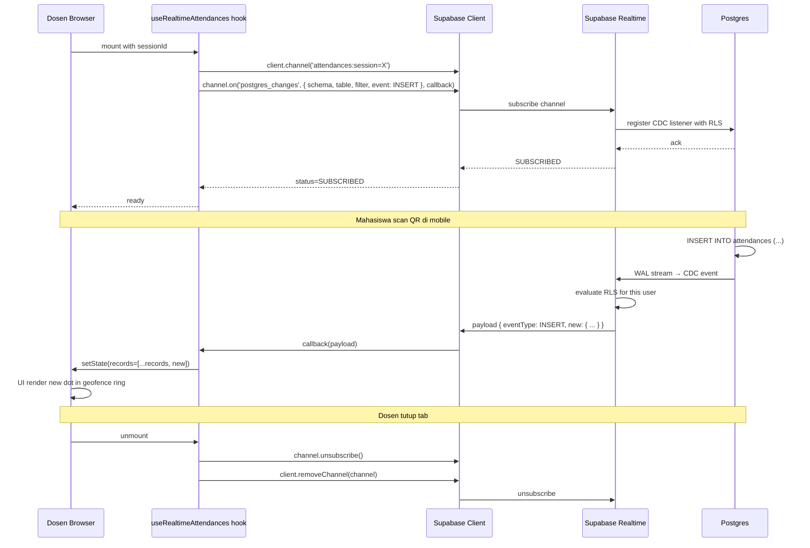

# Design Document: Supabase Realtime — Attendances Channel

> Phase C1: Setup Supabase Realtime channel untuk tabel `attendances` agar dashboard web (dosen/admin) bisa subscribe perubahan kehadiran tanpa polling. Prerequisite untuk **Live Monitor** (Phase B2) dan upgrade path untuk **QR Display Fullscreen** (Phase B1, sekarang masih polling 5s).

## Overview

Saat ini semua web client polling endpoint untuk live data:
- QR Display Fullscreen: polling `/api/admin/sessions/[id]/live-stats` setiap 5 detik
- Dashboard dosen `recent-activity-feed.tsx`: polling endpoint dashboard

Polling efektif untuk demo PBL tapi **bukan true real-time** — ada lag 5 detik antara mahasiswa scan QR dan UI update di laptop dosen. Untuk fitur showcase **Live Monitor** (geofence ring dengan dot mahasiswa bergerak masuk satu per satu) + project portfolio yang aspirasinya production-grade, polling = tech debt.

**Solusi**: Setup Supabase Realtime channel untuk tabel `attendances`. Web client subscribe via Postgres Changes (CDC) → update UI dalam <500ms saat ada INSERT baru.

Effort estimasi: **4-6 jam**.

## Architecture

### Scope & Boundaries

```mermaid
graph TD
    subgraph "Existing — di-leverage"
        E1[attendances table + RLS policy]
        E2[createClient browser @supabase/ssr]
        E3[/api/admin/sessions/id/live-stats polling endpoint]
    end

    subgraph "New — scope spec ini"
        N1[Migration enable Realtime publication]
        N2[Hook useRealtimeAttendances]
        N3[Type definitions RealtimeAttendanceEvent]
        N4[Reusable provider/store optional]
    end

    subgraph "Consumers — masa depan"
        C1[Live Monitor screen Phase B2]
        C2[QR Display upgrade dari polling]
        C3[Dashboard dosen activity feed real-time]
    end

    N1 -->|enable cdc| E1
    N2 -->|consume| N1
    N2 -->|use client| E2
    N2 --> C1
    N2 --> C2
    N2 --> C3
    E3 -->|nanti deprecated| C2
```

### Decisions Table

| ID | Keputusan | Rasional |
|----|-----------|---------|
| D1 | **Channel scope = tabel `attendances` saja** (bukan multi-table broadcast). | Scope kontrol — Live Monitor butuh ini saja. Tabel lain (`sessions`, `leave_requests`) tidak realtime untuk sekarang — mereka punya UI yang sudah cukup dengan refresh manual. |
| D2 | **Subscription pattern: filter per-session_id**, BUKAN subscribe semua row. Format channel name: `attendances:session=${sessionId}`. | Mahasiswa di MK lain tidak relevan untuk dosen yang lagi pantau sesi spesifik. Filter di RLS + filter di subscription params = double layer security + performance (lebih sedikit messages). |
| D3 | **Event types yang di-listen: `INSERT` saja** untuk MVP. UPDATE dan DELETE tidak relevan (mahasiswa tidak edit attendance, hanya insert sekali). | Reduce noise. Kalau nanti ada use case UPDATE (mis. dosen ubah status manual), tinggal extend hook. |
| D4 | **RLS reuse existing policy** "View own or all if admin/dosen" di `attendances`. Realtime patuh RLS — dosen B yang subscribe channel sesi MK Dosen A tidak akan dapat events. | Defense in depth tanpa setup baru. Migration cukup enable publication, policy sudah handle. |
| D5 | **Migration: `ALTER PUBLICATION supabase_realtime ADD TABLE public.attendances`** + verifikasi `REPLICA IDENTITY FULL` (default), agar payload event include row lengkap. | Standar Supabase setup untuk Realtime. Tanpa ini, `supabase.channel().on('postgres_changes', ...)` tidak akan menerima event. |
| D6 | **Client API: custom hook `useRealtimeAttendances(sessionId, callback)`** di `mypresensi-web/app/lib/realtime/use-realtime-attendances.ts` (atau sub-folder serupa). Reusable across Live Monitor + QR Display + future. | Encapsulasi: subscribe + unsubscribe + reconnect logic + payload typing. Consumer cuma panggil hook + callback `onInsert(record)`. |
| D7 | **Reconnect strategy**: rely on Supabase JS client built-in reconnect (`broadcast.ack: true`, `presence.key: undefined`). Tambah manual `channel.subscribe((status) => ...)` callback untuk surface status ke UI. | Supabase client sudah handle exponential backoff reconnect. Kita cukup expose status `'SUBSCRIBED' | 'CHANNEL_ERROR' | 'TIMED_OUT' | 'CLOSED'` ke caller untuk UI badge "Sync aktif"/"Reconnecting". |
| D8 | **Auth context untuk channel**: pakai cookie session yang sudah aktif di browser. `createClient()` dari `@supabase/ssr` browser client otomatis attach JWT user ke channel — RLS policy `(SELECT auth.uid())` evaluate ke user aktif. | Tidak butuh setup khusus. Yang penting: pastikan tab browser user sudah login (cookie set). Mahasiswa atau anon yang akses channel akan ditolak RLS. |
| D9 | **Type definitions**: `RealtimeAttendanceEvent` interface + `AttendanceRow` payload typing. Tempat: `mypresensi-web/app/types/realtime.ts` baru. | TypeScript strict — payload Postgres Changes by default `unknown`, perlu narrow. |
| D10 | **Cleanup hook unmount**: `channel.unsubscribe()` + `client.removeChannel(channel)` di useEffect return. | Mencegah ghost subscriptions, memory leak, billing usage Supabase Realtime free tier (200 concurrent connections). |
| D11 | **Throttling at hook layer (optional, deferred)**: kalau ada use case `UPDATE` flood (mis. position update tracking), tambah throttle 100ms. Untuk INSERT-only sekarang skip. | YAGNI. Akan revisit saat butuh. |
| D12 | **Verifikasi via MCP Supabase**: `mcp0_apply_migration` untuk migration baru, `mcp0_get_advisors security` 0 issue baru. | Sesuai rule `14-web-supabase-patterns.md` Section G. |
| D13 | **Demo / manual test**: setup 2 browser windows. Window A = dosen di /sesi/[id]/qr (atau page baru `/realtime-test` minimal kalau Live Monitor belum dibuat). Window B = mahasiswa scan QR di mobile emulator. Verify Window A receive event dalam <2 detik tanpa refresh. | Smoke test khas Realtime: mata-vs-mata observation. |
| D14 | **Tidak include presence atau broadcast** di scope spec ini. Hanya Postgres Changes. | Presence (siapa online) dan broadcast (custom messages) berguna untuk fitur lain (chat, collaborative). Untuk Live Monitor cukup Postgres Changes. |
| D15 | **Backward compat**: polling endpoint `/live-stats` tetap ada untuk gracefull fallback kalau Realtime fail. Hook akan return status — caller bisa fallback ke polling kalau status `CHANNEL_ERROR`. | Production resilience. Realtime free tier kadang flaky — fallback polling bagus untuk reliability. |
| D16 | **Verifikasi gate**: migration apply OK + advisor 0 issue baru + `npm run type-check` exit 0 + `npm run lint` clean + manual smoke test. | Sesuai rule `02-quality-debugging-verification.md`. |

### Library Compliance

| Aspect | Choice | Rule reference |
|--------|--------|----------------|
| Realtime client | `@supabase/supabase-js` (already installed via `@supabase/ssr`) | `03-design-and-libraries.md` |
| Type | TypeScript strict, narrow payload via interface | `10-web-conventions.md` |
| File location | `app/lib/realtime/` (new folder) | `10-web-conventions.md` (lib utilities) |

### Sequence Diagram

#### Subscribe Flow



## Components and Interfaces

### Component 1: Migration `021_enable_realtime_attendances.sql`

**Purpose**: Enable Realtime publication untuk tabel attendances.

**Interface**: SQL DDL
```sql
-- Add attendances ke publication supabase_realtime
ALTER PUBLICATION supabase_realtime ADD TABLE public.attendances;

-- Verify REPLICA IDENTITY (default FULL untuk tabel dengan PRIMARY KEY)
-- Optional: explicit untuk safety
ALTER TABLE public.attendances REPLICA IDENTITY FULL;
```

**Idempotent check**:
```sql
-- Sebelum ADD, cek apakah sudah ada
DO $$
BEGIN
  IF NOT EXISTS (
    SELECT 1 FROM pg_publication_tables
    WHERE pubname = 'supabase_realtime'
      AND schemaname = 'public'
      AND tablename = 'attendances'
  ) THEN
    ALTER PUBLICATION supabase_realtime ADD TABLE public.attendances;
  END IF;
END $$;
```

### Component 2: Type definitions `app/types/realtime.ts`

**Purpose**: Type-safe payload untuk consumer.

**Interface**:
```typescript
import type { RealtimePostgresChangesPayload } from '@supabase/supabase-js'

/**
 * Row attendance dari Postgres Changes payload.
 * Match schema tabel attendances (lihat database.ts untuk full row).
 */
export interface RealtimeAttendanceRow {
  id: string
  session_id: string
  student_id: string
  status: string  // 'hadir' | 'terlambat' | 'izin' | 'sakit' | 'alpa'
  scanned_at: string  // ISO 8601
  student_lat: number | null
  student_lng: number | null
  distance_meters: number | null
  is_location_valid: boolean | null
  is_mock_location: boolean | null
  face_confidence: number | null
  is_face_matched: boolean | null
  device_model: string | null
  device_os: string | null
  ip_address: string | null
  created_at: string
}

export type RealtimeAttendancePayload =
  RealtimePostgresChangesPayload<RealtimeAttendanceRow>

export type RealtimeChannelStatus =
  | 'SUBSCRIBED'
  | 'CHANNEL_ERROR'
  | 'TIMED_OUT'
  | 'CLOSED'
  | 'CONNECTING'

export interface UseRealtimeAttendancesOptions {
  /** Session ID untuk filter — channel akan filter `session_id = sessionId` */
  sessionId: string

  /** Callback saat ada INSERT baru. New row ada di payload.new */
  onInsert: (row: RealtimeAttendanceRow) => void

  /** Callback opsional saat status channel berubah */
  onStatusChange?: (status: RealtimeChannelStatus) => void

  /** Auto-disable jika false. Default: true. */
  enabled?: boolean
}
```

### Component 3: Hook `app/lib/realtime/use-realtime-attendances.ts`

**Purpose**: React hook reusable untuk subscribe channel attendances filtered by session.

**Interface**:
```typescript
'use client'

import { useEffect, useRef } from 'react'
import { createClient } from '@/lib/supabase/client'
import type {
  UseRealtimeAttendancesOptions,
  RealtimeAttendanceRow,
  RealtimeChannelStatus,
} from '@/types/realtime'

export function useRealtimeAttendances(opts: UseRealtimeAttendancesOptions): void
```

**Implementation skeleton**:
```typescript
export function useRealtimeAttendances({
  sessionId,
  onInsert,
  onStatusChange,
  enabled = true,
}: UseRealtimeAttendancesOptions): void {
  // Refs untuk avoid stale closure di callback
  const onInsertRef = useRef(onInsert)
  const onStatusChangeRef = useRef(onStatusChange)
  useEffect(() => { onInsertRef.current = onInsert }, [onInsert])
  useEffect(() => { onStatusChangeRef.current = onStatusChange }, [onStatusChange])

  useEffect(() => {
    if (!enabled || !sessionId) return

    const supabase = createClient()
    const channel = supabase.channel(`attendances:session=${sessionId}`)
      .on(
        'postgres_changes',
        {
          event: 'INSERT',
          schema: 'public',
          table: 'attendances',
          filter: `session_id=eq.${sessionId}`,
        },
        (payload) => {
          const row = payload.new as RealtimeAttendanceRow
          onInsertRef.current(row)
        }
      )
      .subscribe((status) => {
        onStatusChangeRef.current?.(status as RealtimeChannelStatus)
      })

    return () => {
      channel.unsubscribe()
      supabase.removeChannel(channel)
    }
  }, [sessionId, enabled])
}
```

**Responsibilities**:
- Subscribe channel pada mount, unsubscribe pada unmount
- Avoid stale closure via refs — callback bisa update tanpa re-subscribe
- Filter server-side via Postgres `filter` syntax
- Surface status ke caller untuk UI badge

### Component 4 (optional): Demo test page `app/(dashboard)/realtime-test/page.tsx`

**Purpose**: Manual smoke test page — dosen buka, mahasiswa scan QR di mobile, observe row baru muncul.

**Status**: optional — boleh skip kalau Live Monitor (Phase B2) langsung dikerjakan setelahnya.

## Data Models

Tidak ada model DB baru. Reuse:
- `attendances` table (existing) — schema lihat `app/types/database.ts`
- RLS policy "View own or all if admin/dosen" (existing migration 012)

**Validation**: payload dari Postgres Changes by default unknown. Hook narrow ke `RealtimeAttendanceRow` interface (manual cast — tidak ada runtime validation karena overhead vs trust schema match).

## Algorithmic Pseudocode

### Algorithm 1: Channel Subscribe Lifecycle

```pascal
ALGORITHM useRealtimeAttendancesEffect(sessionId, enabled, callbacks)
INPUT: sessionId: UUID, enabled: bool, callbacks: { onInsert, onStatusChange }
OUTPUT: cleanup function

STATE:
  channel: RealtimeChannel | null
  client: SupabaseClient

PRECONDITIONS:
  - User logged in (cookie active) — channel subscribe akan fail otherwise
  - Browser support WebSocket (modern browsers, OK)
  - sessionId valid UUID

POSTCONDITIONS:
  - Channel subscribed jika enabled && sessionId
  - Cleanup function dipanggil saat dependencies berubah atau unmount
  - Memory hygiene: tidak ada ghost channel setelah cleanup

BEGIN
  IF NOT enabled OR sessionId is null THEN
    RETURN noop cleanup
  END IF

  client ← createClient()
  channel ← client.channel(`attendances:session=${sessionId}`)
    .on('postgres_changes', {
        event: 'INSERT',
        schema: 'public',
        table: 'attendances',
        filter: `session_id=eq.${sessionId}`,
      }, payload → callbacks.onInsert(payload.new))
    .subscribe(status → callbacks.onStatusChange?.(status))

  RETURN () → {
    channel.unsubscribe()
    client.removeChannel(channel)
  }
END
```

### Algorithm 2: RLS Evaluation (Server-side, internal Supabase)

```pascal
ALGORITHM evaluateRealtimeRLS(userId, role, eventRow)
INPUT: userId: UUID (from JWT), role: string, eventRow: AttendanceRow
OUTPUT: bool (allow event delivery)

PRECONDITIONS:
  - JWT terverified upstream by Supabase Realtime gateway
  - Existing RLS policy "View own or all if admin/dosen" sudah aktif

POSTCONDITIONS:
  - Mahasiswa hanya terima event untuk attendance miliknya sendiri
  - Dosen / admin terima event untuk semua attendance dalam scope SELECT mereka

BEGIN
  // RLS policy 012 USING clause:
  // (auth.uid() = student_id)
  // OR EXISTS (
  //   SELECT 1 FROM profiles
  //   WHERE id = auth.uid() AND role IN ('admin', 'dosen')
  // )

  IF userId = eventRow.student_id THEN RETURN true
  IF role IN {'admin', 'dosen'} THEN RETURN true
  RETURN false
END
```

## Correctness Properties

### Property 1: Subscribe-Unsubscribe Symmetry

*For every* mount of `useRealtimeAttendances` with `enabled=true && sessionId≠null`, the cleanup function eventually calls `channel.unsubscribe()` AND `client.removeChannel(channel)` exactly once. After unmount, no further `onInsert` callbacks fire.

**Validates: Requirements 5.1, 5.4**

### Property 2: Filter Correctness

*For any* INSERT event payload received by hook, `payload.new.session_id === sessionId` (the channel filter excludes other sessions server-side).

**Validates: Requirements 4.3**

### Property 3: RLS Hardness

*Any* INSERT to `attendances` table whose row would NOT pass RLS SELECT policy for the subscribed user MUST NOT be delivered as event to that user's channel. (Verified: dosen B subscribe channel of session in MK Dosen A → tidak terima event apapun.)

**Validates: Requirements 6.1, 6.2**

### Property 4: Status Lifecycle Order

*Channel status* sequence selalu: `CONNECTING → SUBSCRIBED` (success path) atau `CONNECTING → CHANNEL_ERROR` atau `CONNECTING → TIMED_OUT` (fail paths). Setelah `SUBSCRIBED`, kemungkinan transisi ke `CLOSED` (manual unsubscribe) atau `CHANNEL_ERROR` (network drop). Status TIDAK pernah jump dari `SUBSCRIBED` langsung ke `CONNECTING` tanpa lewat `CHANNEL_ERROR` atau `CLOSED`.

**Validates: Requirements 7.1, 7.2**

### Property 5: Stale Closure Resistance

*Calling* `useRealtimeAttendances` with same `sessionId` but updated `onInsert` callback (e.g. callback closure has fresh state) MUST invoke the latest callback for new events. Channel TIDAK re-subscribe just because callback identity changed.

**Validates: Requirements 8.2**

## Error Handling

### Scenario 1: User belum login (no cookie)

**Condition**: Hook dipanggil di page yang lupa redirect login.
**Response**: `subscribe` callback receive status `CHANNEL_ERROR` (RLS reject — tidak ada `auth.uid()`). Caller via `onStatusChange` bisa show banner "Sesi tidak aktif, login ulang".
**Recovery**: Caller redirect ke `/login`.

### Scenario 2: WebSocket connection drop (network blip)

**Condition**: WiFi flicker.
**Response**: Supabase client built-in reconnect — sequence: `SUBSCRIBED → CHANNEL_ERROR → CONNECTING → SUBSCRIBED`. UI badge berubah otomatis.
**Recovery**: Otomatis. Events selama disconnect TIDAK delivered (CDC tidak buffer untuk channel down) — ini limitation. Caller bisa fallback ke fetch ulang full state setelah reconnect.

### Scenario 3: RLS deny untuk dosen lain

**Condition**: Dosen B coba akses `/sesi/<id-MK-A>/qr` direct, ownership gate sudah block di server, tapi misal somehow sampai client.
**Response**: Realtime subscribe akan SUBSCRIBED (RLS evaluate per-event, bukan per-channel), tapi semua event INSERT akan gagal RLS check → tidak terima.
**Recovery**: Tidak ada — by design. Kalau dosen B somehow open page, dia subscribe tapi tidak dapat data (UI kosong).

### Scenario 4: Migration apply fail

**Condition**: `ALTER PUBLICATION` fail karena table tidak ada (dropped) atau permission denied.
**Response**: MCP `apply_migration` return error → tidak deploy. Manual SQL via Supabase Studio juga akan show error.
**Recovery**: Verify migration script idempotent (DO block check `pg_publication_tables`).

### Scenario 5: Free tier connection limit

**Condition**: Supabase Free tier limit 200 concurrent Realtime connections. Jika 200+ dosen open Live Monitor simultan, connection ke-201 fail.
**Response**: `subscribe` status `CHANNEL_ERROR` dengan message hint connection limit.
**Recovery**: Acceptable untuk PBL scale (maks 50 dosen aktif). Untuk production scale-out, upgrade ke Pro plan ($25/mo, unlimited Realtime).

### Scenario 6: REPLICA IDENTITY tidak FULL

**Condition**: Tabel `attendances` di-`ALTER` ke `REPLICA IDENTITY DEFAULT` (cuma PK) di masa depan. Payload `payload.new` akan cuma include PK, bukan full row.
**Response**: Hook return parsial data — caller crash kalau akses `payload.new.student_id`.
**Recovery**: Migration eksplisit `REPLICA IDENTITY FULL` di task 0.1 sebagai safety net.

## Testing Strategy

### Unit Testing
- Pure function `Algorithm 1` di hook tidak mudah unit-test karena async + WebSocket mock complex. Skip — manual smoke test cukup.

### Property-Based Testing
PBT tidak applicable di sini (most tests = manual/integration karena Realtime).

### Integration Testing
**Manual smoke test** (lihat task 4.1 di tasks.md):
- 2 browser windows
- Window A: dosen di page test (atau Live Monitor masa depan)
- Window B: mahasiswa scan QR via mobile emulator
- Observe Window A receive event dalam <2 detik tanpa refresh

### Verification per task
- Migration apply via MCP → verify via `pg_publication_tables` query
- Hook code → `npm run type-check` exit 0 + `npm run lint` clean
- Final smoke test: 2 browser windows interaction

## Performance Considerations

- **Network overhead**: WebSocket persistent connection ~5 KB/min idle. Saat event muncul: ~2-5 KB per event. Jauh lebih kecil dari polling 5 detik (request 1 KB × 12/min = 12 KB/min, tidak include response).
- **Latency target**: <500ms dari INSERT ke client receive. Supabase Realtime (Phoenix-based) consistently <200ms p50.
- **Connection limit**: Free tier 200 concurrent. Project PBL aman.
- **Subscription overhead per session**: 1 channel per dosen × 1 session = 1-50 connections normal. Tidak khawatir.
- **Cleanup wajib**: tanpa unsubscribe + removeChannel saat unmount, accumulate connection di tab user yang buka-tutup window.

## Security Considerations

- **RLS evaluated per event**: Realtime tidak bypass RLS. Mahasiswa A subscribe channel tidak akan dapat event mahasiswa B.
- **JWT propagation**: cookie session di browser otomatis attach ke channel via `createClient()` browser client.
- **Channel name predictable**: `attendances:session=${sessionId}` — channel name bukan secret, tapi tidak ada risk karena RLS handle di event delivery layer.
- **Filter syntax server-side**: `session_id=eq.${sessionId}` di-parse Supabase Realtime, bukan SQL injection risk (Supabase escape).
- **No sensitive field di payload**: payload include semua kolom attendances karena `REPLICA IDENTITY FULL`. Caller hook harus careful tidak `console.log(payload)` di production (bisa expose `device_os`, `ip_address`).
- **Free tier exhaustion DoS**: Mahasiswa malicious bisa open banyak tab subscribe → habiskan slot Free tier 200. Mitigation: RLS deny untuk mahasiswa di session yang bukan miliknya, jadi best they bisa = subscribe sendiri (counter usage = sendiri).

## Dependencies

**Tidak ada dependency baru.** Reuse:
- `@supabase/ssr` (existing) — `createBrowserClient` untuk client
- `@supabase/supabase-js` (transitive) — `RealtimeChannel`, `RealtimePostgresChangesPayload` types
- React 18 (existing)

## Migration Plan & Rollback

### Order of Implementation
1. **Migration 021** — enable publication for attendances + REPLICA IDENTITY FULL (apply via MCP)
2. **Verify advisor** — security 0 issue baru
3. **Type definitions** — `app/types/realtime.ts`
4. **Hook** — `app/lib/realtime/use-realtime-attendances.ts`
5. **Verification** — type-check + lint
6. **Manual smoke test** — 2 browser windows + mobile scan

### Rollback Strategy

**Migration rollback** (kalau perlu, jarang):
```sql
-- Drop dari publication
ALTER PUBLICATION supabase_realtime DROP TABLE public.attendances;
-- REPLICA IDENTITY balik ke DEFAULT (PK only)
ALTER TABLE public.attendances REPLICA IDENTITY DEFAULT;
```

Konsumer code rollback per file via git — tidak ada side effect cross-feature karena hook reusable terisolasi.

### Compatibility & Versioning
- Tidak ada perubahan schema attendances. Tidak ada perubahan API mobile.
- Polling endpoint `/api/admin/sessions/[id]/live-stats` tetap berfungsi (backward compat untuk Phase B1 QR Display).
- CHANGELOG dapat 1 entry `[ADD]` migration + `[ADD]` hook + `[CFG]` Supabase publication.
