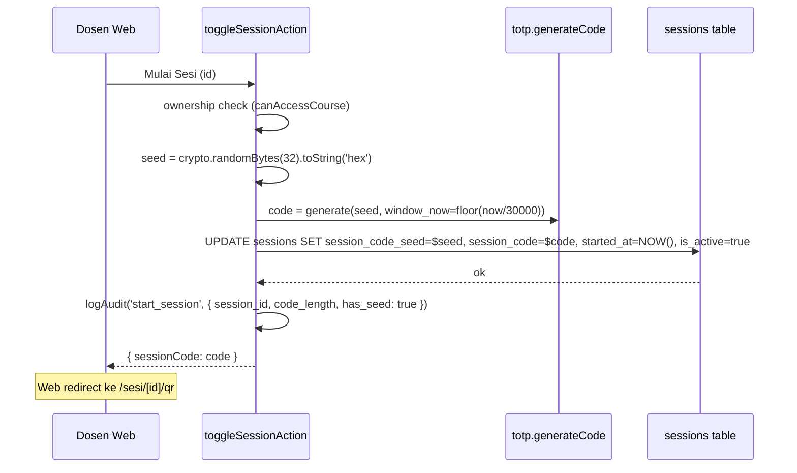
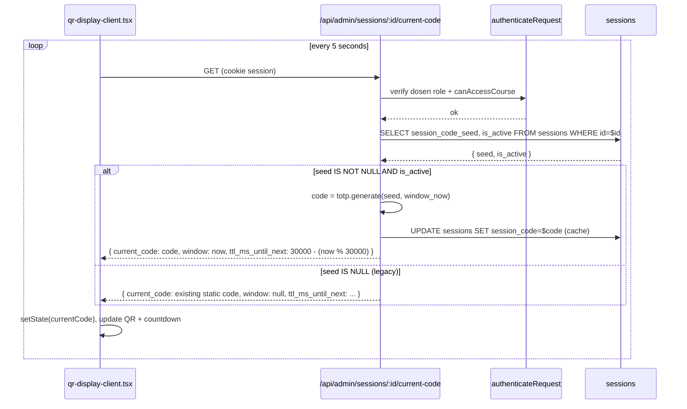
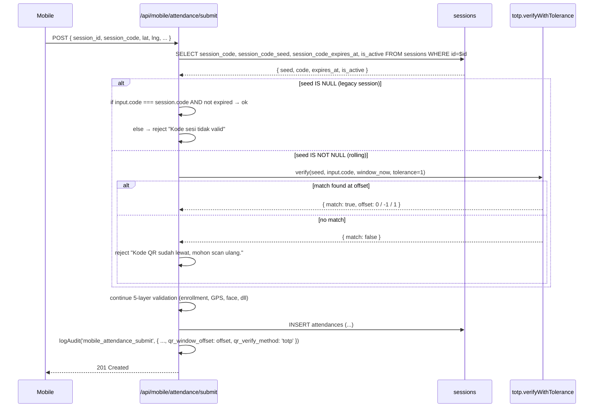

# Design Document: Rolling QR TOTP-like (Phase 3 v7)

> Phase 3 dari implementation_plan v7: ganti QR statis 3-menit dengan QR rolling TOTP-like untuk anti-share screenshot. Layer 1 dari 3-layer security (QR · GPS · Face). Backward compatible — sessions existing yang sudah punya `session_code` statis tetap jalan via fallback equality check.

## Overview

QR statis 3 menit punya celah kritis: **mahasiswa screenshot QR + share via WhatsApp ke teman yang lagi di kos**. Selama 3 menit window, screenshot itu valid 100% identik dengan QR yang dipajang dosen. Layer 2 (GPS) dan Layer 3 (Face) sudah cover kalau penerima coba submit, TAPI menambah Layer 1 anti-share = defense in depth, kurangi noise audit log dari attempt yang ketolak di Layer 2/3.

**Solusi**: Generate kode 6-digit secara *time-based* dari seed rahasia per-session (TOTP RFC 6238 style). Web display polling endpoint setiap 5 detik untuk dapat kode "current" → screenshot expired dalam beberapa puluh detik. Server verify dengan tolerance window kecil supaya 4G lag mahasiswa tidak menyebabkan false reject.

**Backward compat**: 
- Schema lama (`session_code` static + `session_code_expires_at` 3-menit) **tetap dipertahankan**. Tambah kolom **baru**: `session_code_seed TEXT NULL`. Kalau seed NULL → fallback static check (existing behavior). Kalau seed terisi → TOTP verify.
- Mobile **NO CHANGE** — payload submit tetap `{session_id, session_code}`. Server yang adapt logic.

**Effort estimasi**: 4-6 jam (pessimistic) — migration + TOTP utility + 1 endpoint baru + 2 server action update + 2 web display polling.

## Architecture

### Scope & Boundaries

```mermaid
graph TD
    subgraph "Database (migration 022)"
        D1[sessions.session_code_seed TEXT NULL]
        D2[sessions.session_code TEXT - existing]
        D3[sessions.session_code_expires_at - existing]
    end

    subgraph "Backend - Web Server"
        B1[lib/utils/totp.ts - HMAC-SHA1 generator]
        B2[/api/admin/sessions/:id/current-code GET]
        B3[/api/mobile/attendance/submit POST - verify]
        B4[lib/actions/sessions.ts - startSession, refreshSessionCode]
    end

    subgraph "Web Display - Dosen"
        W1[qr-display-client.tsx - polling 5s]
        W2[session-list.tsx modal - polling 5s]
    end

    subgraph "Mobile - Mahasiswa - NO CHANGE"
        M1[Scanner QR - tetap kirim sid+code]
    end

    D1 --> B1
    B1 --> B2
    B1 --> B3
    B4 --> D1
    W1 --> B2
    W2 --> B2
    M1 --> B3
```

### Decisions Table

| ID | Keputusan | Rasional |
|----|-----------|----------|
| **D1** | **TOTP-like (HMAC-SHA1 seed + window-based)** mengikuti RFC 6238 dengan tweak: window length custom (30s default), digit count 6, secret per-session (bukan global). | Algorithm sudah battle-tested (Google Authenticator, Authy, dll). Seed per-session memastikan satu sesi tidak pengaruhi sesi lain. HMAC-SHA1 cukup secure untuk threat model "share screenshot ke teman di kos" — bukan threat model APT. |
| **D2** | **Window 30s + tolerance ±1 = 90s effective acceptance** (default A3, bukan A1 5s). | TRADE-OFF kritis. A1 (5s + ±2 = 15s) lebih ketat tapi false-reject rate tinggi di koneksi 4G kampus yang sering lag 5-15 detik. A3 (30s + ±1 = 90s) realistic untuk koneksi mahasiswa Politani Samarinda — share screenshot via WA butuh ≥60-120 detik (capture, upload WA, teman download, scan), masih cukup untuk reject share kalau mahasiswa malas. Kalau threat model lebih agresif, gampang tightening jadi A1 ke depan dengan ganti konstanta. |
| **D3** | **Schema additive**: tambah `sessions.session_code_seed TEXT NULL` (hex 32-byte secret = 64 char). Kolom existing `session_code` + `session_code_expires_at` **tidak diubah**. | Backward compat. Sessions lama yang masih punya seed=NULL tetap pakai static equality check. Sessions baru (post-migration) langsung dapat seed → TOTP verify. Tidak ada migration data — purely additive. |
| **D4** | **Backward-compat fallback di submit endpoint**: kalau `session.session_code_seed IS NULL` → static `session_code === input.session_code` check (existing behavior). Kalau seed terisi → TOTP verify dengan tolerance window. | Tidak ada breaking change. Sessions yang sudah aktif sebelum deploy tidak akan ke-break. Kode existing fallback tetap valid untuk testing/rollback. |
| **D5** | **Mobile NO CHANGE**. Payload tetap `{session_id, session_code, ...}`. Server adapt verifikasi. | Hindari version-skew rilis web vs mobile. APK lama tetap jalan. Mobile tidak perlu tahu konsep TOTP. |
| **D6** | **Web display polling 5 detik via endpoint baru `GET /api/admin/sessions/:id/current-code`**. **BUKAN** Supabase Realtime. | Realtime channel/subscription overhead (TCP koneksi persisten + RLS check) tidak worth untuk fitur ini. Polling 5s dengan dosen aktif buka 1-2 window display saja = beban server kecil. Endpoint cached header `Cache-Control: no-store` (TOTP code memang harus fresh). |
| **D7** | **Endpoint admin/dosen-only** dengan ownership check via `canAccessCourse()`. Endpoint **tidak boleh** kebuka untuk role mahasiswa atau anon. Body response include `current_code` plus metadata window untuk debugging (offset 0). | Endpoint expose code current → bocor ke mahasiswa = bisa share via API langsung tanpa screenshot. Gating ketat: middleware route group `(qr-projector)` + role check + ownership cek di handler. |
| **D8** | **Server-side seed**: `session_code_seed` **TIDAK PERNAH** di-return ke client. Dosen UI hanya lihat `current_code` 6-digit. Mobile hanya kirim `session_code` ke submit. | Seed = Tier 1 secret (per data classification rule 04). Bocor seed = bisa generate kode kapan saja remote. RLS policy + endpoint response strict. |
| **D9** | **Initial `session_code` saat startSession**: server compute `code(window_now)` dan persist ke `sessions.session_code` (existing kolom) sebagai cache. Setiap polling endpoint hit, server recompute dan update cache. Nilai cache **tidak di-trust** untuk verifikasi — submit endpoint selalu compute ulang dari seed. | `session_code` existing kolom tetap kompatibel: dipakai untuk display by older client paths (mis. log monitoring) dan fallback static check. Cache update mencegah racing — tidak strict perlu, hanya untuk konsistensi UI. |
| **D10** | **`refreshSessionCode` strategy**: rotate seed (`crypto.randomBytes(32)`) + reset `started_at_window_ref` (kolom logical, bukan baru). UI di dosen client refresh-trigger juga clear poll cache → next poll dapat code baru. | Refresh code = "saya curiga ada kebocoran seed atau lupa kapan rolling mulai" → ganti seed total. Alternatif (geser window pointer saja) tidak cukup secure. Cost rotate = ringan (32 byte random). |
| **D11** | **Audit log enhancement**: `mobile_attendance_submit` details tambah field `qr_window_offset` (int: -1, 0, 1 untuk A3) saat verify match — forensic untuk lihat berapa lambat mahasiswa scan. Plus saat reject: `qr_verify_method` ('static_legacy' or 'totp') + `qr_window_tried` (jumlah window yang dicoba). | Membantu adjust window/tolerance ke depan. Kalau majoritas submit ada di offset +1 → koneksi mahasiswa lambat → tighten ke ±0 percuma. |
| **D12** | **Pesan error Bahasa Indonesia ramah** untuk mahasiswa: `"Kode QR sudah lewat, mohon scan ulang."` — TIDAK menyebut "TOTP", "window", "seed", "expired" technical. | Mahasiswa tidak butuh tahu detail algoritma. UX rule 01-agent-persona: "Bahasa ramah, bukan teknis". |
| **D13** | **Library**: pure Node.js `crypto` (HMAC-SHA1) — TIDAK pakai library eksternal `otplib` atau `speakeasy`. Saving 50KB bundle + 0 supply chain risk. Algorithm 30 baris saja. | Library lock rule 03: jangan tambah dependency tanpa diskusi. Crypto built-in cukup. |
| **D14** | **Tolerance ASYMMETRIC pertimbangan**: window matrix `[now-1, now, now+1]` (3 window total, 90 detik effective). TIDAK pakai `[now-2, ..., now+2]` (A1 style 5 window) karena window 30s sudah cukup wide → false-positive risk dengan 5 window besar. | Trade-off correctness vs availability. 90 detik = covers 4G burst + screen lag tanpa over-permissive. |
| **D15** | **Verifikasi gate**: type-check + lint + build clean. Smoke test manual via dosen login → start session → buka projector → screenshot QR → tunggu 90s+ → coba submit dari mobile → harus ke-reject. | Sesuai rule 02 + 06 verifikasi runtime. Property test untuk TOTP utility (round-trip + window matching). |

### Sequence Diagrams

#### Start Session — Generate Seed + Initial Code



#### Web Display Polling Current Code



#### Mobile Submit — Verify with Tolerance Window



### Library Compliance

| Aspect | Choice | Rule reference |
|--------|--------|----------------|
| HMAC-SHA1 generator | Node.js `crypto` built-in | `03-design-and-libraries` — no new dep |
| Random seed | `crypto.randomBytes(32).toString('hex')` | Existing pattern di `sessions.ts` (`generateOTP` via `crypto.randomInt`) |
| Web polling | `fetch()` + `setInterval` (existing pattern di `qr-display-client.tsx`) | No new dep |
| QR rendering | `qrcode.react` (existing) | No change |

## Components and Interfaces

### Component 1: Migration `022_rolling_qr_seed.sql`

> File lokal pakai nomor `022` karena `020_sessions_started_at_index.sql` (Phase 5 mobile) dan `021_enable_realtime_attendances.sql` sudah dipakai. History Supabase via MCP tetap pakai timestamp `YYYYMMDDhhmmss_rolling_qr_seed`.

```sql
-- supabase/migrations/022_rolling_qr_seed.sql
-- Phase 3 v7: Rolling QR TOTP-like seed column.
-- Additive — kolom session_code dan session_code_expires_at tetap dipertahankan
-- untuk backward compatibility (sessions lama dengan seed=NULL → static check).

ALTER TABLE public.sessions
  ADD COLUMN IF NOT EXISTS session_code_seed TEXT NULL;

COMMENT ON COLUMN public.sessions.session_code_seed IS
  'Hex 32-byte secret seed untuk TOTP-like rolling QR (Phase 3 v7). Server-side only — JANGAN expose ke client. Null = legacy session (static code).';

-- Index partial untuk query "active rolling sessions" (mis. by admin endpoint polling).
CREATE INDEX IF NOT EXISTS idx_sessions_active_with_seed
  ON public.sessions(id) 
  WHERE session_code_seed IS NOT NULL AND is_active = true;
```

**Idempotent guard**: `IF NOT EXISTS`. Apply via `mcp0_apply_migration` agar ke-track di Supabase migration history. **Tidak ada RLS policy baru** — kolom mengikuti policy existing tabel `sessions` (sejak migration 011 + 012). Akses tetap server-only via `service_role`.

### Component 2: TOTP Utility `app/lib/utils/totp.ts`

Pure utility — no DB, no auth, no external deps. Easy to unit-test.

```typescript
// app/lib/utils/totp.ts
// TOTP-like generator untuk Rolling QR (Phase 3 v7).
// Pure function — HMAC-SHA1 + dynamic truncation per RFC 6238 (tweaked window length).
// SECURITY: seed harus 32-byte hex (64 char) generated via crypto.randomBytes.
// Tidak boleh digunakan untuk auth credentials — only ephemeral session QR.

import { createHmac } from 'crypto'

const WINDOW_SIZE_MS = 30_000 // 30 detik per window (default A3)
const DIGIT_COUNT = 6
const TOLERANCE = 1 // ±1 window = 90 detik effective acceptance

export interface TotpVerifyResult {
  match: boolean
  offset: number | null   // -1, 0, +1 saat match. null saat tidak match.
  window: number          // window yang dipakai untuk verifikasi
}

/**
 * Compute TOTP code untuk window tertentu.
 * @param seedHex hex 64-char (32 byte) secret
 * @param window integer window number = floor(timestamp_ms / WINDOW_SIZE_MS)
 * @returns 6-digit zero-padded string ("042831")
 */
export function generateCode(seedHex: string, window: number): string

/**
 * Get current window number berdasarkan now() ms.
 */
export function getCurrentWindow(nowMs: number = Date.now()): number

/**
 * Verify input code dengan tolerance window. Loop dari -TOLERANCE..+TOLERANCE.
 * Return offset pertama yang match (atau null kalau no match).
 * 
 * @param seedHex secret seed
 * @param inputCode 6-digit string dari client
 * @param currentWindow window saat ini di server
 * @param tolerance jumlah window di tiap arah (default 1 = total 3 window check)
 */
export function verifyWithTolerance(
  seedHex: string,
  inputCode: string,
  currentWindow: number,
  tolerance: number = TOLERANCE
): TotpVerifyResult

/**
 * Hitung sisa milisecond hingga window berikutnya.
 * Untuk dipakai di response endpoint (UI countdown).
 */
export function msUntilNextWindow(nowMs: number = Date.now()): number
```

### Component 3: Admin Endpoint `app/api/admin/sessions/[id]/current-code/route.ts`

GET-only. Returns current rolling code untuk web display polling. **Bukan** untuk mobile.

```typescript
// app/api/admin/sessions/[id]/current-code/route.ts
// Endpoint admin/dosen — return current rolling QR code untuk projector display.
// SECURITY: ownership check via canAccessCourse. Mahasiswa role REJECTED.
// JANGAN expose seed ke response — hanya current_code 6-digit.

GET /api/admin/sessions/:id/current-code

Response 200:
{
  "current_code": "428103",       // 6-digit rolling code (atau static legacy)
  "window": 56789012,              // window number (null untuk legacy session)
  "ttl_ms_until_next": 14823,      // ms sampai code berikutnya generate
  "is_rolling": true,              // false untuk legacy session
  "is_active": true,
  "expires_at": null               // ISO string untuk legacy, null untuk rolling
}

Response 401: tidak login
Response 403: bukan dosen pemilik MK
Response 404: session tidak ditemukan
Response 410: sesi sudah berakhir (is_active=false)
```

**Caching**: Header `Cache-Control: no-store`. Polling client tidak boleh cache. Endpoint **tidak rate-limit** karena dosen-only dan polling 5s = 12 req/menit per dosen, ringan.

### Component 4: Update `app/lib/actions/sessions.ts`

Two changes:

**4a. `toggleSessionAction(sessionId, isActive=true)` — generate seed + initial code**

```typescript
// Saat dosen klik "Mulai Sesi"
import { generateCode, getCurrentWindow } from '@/lib/utils/totp'
import crypto from 'crypto'

const seed = crypto.randomBytes(32).toString('hex')  // 64-char hex
const currentWindow = getCurrentWindow()
const initialCode = generateCode(seed, currentWindow)

// session_code_expires_at di-set very-far-future untuk rolling sessions (mis. +24 jam)
// supaya UI countdown legacy tidak nge-expire prematurely.
// Server tetap compute fresh code via TOTP, expires_at hanya placeholder.
const expiresAt = new Date(Date.now() + 24 * 60 * 60 * 1000).toISOString()

await supabase.from('sessions').update({
  is_active: true,
  session_code: initialCode,
  session_code_seed: seed,
  session_code_expires_at: expiresAt,
  started_at: new Date().toISOString(),
  ended_at: null,
}).eq('id', sessionId)

await logAudit({
  action: 'start_session',
  details: { session_id: sessionId, code_length: 6, has_seed: true, qr_mode: 'rolling' },
})
```

**4b. `refreshSessionCode(sessionId)` — rotate seed**

Strategy: full seed rotation, BUKAN cuma window pointer geser. Alasan: refresh = "I think seed leaked atau saya butuh fresh start". Cost rotate ringan.

```typescript
// Generate seed BARU (rotate)
const newSeed = crypto.randomBytes(32).toString('hex')
const currentWindow = getCurrentWindow()
const newCode = generateCode(newSeed, currentWindow)
const newExpiresAt = new Date(Date.now() + 24 * 60 * 60 * 1000).toISOString()

await supabase.from('sessions').update({
  session_code: newCode,
  session_code_seed: newSeed,
  session_code_expires_at: newExpiresAt,
}).eq('id', sessionId)

await logAudit({
  action: 'refresh_session_code',
  details: { session_id: sessionId, code_length: 6, has_seed: true, rotated: true },
})
```

### Component 5: Refactor `app/api/mobile/attendance/submit/route.ts`

LAYER 2 (session_code check) at line ~105 — branch by seed presence:

```typescript
// 5. LAYER 2: Validasi session_code — TOTP verify ATAU static fallback
import { verifyWithTolerance, getCurrentWindow } from '@/lib/utils/totp'

let qrVerifyMethod: 'static_legacy' | 'totp'
let qrWindowOffset: number | null = null

if (session.session_code_seed) {
  // Rolling QR mode — TOTP verify dengan tolerance window
  qrVerifyMethod = 'totp'
  const currentWindow = getCurrentWindow()
  const verify = verifyWithTolerance(
    session.session_code_seed,
    input.session_code,
    currentWindow,
    1, // tolerance ±1 window = 90s effective
  )
  if (!verify.match) {
    await logAudit({
      action: 'qr_code_invalid_attempt',
      userId: user.id,
      ipAddress,
      details: {
        session_id: input.session_id,
        qr_verify_method: 'totp',
        current_window: currentWindow,
        student_nim: user.nim_nip,
      },
    })
    return errorResponse('Kode QR sudah lewat, mohon scan ulang.', 400)
  }
  qrWindowOffset = verify.offset
} else {
  // Legacy static mode — equality + expiry check (existing behavior)
  qrVerifyMethod = 'static_legacy'
  if (session.session_code !== input.session_code) {
    return errorResponse('Kode sesi tidak valid.', 400)
  }
  if (session.session_code_expires_at) {
    const expiry = new Date(session.session_code_expires_at)
    if (expiry < new Date()) {
      return errorResponse('Kode sesi sudah kedaluwarsa. Minta dosen untuk refresh kode.', 400)
    }
  }
}

// ... lanjut LAYER 3 (enrollment), 4 (duplicate), 5 (GPS), 6 (face) — UNCHANGED ...

// Audit log final — tambah qr_window_offset + qr_verify_method
await logAudit({
  action: 'mobile_attendance_submit',
  userId: user.id,
  ipAddress,
  details: {
    student_id: user.id,
    student_nim: user.nim_nip,
    session_id: input.session_id,
    /* ... existing fields ... */
    qr_verify_method: qrVerifyMethod,
    qr_window_offset: qrWindowOffset, // null untuk legacy, -1/0/+1 untuk rolling
  },
})
```

**No change**: rate limiter, GPS Haversine, face gate, response shape.

### Component 6: Refactor `qr-display-client.tsx`

Existing component sudah punya pattern polling untuk `live-stats` (5 detik dengan exponential backoff). **Reuse pattern** untuk endpoint baru `/api/admin/sessions/:id/current-code`.

Changes:
- Tambah state `currentCode: string | null` + `windowTtlMs: number`.
- Tambah second polling loop untuk endpoint `current-code` (interval 5 detik, parallel dengan live-stats poll).
- `qrPayload` derive dari `currentCode` state (BUKAN dari prop `sessionCode` — yang itu hanya nilai initial dari SSR).
- `OtpBlock` countdown bar derive dari `windowTtlMs` (ttl turun dari 30s ke 0, lalu naik lagi setelah refresh).
- `ExpiredOverlay` hanya muncul kalau `is_rolling=false` AND legacy expiry passed (backward compat). Untuk rolling sessions, code "tidak pernah expired" — yang berubah hanya nilainya.
- Polling error handling sama dengan existing (3x error → backoff 30s).

### Component 7: Refactor `session-list.tsx` Modal

Modal QR di session-list (kompak, bukan fullscreen) — **same polling pattern** sebagai Component 6 tapi dipanggil dari dalam expanded course card.

Changes:
- State `modalCurrentCodes: Record<sessionId, string>` untuk simpan code per active session yang lagi di-display.
- Polling `useEffect` baru: untuk setiap active session yang punya `session_code_seed != null`, fetch `/api/admin/sessions/:id/current-code` setiap 5 detik. Kalau seed null (legacy) — fallback ke nilai static dari prop (existing behavior).
- QR `value` dan OTP digit display derive dari state.
- Countdown bar (label "Kode berlaku") derive dari `windowTtlMs` per session.

### Component 8: Mobile Implementation — NONE

Mobile **tidak diubah**. Scanner QR tetap kirim payload `{session_id, session_code, ...}`. Server side yang adapt logic verify. APK lama (dengan pattern existing) tetap jalan.

## Data Models

### New Column

| Column | Type | Constraints | Catatan |
|--------|------|-------------|---------|
| `sessions.session_code_seed` | `TEXT NULL` | – | Hex 64-char (32 byte) random secret. Server-side only. NULL = legacy session = static fallback. |

### Existing Columns (UNCHANGED)

| Column | Behavior |
|--------|----------|
| `sessions.session_code` | Untuk rolling sessions: di-update setiap polling endpoint hit (cache). Untuk legacy: tetap static value 6-digit. |
| `sessions.session_code_expires_at` | Untuk rolling sessions: set ke `started_at + 24h` (placeholder). Untuk legacy: 3 menit dari generate (existing behavior). |

### Endpoint Response Shape

```typescript
// GET /api/admin/sessions/:id/current-code
interface CurrentCodeResponse {
  current_code: string          // 6-digit padded
  window: number | null         // null untuk legacy, integer untuk rolling
  ttl_ms_until_next: number     // ms sampai code berikutnya berubah (0 untuk static)
  is_rolling: boolean
  is_active: boolean
  expires_at: string | null     // ISO string atau null
}
```

### Audit Log Details Schema (Enhanced)

```typescript
// action: 'mobile_attendance_submit'
{
  // ... existing fields ...
  qr_verify_method: 'static_legacy' | 'totp',
  qr_window_offset: number | null,   // -1, 0, +1 untuk totp; null untuk static
}

// action: 'qr_code_invalid_attempt' (new)
{
  session_id: string,
  qr_verify_method: 'totp',
  current_window: number,
  student_nim: string,
}

// action: 'start_session', 'refresh_session_code'
{
  // ... existing fields ...
  has_seed: boolean,
  qr_mode: 'rolling' | 'static_legacy',
  rotated?: boolean, // refresh_session_code only
}
```

## Algorithmic Pseudocode

### Algorithm 1: TOTP Code Generation

```pascal
ALGORITHM generateCode(seedHex, window)
INPUT: seedHex string (hex 64-char), window integer
OUTPUT: string 6-digit zero-padded

PRECONDITIONS:
  - seedHex.length == 64
  - seedHex matches /^[0-9a-f]+$/i
  - window >= 0

POSTCONDITIONS:
  - return string of length 6
  - return value deterministic for same (seedHex, window)
  - distinct windows produce distinct codes with high probability

BEGIN
  // Convert hex seed to byte buffer (32 bytes)
  seedBytes ← Buffer.from(seedHex, 'hex')

  // Convert window to 8-byte big-endian buffer
  windowBuf ← Buffer.alloc(8)
  windowBuf.writeBigUInt64BE(BigInt(window), 0)

  // HMAC-SHA1
  hmac ← createHmac('sha1', seedBytes)
  hmac.update(windowBuf)
  digest ← hmac.digest()  // 20 bytes

  // Dynamic truncation per RFC 6238
  offset ← digest[19] AND 0x0F  // last 4 bits = offset 0..15
  binary ← (digest[offset]   AND 0x7F) << 24
         | (digest[offset+1] AND 0xFF) << 16
         | (digest[offset+2] AND 0xFF) << 8
         | (digest[offset+3] AND 0xFF)

  // Take 6 last digits, zero-pad
  code ← (binary MOD 1_000_000).toString().padStart(6, '0')

  ASSERT code.length == 6
  RETURN code
END
```

### Algorithm 2: Verify with Tolerance Window

```pascal
ALGORITHM verifyWithTolerance(seedHex, inputCode, currentWindow, tolerance)
INPUT: seedHex string, inputCode string (6-digit), currentWindow int, tolerance int (>=0)
OUTPUT: { match: boolean, offset: int | null, window: int }

PRECONDITIONS:
  - inputCode.length == 6
  - inputCode matches /^\d{6}$/
  - tolerance in [0, 5] (sanity bound)

POSTCONDITIONS:
  - match=true ⟹ exists offset in [-tolerance, +tolerance] s.t. generateCode(seed, currentWindow + offset) == inputCode
  - match=false ⟹ for all offset in range, generateCode(seed, currentWindow + offset) != inputCode

BEGIN
  // Sanitize input
  IF inputCode.length != 6 OR NOT matches /^\d{6}$/ THEN
    RETURN { match: false, offset: null, window: currentWindow }
  END IF

  // Loop tolerance window: -tolerance..+tolerance inclusive
  // Order: 0 first (most likely match), then -1, +1, -2, +2, ...
  // Reasoning: optimize for happy path (no lag).
  candidates ← [0]
  FOR i FROM 1 TO tolerance DO
    candidates.push(-i)
    candidates.push(+i)
  END FOR

  FOR EACH offset IN candidates DO
    candidate ← generateCode(seedHex, currentWindow + offset)
    IF constantTimeCompare(candidate, inputCode) THEN
      RETURN { match: true, offset: offset, window: currentWindow }
    END IF
  END FOR

  RETURN { match: false, offset: null, window: currentWindow }
END
```

**Note**: `constantTimeCompare` pakai `crypto.timingSafeEqual(Buffer.from(a), Buffer.from(b))` — mitigasi side-channel timing attacks (paranoid tapi murah).

### Algorithm 3: Server Submit Flow (Layer 2 Verify)

```pascal
ALGORITHM verifyQrCodeAtSubmit(session, inputCode)
INPUT: session row, inputCode string
OUTPUT: { ok: boolean, errorMsg: string | null, qrVerifyMethod: string, qrWindowOffset: int | null }

PRECONDITIONS:
  - session is a row from sessions table
  - inputCode is the value from request body input.session_code

POSTCONDITIONS:
  - qrVerifyMethod always set
  - ok=true ⟹ inputCode is valid
  - ok=false ⟹ errorMsg is user-friendly Bahasa Indonesia

BEGIN
  IF session.session_code_seed IS NOT NULL THEN
    // Rolling mode
    method ← 'totp'
    currentWindow ← getCurrentWindow(now)
    result ← verifyWithTolerance(session.session_code_seed, inputCode, currentWindow, TOLERANCE=1)
    
    IF result.match THEN
      RETURN { ok: true, errorMsg: null, qrVerifyMethod: 'totp', qrWindowOffset: result.offset }
    ELSE
      logAudit('qr_code_invalid_attempt', { ..., qr_verify_method: 'totp', current_window: currentWindow })
      RETURN { ok: false, errorMsg: 'Kode QR sudah lewat, mohon scan ulang.', qrVerifyMethod: 'totp', qrWindowOffset: null }
    END IF
  ELSE
    // Legacy static mode (backward compat)
    method ← 'static_legacy'
    IF session.session_code != inputCode THEN
      RETURN { ok: false, errorMsg: 'Kode sesi tidak valid.', qrVerifyMethod: 'static_legacy', qrWindowOffset: null }
    END IF
    IF session.session_code_expires_at IS NOT NULL AND session.session_code_expires_at < now THEN
      RETURN { ok: false, errorMsg: 'Kode sesi sudah kedaluwarsa. Minta dosen untuk refresh kode.', qrVerifyMethod: 'static_legacy', qrWindowOffset: null }
    END IF
    RETURN { ok: true, errorMsg: null, qrVerifyMethod: 'static_legacy', qrWindowOffset: null }
  END IF
END
```

### Algorithm 4: Polling Endpoint Logic

```pascal
ALGORITHM getCurrentCode(sessionId, requestingUser)
INPUT: sessionId UUID, requestingUser (auth context)
OUTPUT: HTTP response

PRECONDITIONS:
  - requestingUser authenticated via cookie (web SSR / route handler)

BEGIN
  // 1. Auth — must be admin or dosen pemilik MK
  IF requestingUser.role NOT IN ['admin', 'dosen'] THEN
    RETURN 403 'Akses ditolak'
  END IF

  // 2. Fetch session
  session ← SELECT id, course_id, is_active, session_code, session_code_seed, session_code_expires_at FROM sessions WHERE id = sessionId
  IF session IS NULL THEN
    RETURN 404 'Sesi tidak ditemukan'
  END IF

  // 3. Ownership check (dosen hanya MK-nya, admin pass-through)
  IF requestingUser.role = 'dosen' THEN
    hasAccess ← canAccessCourse(requestingUser.id, 'dosen', session.course_id)
    IF NOT hasAccess THEN
      RETURN 403 'Akses ditolak'
    END IF
  END IF

  // 4. Sesi tidak aktif → 410 Gone
  IF NOT session.is_active THEN
    RETURN 410 'Sesi sudah berakhir'
  END IF

  // 5. Compute current code based on mode
  IF session.session_code_seed IS NOT NULL THEN
    // Rolling mode
    currentWindow ← getCurrentWindow(now)
    code ← generateCode(session.session_code_seed, currentWindow)
    ttl ← msUntilNextWindow(now)

    // Update cache (best-effort, non-blocking semantically)
    UPDATE sessions SET session_code = code WHERE id = sessionId

    RETURN 200 {
      current_code: code,
      window: currentWindow,
      ttl_ms_until_next: ttl,
      is_rolling: true,
      is_active: true,
      expires_at: null
    }
  ELSE
    // Legacy static mode — return existing values
    RETURN 200 {
      current_code: session.session_code,
      window: null,
      ttl_ms_until_next: 0,
      is_rolling: false,
      is_active: true,
      expires_at: session.session_code_expires_at
    }
  END IF
END
```

## Correctness Properties

*Bagian ini menyatakan properti universal (berlaku untuk semua input valid) yang harus dipertahankan implementasi. Properti dapat diturunkan menjadi property-based test pada `totp.ts` (lihat Testing Strategy).*

### Property 1: TOTP Determinism

*For all* `seedHex` valid (hex 64-char) dan window integer `w`, `generateCode(seedHex, w)` SELALU mengembalikan string 6-digit yang IDENTIK pada setiap pemanggilan — tidak ada non-determinisme (no `Date.now()` di dalam — window di-pass eksternal).

**Validates: Requirements 2.4, 3.2**

### Property 2: Window Verifikasi Round-Trip

*For all* `seedHex` valid dan window `w`, `verifyWithTolerance(seedHex, generateCode(seedHex, w), w, 0).match === true` — code yang fresh-generated harus pasti match di window yang sama tanpa tolerance.

**Validates: Requirements 2.7, 3.3**

### Property 3: Tolerance Acceptance

*For all* `seedHex` valid, window `w`, dan offset `o ∈ [-tolerance, +tolerance]`, `verifyWithTolerance(seedHex, generateCode(seedHex, w + o), w, tolerance).match === true` dan offset yang dikembalikan = `o`.

**Validates: Requirements 2.7, 3.4, 13.1, 13.2**

### Property 4: Tolerance Rejection

*For all* `seedHex` valid, window `w`, dan offset `o ∉ [-tolerance, +tolerance]`, dengan probabilitas tinggi (≥ 99.9999%) `verifyWithTolerance(seedHex, generateCode(seedHex, w + o), w, tolerance).match === false`. Catatan: collision teoritis 1/1.000.000 per komparasi.

**Validates: Requirements 2.8, 3.5, 11.1, 13.3**

### Property 5: Backward Compat Legacy

*For all* session row dengan `session_code_seed IS NULL`, perilaku verifikasi (static-equality + `expires_at` check) di submit endpoint IDENTIK dengan implementasi pre-Phase 3.

**Validates: Requirements 4.6, 4.7, 4.8, 14.1, 14.2, 14.3, 14.4**

### Property 6: Seed Privacy Invariant

*For all* HTTP response yang di-generate sistem (mobile endpoint, admin endpoint, server action return value) DAN setiap audit log entry, body/details TIDAK PERNAH memuat nilai `session_code_seed` raw maupun substring yang dapat dipakai mereverse seed.

**Validates: Requirements 4.11, 5.11, 6.4, 7.6, 15.6, 16.1, 16.2**

### Property 7: Endpoint Auth Negative Cases

*For all* request `GET /api/admin/sessions/:id/current-code` dengan auth context bukan (admin OR dosen pemilik MK), endpoint SHALL return HTTP 401 atau 403 — TIDAK PERNAH 200. Khususnya: mahasiswa role, anon, dosen-bukan-pemilik semuanya direject.

**Validates: Requirements 5.5, 16.3**

### Property 8: Audit Method Field Completeness

*For all* submit request (success atau fail) yang lolos auth Layer 1 (sampai Layer 2 verifikasi code), tepat satu audit log entry `mobile_attendance_submit` (untuk success) ATAU `qr_code_invalid_attempt` (untuk reject di Layer 2 rolling) ditulis dengan `details.qr_verify_method` field terisi salah satu dari `'totp'` atau `'static_legacy'`.

**Validates: Requirements 4.5, 4.9, 15.1, 15.2, 15.3**

### Property 9: Window Continuity Unpredictability

*For all* dua window adjacent `w` dan `w+1`, code yang dihasilkan tidak prediktable dari satu sama lain berdasarkan sifat HMAC-SHA1. Mahasiswa yang melihat code di window `w` tidak dapat menebak code di `w+5` tanpa mengetahui seed.

**Validates: Requirements 11.1, 16.5**

### Property 10: Mobile Backward Compat

*For all* APK mobile pra-Phase-3 (yang kirim `{session_id, session_code, ...}` payload existing), submit ke session rolling-mode yang baru SHALL berhasil tanpa perubahan kode mobile, sepanjang code yang di-scan masih dalam tolerance window.

**Validates: Requirements 10.1, 10.2, 10.3, 10.4**


## Error Handling

### Rolling QR — Code Tidak Match

**Condition**: Submit dengan code yang tidak ada di window `[currentWindow - 1, currentWindow + 1]`.
**Response**: 400 dengan `"Kode QR sudah lewat, mohon scan ulang."`. Audit log `qr_code_invalid_attempt`.
**Recovery**: Mahasiswa scan QR ulang dari layar dosen — code sudah refresh.

### Endpoint Polling — Network Error

**Condition**: Web display kehilangan koneksi ke endpoint.
**Response (client)**: Tampilkan badge "Sync terganggu" (pattern existing). Setelah 3 error consecutive → backoff 30s. Code QR di layar **tetap** menampilkan nilai terakhir → mahasiswa scan QR akan reject (code stale).
**Recovery**: Saat koneksi pulih, polling resume → code update.

### Endpoint Polling — Sesi Berakhir di Tengah

**Condition**: Dosen klik "Akhiri Sesi" sambil projector masih buka. Endpoint `current-code` return 410.
**Response (client)**: Tampilkan banner "Sesi sudah berakhir" dan auto-close window (pattern existing untuk 403/404).

### Refresh Code — Race Condition

**Condition**: Dosen klik "Refresh Kode" saat polling sedang fetch.
**Response**: Polling next tick akan dapat seed baru → code baru. Window mahasiswa scan in-flight pakai seed lama akan reject (kalau sudah lewat dari yang lama). Trade-off acceptable — refresh = explicit dosen action, expected behavior reset.

### Type Validation Edge

**Condition**: Mobile kirim `session_code` bukan 6-digit (mis. " 123456" dengan whitespace, atau "12345"). 
**Response**: Existing Zod schema `session_code: z.string().length(6)` reject di parse stage → 400 "Kode sesi harus 6 digit". TOTP layer tidak terkena.

## Threat Model — Phase 3

| Threat | Mitigation Level | Notes |
|--------|------------------|-------|
| **Share screenshot QR via WhatsApp** | HIGH | Code rotate setiap 30s + tolerance ±90s. Window share via WA realistik 60-120s = code sudah expired saat teman scan. **Defense Layer 1**. |
| **Replay attack — intercept HTTPS payload mahasiswa** | MEDIUM | TLS 1.2/1.3 mencegah passive intercept. Kalau aktif (MITM dengan cert palsu) — outside scope (LAN kampus terenkripsi). 90s window membatasi replay window. UNIQUE constraint `(session_id, student_id)` mencegah duplicate submit. |
| **Brute force code 6-digit** | MEDIUM | Rate limit existing 10 req/menit per (user, device) = max 600 attempt/jam. Probabilitas tebakan random hit = 600 / 1_000_000 = 0.06%/jam. Plus Layer 2 (GPS) + Layer 3 (Face) yang independent gates. |
| **Seed leak** (mis. dump DB tanpa auth check) | LOW | Seed di kolom `session_code_seed` — RLS + endpoint guard. Service role only. Kalau bocor, dosen klik "Refresh Kode" untuk rotate. |
| **Time skew client vs server** | LOW | Server adalah source of truth — window dihitung di server saja. Client tidak tahu window. Tolerance ±1 cover small skew (≤30s). |
| **False reject akibat 4G lag mahasiswa** | LOW | Tolerance window 90s effective covers lag 4G Politani Samarinda. Kalau mahasiswa idle >90s after scan, suruh scan ulang (UX expected). |
| **Replay code yang sudah expired** | HIGH | Window check di server. Kode dari window `w-3` ditolak saat current window = `w`. |

## Testing Strategy

### Unit Test — TOTP Utility (HIGH VALUE)

File: `app/lib/utils/totp.test.ts` (baru). Pakai Jest atau Vitest sesuai existing test setup.

Property-style tests (pseudocode):

```typescript
describe('totp.generateCode', () => {
  it('produces deterministic 6-digit code for fixed seed and window', () => {
    const seed = '00'.repeat(32) // dummy
    expect(generateCode(seed, 1234567)).toBe(generateCode(seed, 1234567))
    expect(generateCode(seed, 1234567)).toMatch(/^\d{6}$/)
  })

  it('produces different codes for adjacent windows (very high prob)', () => {
    const seed = crypto.randomBytes(32).toString('hex')
    const a = generateCode(seed, 100)
    const b = generateCode(seed, 101)
    // Collision prob 1/1M per pair — single test fine
    expect(a).not.toBe(b)
  })

  it('produces different codes for different seeds', () => {
    const seedA = crypto.randomBytes(32).toString('hex')
    const seedB = crypto.randomBytes(32).toString('hex')
    expect(generateCode(seedA, 100)).not.toBe(generateCode(seedB, 100))
  })
})

describe('totp.verifyWithTolerance', () => {
  it('matches code at offset 0 (current window)', () => {
    const seed = crypto.randomBytes(32).toString('hex')
    const w = getCurrentWindow()
    const code = generateCode(seed, w)
    const result = verifyWithTolerance(seed, code, w, 1)
    expect(result.match).toBe(true)
    expect(result.offset).toBe(0)
  })

  it('matches code from previous window within tolerance', () => {
    const seed = crypto.randomBytes(32).toString('hex')
    const w = getCurrentWindow()
    const code = generateCode(seed, w - 1) // simulate 30s lag
    const result = verifyWithTolerance(seed, code, w, 1)
    expect(result.match).toBe(true)
    expect(result.offset).toBe(-1)
  })

  it('rejects code outside tolerance window', () => {
    const seed = crypto.randomBytes(32).toString('hex')
    const w = getCurrentWindow()
    const code = generateCode(seed, w - 5) // 150s old
    const result = verifyWithTolerance(seed, code, w, 1)
    expect(result.match).toBe(false)
    expect(result.offset).toBe(null)
  })

  it('rejects malformed input (non-digit, wrong length)', () => {
    const seed = crypto.randomBytes(32).toString('hex')
    const w = getCurrentWindow()
    expect(verifyWithTolerance(seed, 'abcdef', w, 1).match).toBe(false)
    expect(verifyWithTolerance(seed, '12345', w, 1).match).toBe(false)
    expect(verifyWithTolerance(seed, '1234567', w, 1).match).toBe(false)
  })
})
```

### Manual Smoke Test (USER-ACTION)

1. **Start session rolling**: Login dosen → buat sesi baru → klik "Mulai Sesi". Cek DB: `session_code_seed` non-null + `session_code` 6-digit + `session_code_expires_at` ~24h forward.
2. **Display polling**: Buka `/sesi/[id]/qr` → buka DevTools Network tab → confirm GET `/api/admin/sessions/:id/current-code` setiap 5s. Code di QR + OTP block update tiap ~30s.
3. **Submit happy path**: Mobile scan QR → submit → 201 success.
4. **Submit dengan screenshot lama**: Screenshot QR layar → tunggu 90+ detik tanpa refresh → mobile scan dari screenshot → 400 "Kode QR sudah lewat, mohon scan ulang."
5. **Backward compat**: SQL update DB manual `session_code_seed = NULL` di sebuah session aktif → mobile submit dengan static code → tetap success (legacy path).
6. **Refresh code**: Klik "Refresh Kode" di session-list → cek DB seed berubah → polling next tick di projector → code di QR berubah.
7. **Auth gate**: Mobile (role mahasiswa) coba GET `/api/admin/sessions/:id/current-code` dengan Bearer JWT → 403/401.

### Verification Commands

```powershell
cd mypresensi-web
npm run type-check       # exit 0
npm run lint             # exit 0
npm run build            # exit 0 (pre-merge)
```

```powershell
# Property test
npm test -- totp.test.ts
```

## Performance Considerations

- **TOTP compute**: HMAC-SHA1 ~10μs per call. Endpoint polling = 12 req/menit per dosen aktif. Negligible.
- **DB write per poll**: Cache update `UPDATE sessions SET session_code = ...` setiap 5s per active session. Ringan tapi monitoring dead-tuple percentage (autovacuum). Bisa di-skip kalau current cache value sama dengan computed (saving write).
- **Mobile latency unchanged**: Verifikasi TOTP tambah ~10μs vs static equality ~1μs. Sub-millisecond, irrelevant pada budget submit ~200-500ms.

## Security Considerations

1. **Seed = Tier 1 secret** (data classification rule 04). Penanganan:
   - Stored in `sessions.session_code_seed` only.
   - JANGAN log to `audit_logs.details` (existing rule untuk session_code applies juga ke seed).
   - JANGAN return ke endpoint mobile/admin response body.
   - Saat session ended (`is_active=false`), seed boleh tetap di DB untuk forensic — tidak perlu wipe (sudah tidak bisa dipakai karena `is_active` check di submit).

2. **Endpoint admin auth**: 3 layer defense — middleware (cookie session) + handler `requireRole(['admin', 'dosen'])` + ownership `canAccessCourse`. Mahasiswa tidak ada route ke endpoint ini.

3. **Constant time compare**: Pakai `crypto.timingSafeEqual` di `verifyWithTolerance` untuk mitigasi side-channel timing — overkill untuk threat model ini, tapi murah.

4. **Cache `session_code` di DB**: Nilai cache adalah code current = bocor jika `audit_logs.details.session_id` di-cross-reference dengan `sessions.session_code` di waktu T. Mitigasi sudah ada — `audit_logs` admin-only SELECT (migration 006).

5. **Pre-deploy DB advisor**: Run `mcp0_get_advisors({ type: 'security' })` setelah apply migration 022 → 0 issue baru.

## Dependencies

**No new dependencies**. Pakai Node.js `crypto` built-in (`createHmac`, `randomBytes`, `timingSafeEqual`).

## Migration Plan & Rollback

### Forward
1. Apply migration 022 via MCP `apply_migration` (additive, idempotent).
2. Deploy backend code (TOTP utility + endpoint baru + submit refactor + sessions.ts update).
3. Deploy web code (QR display polling refactor).
4. **Tidak perlu deploy mobile** — tetap kompatibel.

### Rollback Strategy

**Per file via git revert** (preferred):
- Revert backend changes → submit endpoint kembali ke static-only check. Sessions baru yang punya seed akan **tetap jalan** karena UPDATE setiap polling juga refresh `session_code` cache → static equality match.

**DB rollback (jarang dibutuhkan)**:
```sql
-- Optional: drop column kalau betul-betul mau full rollback
ALTER TABLE sessions DROP COLUMN IF EXISTS session_code_seed;
DROP INDEX IF EXISTS idx_sessions_active_with_seed;
```

Tapi catatan: rollback DB column hanya aman setelah revert backend (tidak ada query yang refer kolom).

## Out of Scope

- **Liveness check QR** (mis. challenge-response) — overkill untuk threat model.
- **iOS support** — proyek Android-only.
- **Cross-tab sync via BroadcastChannel** — single window display sudah cukup.
- **Migration data dari static ke rolling untuk sessions yang aktif** — biarkan natural: sessions baru (post-deploy) auto-rolling, sessions lama tetap static sampai berakhir.
- **A1 5-second window mode** — defer, tightening konstanta saja kalau kelak dibutuhkan (baseline A3 30s).
