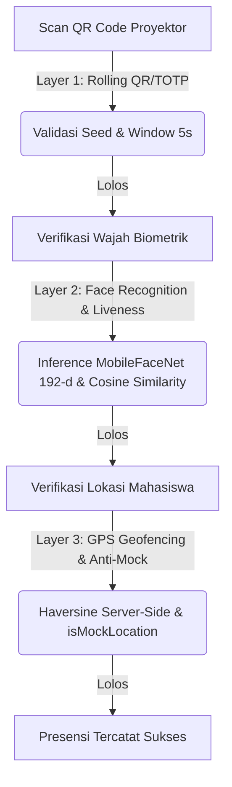

# MyPresensi — Sistem Presensi Digital 3-Layer Verifikasi
[](https://nextjs.org)
[](https://react.dev)
[](https://flutter.dev)
[](https://supabase.com)
[](https://firebase.google.com)
[](https://projek-pbl-semester-6.vercel.app)

Sistem presensi digital terintegrasi berbasis **Face Recognition**, **Geofencing (GPS)**, dan **Dynamic QR Code (TOTP)** yang dirancang khusus untuk **Program Studi TRPL, Politeknik Pertanian Negeri Samarinda**. Proyek ini merupakan hasil kolaborasi PBL (Project-Based Learning) Semester 6.

> 🌐 **Live Web Application (Vercel)**: [https://projek-pbl-semester-6.vercel.app](https://projek-pbl-semester-6.vercel.app)
> 📱 **Mobile App Version**: v1.0.0 (Android)

---

## 🔒 3-Layer Arsitektur Keamanan Verifikasi

MyPresensi menerapkan pendekatan *Defense in Depth* untuk menjamin keaslian data kehadiran mahasiswa melalui 3 lapis verifikasi yang ketat:



### 1. Layer 1: Dynamic Rolling QR (TOTP-like)
* **Mekanisme**: QR Code yang ditampilkan oleh dosen di layar proyektor berubah otomatis secara real-time mengikuti interval window 5 detik (modifikasi RFC 6238 TOTP).
* **Security**: Dihasilkan menggunakan seed acak 32-byte kriptografis (`session_code_seed`) yang disimpan di server. Kode QR di-sync tanpa menulis ulang database secara berulang (read-only polling) untuk meminimalkan beban I/O.
* **Anti-Share**: Mencegah kecurangan titip absen melalui tangkapan layar (screenshot) karena token kedaluwarsa dengan cepat sebelum sempat didistribusikan.

### 2. Layer 2: Face Biometric & Liveness Check
* **Mekanisme**: Deteksi wajah menggunakan Google ML Kit, sedangkan ekstraksi embedding 192-dimensi diproses secara on-device menggunakan model **MobileFaceNet (TFLite)** yang berjalan secara asinkron pada background *Isolate* Flutter.
* **Security**: Perbandingan biometrik dikerjakan secara *server-side* (`/api/mobile/face/verify`) untuk menjaga data embedding asli tidak bocor ke client. Pencocokan menggunakan rumus *Cosine Similarity* dengan threshold default `0.65`.
* **Liveness**: Menghindari pemalsuan dengan foto/video melalui pengujian keaktifan multi-step: hadap lurus (look straight), kedip mata (blink), menoleh kiri (turn left), dan menoleh kanan (turn right).

### 3. Layer 3: GPS Geofencing & Anti-Mock
* **Mekanisme**: Jarak koordinat mahasiswa terhadap pusat lokasi kelas dihitung secara akurat menggunakan rumus **Haversine** di sisi server (server-side calculation) saat melakukan submit presensi.
* **Security**: Mendeteksi manipulasi lokasi (Fake GPS) secara aktif. Jika parameter `is_mock_location` bernilai `true` dari sensor internal perangkat mobile, request presensi langsung ditolak (403 Forbidden) dan dicatat dalam audit log.
* **Geofence**: Batas radius default disetel 150 meter (dapat dikonfigurasi dinamis 50-500m dari preset lokasi kampus).

---

## 📂 Struktur Repositori

```bash
Projek-PBL-Semester-6/
├── mypresensi-web/        # Next.js 14 — Dashboard Admin/Dosen & Web APIs
│   ├── app/               # Next.js App Router (Dashboard, Sesi, API handler)
│   ├── components/        # Reusable UI components & Recharts widgets
│   ├── lib/               # Server actions, Supabase Client & OTP utilities
│   └── public/            # Static assets
│
├── mypresensi-mobile/     # Flutter 3.11 — Aplikasi Mahasiswa
│   ├── lib/
│   │   ├── core/          # App config, routing, & theme tokens
│   │   ├── features/      # Fitur (Auth, Attendance, Face, History, Profile)
│   │   └── shared/        # Shared widgets, utilities & HTTP client singleton
│   └── assets/            # Model MobileFaceNet (.tflite) & local images
│
├── docs/                  # Panduan desain UI/UX & spesifikasi teknis
├── scripts/               # Skrip pembantu & testing lokal
├── dev-log.md             # Log perubahan teknis berurutan
└── CHANGELOG.md           # Riwayat rilis fitur & bug-fix
```

---

## 🛠️ Tech Stack & Library Lock

### Web Application (`mypresensi-web`)
* **Framework**: Next.js 14.2 (App Router) & React 18.3
* **Language**: TypeScript (Strict Type Check)
* **Styling**: Tailwind CSS & Vanilla CSS Variables
* **Database & Auth**: Supabase (Postgres RLS, Storage Bucket, Realtime Sync)
* **Locked Libraries**:
  * Toast/Dialog: **SweetAlert2** via `@/lib/swal` (Tidak menggunakan native dialog)
  * Validation: **Zod** (Skema validasi sisi API & Form)
  * Icons: **Lucide React**
  * Charts: **Recharts** (Grafik tren kehadiran & rasio)
  * Form: **`useFormState` + `useFormStatus`** React 18 hooks

### Mobile Application (`mypresensi-mobile`)
* **SDK**: Flutter 3.11.4 & Dart 3.1
* **Locked Libraries**:
  * State Management: **flutter_riverpod** (Riverpod v3)
  * HTTP Client: **Dio** (Singleton dengan interceptor JWT & logging)
  * Navigation: **go_router** dengan refreshListenable
  * Secure Storage: **flutter_secure_storage** (Enkripsi token & credentials)
  * Biometric & Face: **google_mlkit_face_detection** + **tflite_flutter** (MobileFaceNet)

---

## 🚀 Setup & Instalasi Lokal

### Persiapan Awal
Pastikan Anda memiliki kakas berikut dengan versi minimum:
| Tool | Versi Minimal | Catatan |
|------|---------------|---------|
| **Node.js** | 18.x | LTS recommended (20.x) |
| **npm** | 9+ | Bundled dengan Node |
| **Flutter SDK** | stable terbaru | `flutter doctor` harus pass semua |
| **Android Studio** | Hedgehog+ | Untuk emulator + SDK |
| **Akun Supabase** | Free tier cukup | https://supabase.com |
| **Akun Firebase** | Free (Spark) cukup | https://console.firebase.google.com — untuk FCM |
| **Google AI Studio key** | Opsional | https://aistudio.google.com/apikey — untuk fitur AI chat |
| **Git** | 2.30+ | |

---

## Setup dari Nol (Developer Baru)

Urutan ini penting: **database dulu, baru web, baru mobile.**

### 1. Clone Repository

```powershell
git clone <repo-url> Projek-PBL-Semester-6
cd Projek-PBL-Semester-6
```

### 2. Setup Database (Supabase)

1. Buat project baru di [supabase.com](https://supabase.com) (region terdekat, mis. Singapore).
2. Buka **SQL Editor** di dashboard, lalu jalankan file SQL di `mypresensi-web/supabase/migrations/` **secara berurutan** sesuai tabel di bawah (001 → 025).
3. Buat Storage bucket `avatars` manual via **Dashboard → Storage → New bucket** (bucket `leave_evidence` sudah otomatis dibuat oleh migration 019).

| # | File | Tujuan |
|---|------|--------|
| 001 | `001_initial_schema.sql` | Tabel inti (profiles, courses, sessions, attendances, dll) + RLS |
| 002 | `002_notifications.sql` | Notifikasi in-app |
| 003 | `003_face_verification_mode.sql` | Setting verifikasi wajah optional/required |
| 004 | `004_campus_locations.sql` | Preset lokasi GPS kampus |
| 005 | `005_mobilefacenet_threshold.sql` | Threshold cosine similarity 0.65 |
| 006 | `006_security_hardening.sql` | Function search_path + pembersihan policy permissive |
| 007 | `007_disable_graphql.sql` | Nonaktifkan pg_graphql |
| 008 | `008_avatar_listing_hardening.sql` | Batasi listing avatar |
| 009 | `009_rate_limit_log_explicit_policy.sql` | Policy explicit rate_limit_log |
| 010 | `010_fk_indexes.sql` | Index foreign key (performa) |
| 011 | `011_rls_auth_initplan.sql` | Optimasi RLS `auth.uid()` |
| 012 | `012_consolidate_permissive_policies.sql` | Konsolidasi policy |
| 013 | `013_late_status.sql` | Status presensi "terlambat" |
| 014 | `014_device_id_audit.sql` | Audit device ID |
| 015 | `015_at_risk_function.sql` | Fungsi mahasiswa at-risk |
| 016 | `016_attendances_realtime.sql` | Persiapan Realtime attendances |
| 017 | `017_seed_demo_data.sql` | ⚠️ **OPSIONAL — SKIP di fresh setup.** Berisi UUID user hardcoded milik environment asli; di project baru akan error FK. Hanya jalankan setelah mengganti UUID dengan user milikmu. |
| 018 | `018_revoke_at_risk_function_public.sql` | Revoke akses publik fungsi at-risk |
| 019 | `019_leave_evidence_bucket.sql` | Bucket bukti izin/sakit |
| 020 | `020_sessions_started_at_index.sql` | Index started_at |
| 021 | `021_enable_realtime_attendances.sql` | Enable Realtime publication attendances |
| 022 | `022_rolling_qr_seed.sql` | Kolom seed QR dinamis (TOTP) |
| 023 | `023_profiles_fcm_token.sql` | Kolom token FCM per user |
| 024 | `024_qr_gating_tokens.sql` | Token clearance QR gate |
| 025 | `025_add_target_kelas_to_sessions.sql` | Target kelas per sesi |

### 3. Buat Akun Admin Pertama

1. Dashboard Supabase → **Authentication → Users → Add user** → isi email + password (centang auto-confirm).
2. Salin **UUID** user yang baru dibuat.
3. Jalankan di SQL Editor (sesuaikan nilai):

```sql
insert into profiles (id, full_name, nim_nip, role, must_change_password)
values ('<uuid-dari-auth-users>', 'Admin Utama', 'ADMIN001', 'admin', false);
```

> Jika insert gagal karena kolom wajib lain, cek definisi tabel `profiles` di `001_initial_schema.sql` dan lengkapi kolomnya. Login pertama ke web menggunakan email + password user ini.

### 4. Setup Web App (`mypresensi-web/`)

```powershell
cd mypresensi-web
npm install
Copy-Item .env.local.example .env.local
```

Isi `.env.local` (lihat komentar di file example):

| Variabel | Sumber | Wajib? |
|----------|--------|--------|
| `NEXT_PUBLIC_SUPABASE_URL` | Supabase → Settings → API | ✅ |
| `NEXT_PUBLIC_SUPABASE_ANON_KEY` | Supabase → Settings → API | ✅ |
| `SUPABASE_SERVICE_ROLE_KEY` | Supabase → Settings → API (**RAHASIA**) | ✅ |
| `FIREBASE_SERVICE_ACCOUNT` | Firebase → Service accounts → Generate key (JSON single-line) | ✅ untuk FCM |
| `GOOGLE_GENERATIVE_AI_API_KEY` | https://aistudio.google.com/apikey | Opsional (AI chat) |

**Verify & jalankan**:
```powershell
npm run type-check    # Harus exit 0
npm run lint          # Harus bersih
npm run dev           # http://localhost:3000
```

### 5. Setup Firebase (FCM Push Notification)

Panduan lengkap: **`docs/setup/firebase-setup.md`**. Ringkasnya:

1. Buat project di Firebase Console → tambah **Android app** dengan package `ac.id.politani.mypresensi_mobile`.
2. Download `google-services.json` → letakkan di `mypresensi-mobile/android/app/` (gitignored).
3. **Project Settings → Service accounts → Generate new private key** → jadikan single-line JSON → isi ke `FIREBASE_SERVICE_ACCOUNT` di `.env.local` web.

> Tanpa langkah ini, app mobile tetap jalan tapi notifikasi push sesi/izin tidak akan terkirim.

### 6. Setup Mobile App (`mypresensi-mobile/`)

**Download model MobileFaceNet** (±5 MB, gitignored):
- Ikuti instruksi di `assets/models/README.md`
- Letakkan `mobilefacenet.tflite` di `assets/models/`

**Verify**:
```powershell
flutter analyze       # Harus "No issues found"
```

**Jalankan di emulator** (auto-detect baseUrl `http://10.0.2.2:3000` ke web lokal):
```powershell
flutter devices
flutter run -d emulator-5554
```

**Jalankan di HP fisik** (HP & laptop harus satu jaringan WiFi):
- Pakai script helper: `mypresensi-mobile/tool/run-with-lan-ip.ps1` (lihat `mypresensi-mobile/tool/README.md`)
- Script ini menjalankan app dengan baseUrl menunjuk ke IP LAN laptop, bukan `10.0.2.2`

### 7. Smoke Test

Ikuti checklist `docs/smoke-test-checklist.md`: login admin → buat dosen & mahasiswa → buat MK + enroll → mulai sesi → scan QR dari mobile → verifikasi wajah → cek presensi masuk di dashboard.

---

## Deploy ke Vercel (Web)

1. Import repo di [vercel.com](https://vercel.com) → set **Root Directory** ke `mypresensi-web`.
2. Tambahkan semua environment variable dari tabel di langkah 4 (Production + Preview).
3. ⚠️ `FIREBASE_SERVICE_ACCOUNT` **harus single-line JSON** — newline di private key sudah di-handle otomatis oleh `app/lib/fcm-admin.ts`.
4. Deploy. Mobile app production harus menunjuk baseUrl ke domain Vercel (lihat `lib/core/config/app_config.dart`).

---

## Common Commands

### Web
```powershell
cd mypresensi-web
npm run dev          # Dev server (port 3000)
npm run build        # Production build
npm run type-check   # TypeScript strict check
npm run lint         # ESLint
```

### Mobile
```powershell
cd mypresensi-mobile
flutter pub get                                         # Install deps
flutter analyze                                         # Static analysis
flutter test                                            # Unit tests
flutter run -d emulator-5554                            # Run di emulator
flutter build apk --release --obfuscate `
  --split-debug-info=build/symbols                      # Build APK release
```

---

## Troubleshooting

### Web: "Module not found: @/lib/..."
Pastikan menggunakan path alias `@/` dari `tsconfig.json` (root: `app/`). Bukan `@/src/`.

### Web: AI chat balas "AI belum dikonfigurasi"
Isi `GOOGLE_GENERATIVE_AI_API_KEY` di `.env.local` lalu restart dev server.

### Web: Push notification tidak terkirim / error Firebase Init
Cek `FIREBASE_SERVICE_ACCOUNT` — harus single-line JSON valid dari service account key. Lihat `docs/setup/firebase-setup.md`.

### Mobile: Build gagal "tflite_flutter not found"
```powershell
flutter clean
flutter pub get
```
Pastikan model `assets/models/mobilefacenet.tflite` ada (±5 MB).

### Mobile: Notifikasi tidak muncul
Pastikan `google-services.json` ada di `android/app/`, izin notifikasi di-grant (Android 13+), dan `FIREBASE_SERVICE_ACCOUNT` terisi di sisi web.

### Mobile: GPS "Mock location detected"
Di debug build, mock location otomatis di-bypass (lihat `location_service.dart`). Di **release build**, mock location akan reject submit presensi.

### Emulator tidak detect web dev server
Web dev server di `localhost:3000` di host laptop. Dari emulator Android, akses pakai `http://10.0.2.2:3000` (sudah auto-detect di mobile config). Untuk HP fisik, pakai `tool/run-with-lan-ip.ps1`.

### Database error saat fitur QR/notifikasi/kelas
Kemungkinan migration belum lengkap — pastikan **semua** migration 001-025 (kecuali 017) sudah dijalankan berurutan.

---

## File Sensitif (TIDAK Pernah Commit)

Sudah di-cover oleh `.gitignore` di 3 level (root + web + mobile), tapi double-check sebelum push:

| File | Lokasi | Isi |
|------|--------|-----|
| `.env.local` | `mypresensi-web/` | Supabase keys + Firebase service account + Gemini key |
| `credentials-MUSTREAD.txt` | root | Akun admin |
| `key.properties` | `mypresensi-mobile/android/` | Keystore password |
| `*.jks`, `*.keystore` | `mypresensi-mobile/android/app/` | Upload/release keystore |
| `assets/models/*.tflite` | `mypresensi-mobile/` | Model ±5MB, download manual |
| `google-services.json` | `mypresensi-mobile/android/app/` | Firebase config Android (wajib untuk FCM, tapi jangan commit) |

**Audit cepat sebelum commit**:
```powershell
git diff --cached | Select-String -Pattern "(SUPABASE_SERVICE_ROLE_KEY|FIREBASE_SERVICE_ACCOUNT|sbp_|sk_|private_key)" -CaseSensitive:$false
```
Output harus kosong.

---

## Dokumentasi Lain

| File | Fungsi |
|------|--------|
| `dev-log.md` | Log teknis tiap sesi developer (rekap kronologis) |
| `CHANGELOG.md` | Riwayat perubahan per tanggal & file |
| `docs/setup/firebase-setup.md` | Panduan setup Firebase/FCM lengkap |
| `docs/smoke-test-checklist.md` | Checklist uji end-to-end manual |
| `docs/runbook/db-recovery.md` | Prosedur recovery database |
| `docs/plans/implementation_plan.md` | Plan teknis lengkap + threat analysis |
| `docs/decisions/` | Catatan keputusan arsitektur & keamanan |

---

## 🤝 Kontribusi & Lisensi

Proyek PBL Semester 6 ini dikembangkan oleh:
* **Pengembang**: Tulus Arya Danendra
* **NIM**: H233600430
* **Semester / Kelas**: 6 / B
* **Program Studi**: Teknologi Rekayasa Perangkat Lunak (TRPL), Politeknik Pertanian Negeri Samarinda.

*Tidak diperkenankan untuk penggunaan komersial tanpa izin tertulis dari pihak kampus.*
