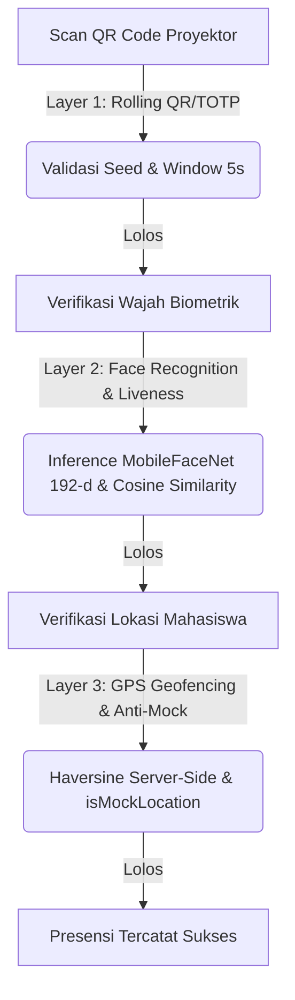

# MyPresensi — Sistem Presensi Digital 3-Layer Verifikasi
[](https://nextjs.org)
[](https://react.dev)
[](https://flutter.dev)
[](https://supabase.com)
[](https://firebase.google.com)
[](https://projek-pbl-semester-6.vercel.app)

Sistem presensi digital terintegrasi berbasis **Face Recognition**, **Geofencing (GPS)**, dan **Dynamic QR Code (TOTP)** yang dirancang khusus untuk **Program Studi TRPL, Politeknik Pertanian Negeri Samarinda**. Proyek ini merupakan hasil kolaborasi PBL (Project-Based Learning) Semester 6.

> 🌐 **Live Web Application (Vercel)**: [https://projek-pbl-semester-6.vercel.app](https://projek-pbl-semester-6.vercel.app)
> 📱 **Mobile App Version**: v1.0.0 (Android)

---

## 🔒 3-Layer Arsitektur Keamanan Verifikasi

MyPresensi menerapkan pendekatan *Defense in Depth* untuk menjamin keaslian data kehadiran mahasiswa melalui 3 lapis verifikasi yang ketat:



### 1. Layer 1: Dynamic Rolling QR (TOTP-like)
* **Mekanisme**: QR Code yang ditampilkan oleh dosen di layar proyektor berubah otomatis secara real-time mengikuti interval window 5 detik (modifikasi RFC 6238 TOTP).
* **Security**: Dihasilkan menggunakan seed acak 32-byte kriptografis (`session_code_seed`) yang disimpan di server. Kode QR di-sync tanpa menulis ulang database secara berulang (read-only polling) untuk meminimalkan beban I/O.
* **Anti-Share**: Mencegah kecurangan titip absen melalui tangkapan layar (screenshot) karena token kedaluwarsa dengan cepat sebelum sempat didistribusikan.

### 2. Layer 2: Face Biometric & Liveness Check
* **Mekanisme**: Deteksi wajah menggunakan Google ML Kit, sedangkan ekstraksi embedding 192-dimensi diproses secara on-device menggunakan model **MobileFaceNet (TFLite)** yang berjalan secara asinkron pada background *Isolate* Flutter.
* **Security**: Perbandingan biometrik dikerjakan secara *server-side* (`/api/mobile/face/verify`) untuk menjaga data embedding asli tidak bocor ke client. Pencocokan menggunakan rumus *Cosine Similarity* dengan threshold default `0.65`.
* **Liveness**: Menghindari pemalsuan dengan foto/video melalui pengujian keaktifan multi-step: hadap lurus (look straight), kedip mata (blink), menoleh kiri (turn left), dan menoleh kanan (turn right).

### 3. Layer 3: GPS Geofencing & Anti-Mock
* **Mekanisme**: Jarak koordinat mahasiswa terhadap pusat lokasi kelas dihitung secara akurat menggunakan rumus **Haversine** di sisi server (server-side calculation) saat melakukan submit presensi.
* **Security**: Mendeteksi manipulasi lokasi (Fake GPS) secara aktif. Jika parameter `is_mock_location` bernilai `true` dari sensor internal perangkat mobile, request presensi langsung ditolak (403 Forbidden) dan dicatat dalam audit log.
* **Geofence**: Batas radius default disetel 150 meter (dapat dikonfigurasi dinamis 50-500m dari preset lokasi kampus).

---

## 📂 Struktur Repositori

```bash
Projek-PBL-Semester-6/
├── mypresensi-web/        # Next.js 14 — Dashboard Admin/Dosen & Web APIs
│   ├── app/               # Next.js App Router (Dashboard, Sesi, API handler)
│   ├── components/        # Reusable UI components & Recharts widgets
│   ├── lib/               # Server actions, Supabase Client & OTP utilities
│   └── public/            # Static assets
│
├── mypresensi-mobile/     # Flutter 3.11 — Aplikasi Mahasiswa
│   ├── lib/
│   │   ├── core/          # App config, routing, & theme tokens
│   │   ├── features/      # Fitur (Auth, Attendance, Face, History, Profile)
│   │   └── shared/        # Shared widgets, utilities & HTTP client singleton
│   └── assets/            # Model MobileFaceNet (.tflite) & local images
│
├── docs/                  # Panduan desain UI/UX & spesifikasi teknis
├── dev-log.md             # Log perubahan teknis berurutan
└── CHANGELOG.md           # Riwayat rilis fitur & bug-fix
```

---

## 🛠️ Tech Stack & Library Lock

### Web Application (`mypresensi-web`)
* **Framework**: Next.js 14.2 (App Router) & React 18.3
* **Language**: TypeScript (Strict Type Check)
* **Styling**: Tailwind CSS & Vanilla CSS Variables
* **Database & Auth**: Supabase (Postgres RLS, Storage Bucket, Realtime Sync)
* **Locked Libraries**:
  * Toast/Dialog: **SweetAlert2** via `@/lib/swal` (Tidak menggunakan native dialog)
  * Validation: **Zod** (Skema validasi sisi API & Form)
  * Icons: **Lucide React**
  * Charts: **Recharts** (Grafik tren kehadiran & rasio)
  * Form: **`useFormState` + `useFormStatus`** React 18 hooks

### Mobile Application (`mypresensi-mobile`)
* **SDK**: Flutter 3.11.4 & Dart 3.1
* **Locked Libraries**:
  * State Management: **flutter_riverpod** (Riverpod v3)
  * HTTP Client: **Dio** (Singleton dengan interceptor JWT & logging)
  * Navigation: **go_router** dengan refreshListenable
  * Secure Storage: **flutter_secure_storage** (Enkripsi token & credentials)
  * Biometric & Face: **google_mlkit_face_detection** + **tflite_flutter** (MobileFaceNet)

---

## 🚀 Setup & Instalasi Lokal

### 1. Persiapan Awal
Pastikan Anda memiliki kakas berikut dengan versi minimum:
* **Node.js**: v18.x atau v20.x (LTS)
* **Flutter SDK**: v3.11.x
* **Android Studio**: Android SDK & Emulator terkonfigurasi

---

### 2. Setup Web App (`mypresensi-web/`)
1. Masuk ke direktori web:
   ```bash
   cd mypresensi-web
   ```
2. Pasang semua dependensi:
   ```bash
   npm install
   ```
3. Salin berkas environment variables:
   ```bash
   cp .env.local.example .env.local
   ```
4. Buka `.env.local` dan isi kredensial Supabase Anda:
   ```env
   NEXT_PUBLIC_SUPABASE_URL=https://your-project-ref.supabase.co
   NEXT_PUBLIC_SUPABASE_ANON_KEY=your_anon_key
   SUPABASE_SERVICE_ROLE_KEY=your_service_role_key
   FIREBASE_SERVICE_ACCOUNT=your_firebase_service_account_json_base64
   ```
5. Verifikasi tipe data dan jalankan dev server:
   ```bash
   npm run type-check
   npm run dev
   ```
   *Web dashboard akan berjalan pada [http://localhost:3000](http://localhost:3000).*

---

### 3. Setup Mobile App (`mypresensi-mobile/`)
1. Masuk ke direktori mobile:
   ```bash
   cd ../mypresensi-mobile
   ```
2. Unduh semua paket dependensi:
   ```bash
   flutter pub get
   ```
3. **Unduh Model MobileFaceNet**:
   * Unduh berkas `mobilefacenet.tflite` (sekitar 5 MB).
   * Tempatkan berkas tersebut pada folder `assets/models/mobilefacenet.tflite`.
4. Jalankan analisis kode statis untuk memastikan tidak ada error:
   ```bash
   flutter analyze
   ```
5. Jalankan aplikasi pada Emulator Android:
   ```bash
   flutter run
   ```


## 🤝 Kontribusi & Lisensi
Proyek PBL Semester 6 ini dikembangkan oleh:
* **Pengembang**: Tulus Arya Danendra
* **NIM**: H233600430
* **Semester / Kelas**: 6 / B
* **Program Studi**: Teknologi Rekayasa Perangkat Lunak (TRPL), Politeknik Pertanian Negeri Samarinda.

*Tidak diperkenankan untuk penggunaan komersial tanpa izin tertulis dari pihak kampus.*
