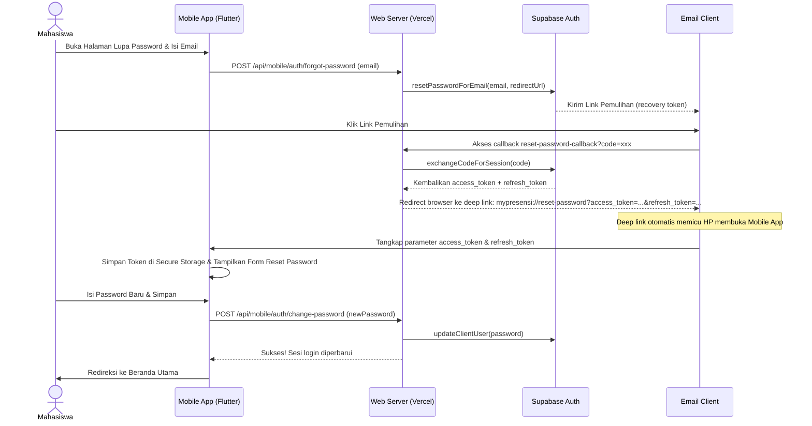

# Rencana Implementasi — Fitur Lupa Password & Deep Linking

Dokumen ini menjelaskan rancangan implementasi fitur Lupa Password terintegrasi pada aplikasi Mobile (Flutter) dan Web (Next.js + Supabase Auth) menggunakan alur deep linking yang aman dan andal.

---

## Alur Kerja Teknis (User Flow)



---

## Perubahan yang Diusulkan

### 1. Web Backend (Next.js)

#### [NEW] [route.ts](file:///d:/file_perkuliahan/Semester-6/Projek-PBL-Semester-6/mypresensi-web/app/api/mobile/auth/forgot-password/route.ts)
Membuat endpoint API untuk memicu pengiriman email lupa password:
*   Menerima `email` dari mobile app.
*   Menggunakan Supabase Admin Client untuk memanggil `supabase.auth.resetPasswordForEmail`.
*   Menyetel `redirectTo` ke `https://projek-pbl-semester-6.vercel.app/api/auth/reset-password-callback`.

#### [NEW] [route.ts](file:///d:/file_perkuliahan/Semester-6/Projek-PBL-Semester-6/mypresensi-web/app/api/auth/reset-password-callback/route.ts)
Membuat halaman callback penukar kode menjadi session:
*   Menerima query parameter `code` dari link email.
*   Memanggil `supabase.auth.exchangeCodeForSession(code)` untuk mendapatkan token akses aktif.
*   Mengarahkan browser (redirect) menggunakan custom URL scheme:
    `mypresensi://reset-password?access_token=${access_token}&refresh_token=${refresh_token}`

---

### 2. Mobile App (Flutter)

#### [MODIFY] [AndroidManifest.xml](file:///d:/file_perkuliahan/Semester-6/Projek-PBL-Semester-6/mypresensi-mobile/android/app/src/main/AndroidManifest.xml)
Menambahkan konfigurasi `<intent-filter>` di dalam `<activity>` utama untuk menangkap skema URL `mypresensi://reset-password`.

```xml
<intent-filter android:label="mypresensi_reset">
    <action android:name="android.intent.action.VIEW" />
    <category android:name="android.intent.category.DEFAULT" />
    <category android:name="android.intent.category.BROWSABLE" />
    <data android:scheme="mypresensi" android:host="reset-password" />
</intent-filter>
```

#### [MODIFY] [app_router.dart](file:///d:/file_perkuliahan/Semester-6/Projek-PBL-Semester-6/mypresensi-mobile/lib/core/router/app_router.dart)
Menambahkan rute baru dan mengizinkan akses tanpa otentikasi awal:
*   `/forgot-password`: Mengarah ke `ForgotPasswordScreen`.
*   `/reset-password`: Mengarah ke `ResetPasswordScreen`, mengekstrak parameter `access_token` dan `refresh_token` dari deep link.

#### [MODIFY] [auth_provider.dart](file:///d:/file_perkuliahan/Semester-6/Projek-PBL-Semester-6/mypresensi-mobile/lib/features/auth/providers/auth_provider.dart)
Menambahkan fungsi `injectSession({required String accessToken, required String refreshToken})` untuk memaksa state ke `authenticated` secara instan menggunakan token yang dikirim dari deep link, agar user bisa langsung menggunakan halaman reset password baru.

#### [NEW] [forgot_password_screen.dart](file:///d:/file_perkuliahan/Semester-6/Projek-PBL-Semester-6/mypresensi-mobile/lib/features/auth/screens/forgot_password_screen.dart)
Halaman input email (UI selaras dengan `LoginScreen`):
*   Field input Email dengan Zod-like validator di Flutter.
*   Hubungan ke API `/api/mobile/auth/forgot-password`.
*   Tampilan sukses: Memberi petunjuk ramah bahwa email pemulihan telah dikirim.

#### [NEW] [reset_password_screen.dart](file:///d:/file_perkuliahan/Semester-6/Projek-PBL-Semester-6/mypresensi-mobile/lib/features/auth/screens/reset_password_screen.dart)
Halaman input password baru:
*   Input password baru + konfirmasi password baru.
*   Validasi minimal 6 karakter.
*   Panggilan API `/api/mobile/auth/change-password` yang sudah ada untuk memperbarui password di Supabase.

---

## Rencana Verifikasi

### Verifikasi Statis & Tes
- Jalankan `flutter analyze` dan `npm run type-check` untuk memastikan kompilasi lulus tanpa error.
- Jalankan unit tests `flutter test` untuk menjamin tidak ada regresi pada provider.

### Uji Coba Manual
1.  Buka aplikasi mobile, masuk ke halaman login, klik tombol "Lupa password?".
2.  Masukkan email akun mahasiswa Anda, lalu klik "Kirim Link".
3.  Periksa kotak masuk email Anda (menggunakan akun Supabase nyata/mahasiswa).
4.  Klik link pemulihan di email, browser HP akan terbuka sesaat dan langsung mengarahkan Anda kembali ke aplikasi mobile (membuka form input password baru).
5.  Masukkan password baru Anda, klik "Simpan", dan pastikan Anda langsung diarahkan masuk ke Beranda utama MyPresensi.
