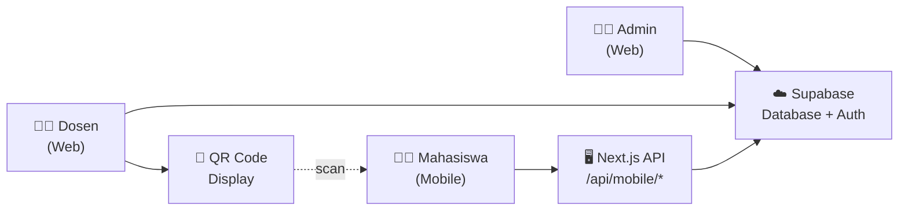
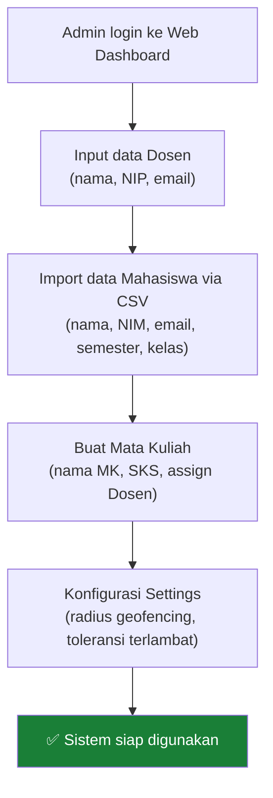
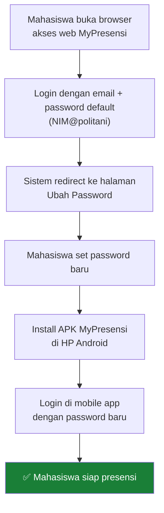
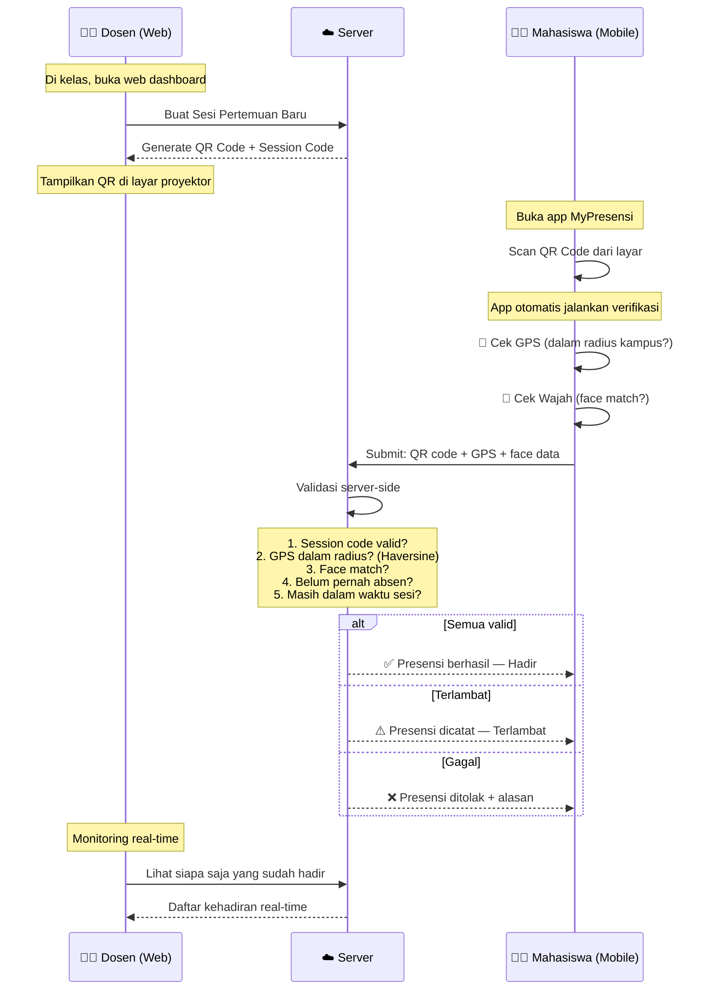
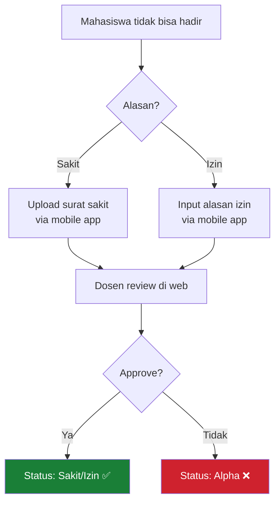
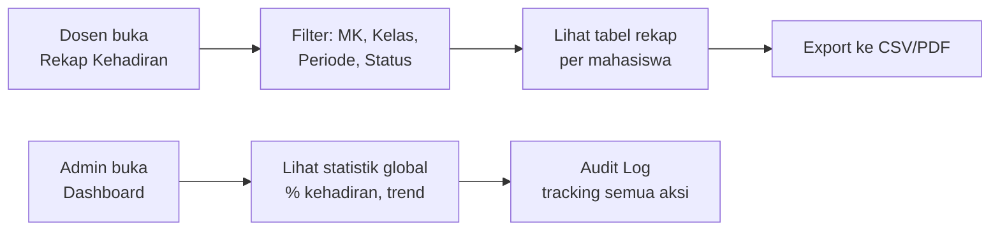
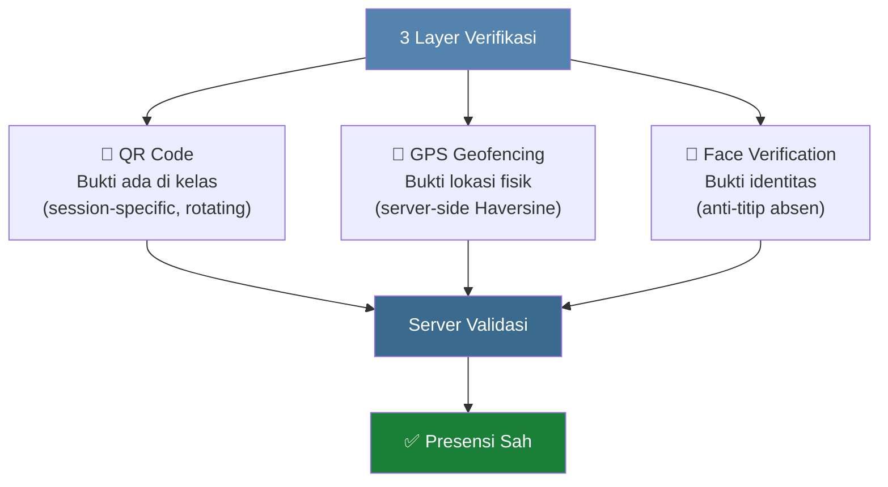

# Alur Kerja MyPresensi — Workflow Lengkap

## Overview Arsitektur

---

## Fase 1: Setup Awal (Admin)

### Detail:
| Langkah | Platform | Keterangan |
|---------|----------|------------|
| Input Dosen | Web | Admin menambahkan dosen, sistem auto-generate akun Supabase Auth |
| Import Mahasiswa | Web | Upload CSV → sistem buat akun massal, password default: `NIM@politani` |
| Buat Mata Kuliah | Web | Assign dosen pengampu ke setiap mata kuliah |
| Settings | Web | Set radius GPS (misal 100m dari kampus), toleransi terlambat (15 menit) |

---

## Fase 2: Mahasiswa Setup Pertama Kali

> **Kenapa harus ganti password via web dulu?**
> Keamanan — password default (`NIM@politani`) terlalu mudah ditebak. Sistem memaksa ganti password sebelum bisa akses fitur mobile.

---

## Fase 3: Presensi Harian (Inti Sistem)

Ini adalah workflow utama yang terjadi **setiap pertemuan kuliah**:

### Detail Per Langkah:

| # | Aktor | Aksi | Platform | Validasi |
|---|-------|------|----------|----------|
| 1 | Dosen | Buat sesi pertemuan baru | Web | - |
| 2 | Dosen | Tampilkan QR Code di proyektor | Web | QR berisi session code unik |
| 3 | Mahasiswa | Buka app → tap "Scan QR" | Mobile | - |
| 4 | Mahasiswa | Arahkan kamera ke QR | Mobile | Decode session code |
| 5 | System | Cek GPS mahasiswa | Mobile + Server | Haversine distance ≤ radius setting |
| 6 | System | Verifikasi wajah | Mobile | Face match dengan data terdaftar |
| 7 | System | Submit ke server | Server | Cek duplikasi, waktu sesi, validitas |
| 8 | Dosen | Monitor kehadiran | Web | Lihat siapa hadir/terlambat/belum |
| 9 | Dosen | Tutup sesi | Web | Mahasiswa yang belum absen = Alpha |

---

## Fase 4: Penanganan Izin/Sakit

---

## Fase 5: Rekap & Reporting (Admin + Dosen)

### Yang Bisa Dilihat:

| Role | Data | Format |
|------|------|--------|
| **Dosen** | Rekap per MK yang diampu, per kelas, per mahasiswa | Tabel + Export CSV |
| **Admin** | Rekap seluruh MK, semua dosen, statistik global | Dashboard + Export |
| **Mahasiswa** | Riwayat kehadiran pribadi | List di mobile app |

---

## Status Kehadiran

| Status | Kode Warna | Kondisi |
|--------|:---:|---------|
| **Hadir** | 🟢 | Scan QR + GPS valid + Face valid, dalam waktu |
| **Terlambat** | 🟡 | Sama seperti hadir, tapi melebihi batas toleransi |
| **Izin** | 🔵 | Diajukan mahasiswa, disetujui dosen |
| **Sakit** | 🟠 | Diajukan + surat sakit, disetujui dosen |
| **Alpha** | 🔴 | Tidak hadir, tidak ada keterangan |

---

## Security Flow

**Kenapa 3 layer?**
- **QR saja** → bisa dishare via foto/screenshot
- **QR + GPS** → bisa dipalsukan lokasi (fake GPS)
- **QR + GPS + Face** → hampir mustahil dipalsukan (harus fisik ada di lokasi + wajah cocok)

---

## Ringkasan: Siapa Pakai Apa

| Role | Platform | Fitur Utama |
|------|----------|-------------|
| **Admin** | 🌐 Web only | Master data, settings, audit, rekap global |
| **Dosen** | 🌐 Web only | Buat sesi, QR code, monitoring, approve izin, rekap |
| **Mahasiswa** | 📱 Mobile only | Login, scan QR, GPS, face, riwayat, notifikasi |
