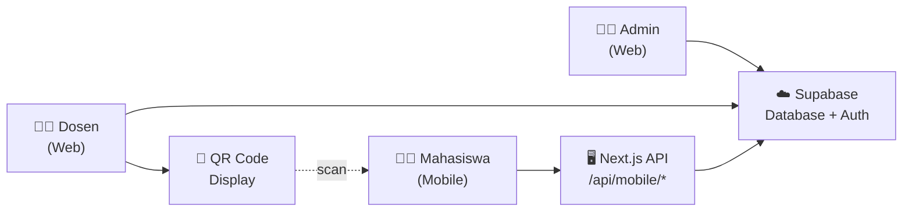
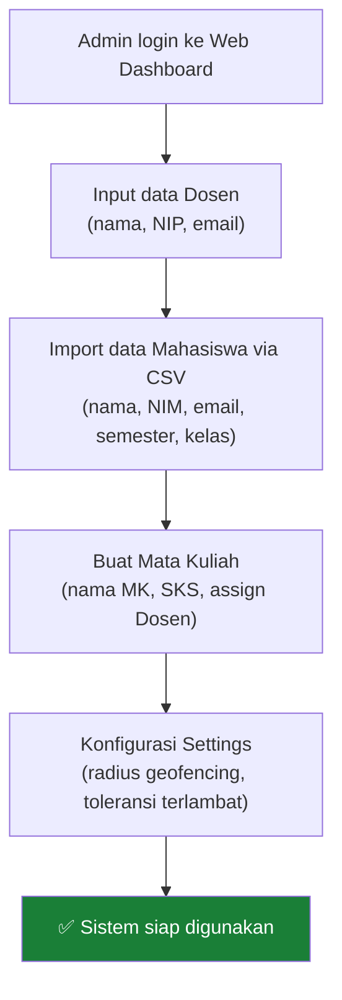
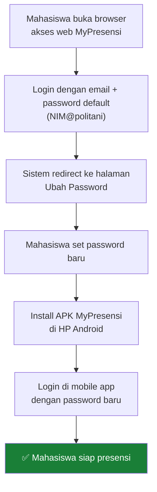
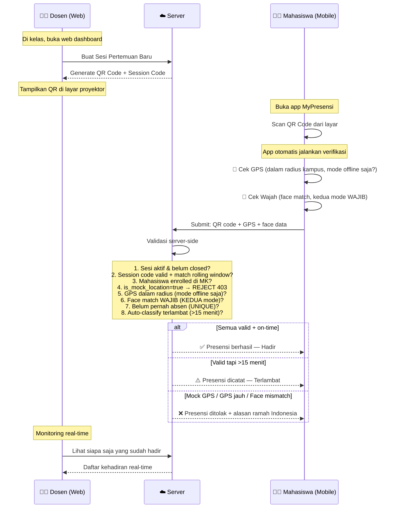
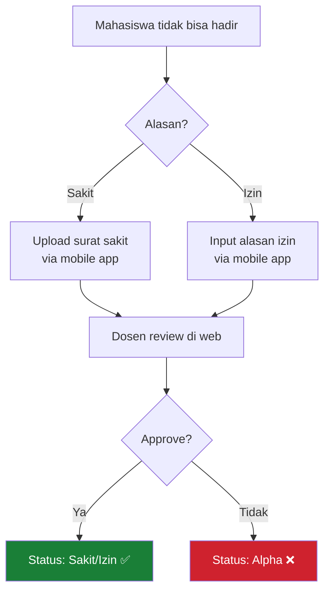
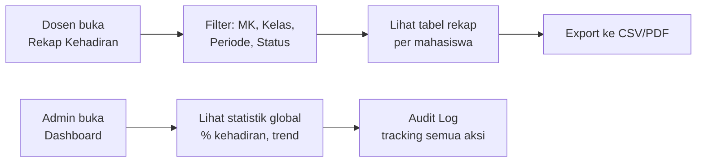
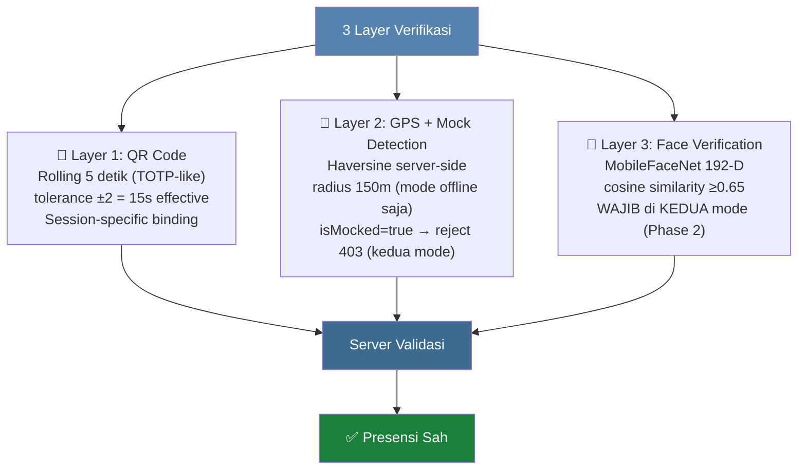

# Alur Kerja MyPresensi — Workflow Lengkap

> **Status (v7, 17 Mei 2026)**: Dokumen ini adalah **reference non-teknis** (alur Mermaid & tabel role).
> Source of truth teknis: `docs/plans/implementation_plan.md v7`.
> Source of truth keputusan security: `docs/decisions/security-architecture-final.md`.
>
> **Yang sudah implementasi (✅)**: GPS Haversine + mock detection, QR statis per sesi, face register/verify 192-D, izin/sakit flow, real-time monitor dosen, audit log.
>
> **Yang sedang dieksekusi (⏳)**:
> - **Phase 2** — Face match WAJIB di **kedua mode** (offline + online) di `submit/route.ts`. Adjustment 17 Mei 2026: dari "offline only" → "kedua mode" untuk cover threat titip absen online.
> - **Phase 3** — QR rolling 5s (TOTP-like, tolerance ±2 = 15s effective)
>
> **Yang DI-SKIP dari v7 (acceptable risk)**:
> - ~~Phase 4 Manual Override Dosen~~ — edge case kamera rusak HP sangat rare. Mahasiswa solve via pinjam HP teman (prosedur informal) atau ajukan izin via fitur leave_request yang sudah ada.

## Overview Arsitektur



---

## Fase 1: Setup Awal (Admin)



### Detail:
| Langkah | Platform | Keterangan |
|---------|----------|------------|
| Input Dosen | Web | Admin menambahkan dosen, sistem auto-generate akun Supabase Auth |
| Import Mahasiswa | Web | Upload CSV → sistem buat akun massal, password default: `NIM@politani` |
| Buat Mata Kuliah | Web | Assign dosen pengampu ke setiap mata kuliah |
| Settings | Web | Set radius GPS (misal 100m dari kampus), toleransi terlambat (15 menit) |

---

## Fase 2: Mahasiswa Setup Pertama Kali



> **Kenapa harus ganti password via web dulu?**
> Keamanan — password default (`NIM@politani`) terlalu mudah ditebak. Sistem memaksa ganti password sebelum bisa akses fitur mobile.

---

## Fase 3: Presensi Harian (Inti Sistem)

Ini adalah workflow utama yang terjadi **setiap pertemuan kuliah**:



### Detail Per Langkah:

| # | Aktor | Aksi | Platform | Validasi |
|---|-------|------|----------|----------|
| 1 | Dosen | Buat sesi pertemuan baru | Web | - |
| 2 | Dosen | Tampilkan QR Code di proyektor | Web | QR berisi session code unik |
| 3 | Mahasiswa | Buka app → tap "Scan QR" | Mobile | - |
| 4 | Mahasiswa | Arahkan kamera ke QR | Mobile | Decode session code |
| 5 | System | Cek GPS mahasiswa | Mobile + Server | Haversine distance ≤ radius setting |
| 6 | System | Verifikasi wajah | Mobile | Face match dengan data terdaftar |
| 7 | System | Submit ke server | Server | Cek duplikasi, waktu sesi, validitas |
| 8 | Dosen | Monitor kehadiran | Web | Lihat siapa hadir/terlambat/belum |
| 9 | Dosen | Tutup sesi | Web | Mahasiswa yang belum absen = Alpha |

---

## Fase 4: Penanganan Izin/Sakit



---

## Fase 5: Rekap & Reporting (Admin + Dosen)



### Yang Bisa Dilihat:

| Role | Data | Format |
|------|------|--------|
| **Dosen** | Rekap per MK yang diampu, per kelas, per mahasiswa | Tabel + Export CSV |
| **Admin** | Rekap seluruh MK, semua dosen, statistik global | Dashboard + Export |
| **Mahasiswa** | Riwayat kehadiran pribadi | List di mobile app |

---

## Status Kehadiran

| Status | Kode Warna | Kondisi |
|--------|:---:|---------|
| **Hadir** | 🟢 | Scan QR + GPS valid + Face valid, dalam waktu |
| **Terlambat** | 🟡 | Sama seperti hadir, tapi melebihi batas toleransi |
| **Izin** | 🔵 | Diajukan mahasiswa, disetujui dosen |
| **Sakit** | 🟠 | Diajukan + surat sakit, disetujui dosen |
| **Alpha** | 🔴 | Tidak hadir, tidak ada keterangan |

---

## Security Flow (3-Layer Defense in Depth)



**Kenapa 3 layer (masing-masing cover threat berbeda, bukan duplikasi)?**
- **QR saja** → bisa dishare via foto/screenshot → di-cover oleh **rolling 5s** (Layer 1) ATAU **face match wajib** (Layer 3)
- **QR + GPS** → bisa dipalsukan lokasi (fake GPS app) → di-cover oleh **`isMocked=true` reject + face match** (Layer 2 + 3)
- **QR + Face** (mode online, GPS skip) → mahasiswa A kasih akun ke B di rumah → face B ≠ face A → reject. Layer 3 cover gap GPS-skip.
- **QR + GPS + Face** → hampir mustahil dipalsukan (harus fisik ada di lokasi + wajah cocok)

**Yang TIDAK di-cover (acceptable risk)**:
- Active liveness challenge (mudah di-bypass video) — hanya basic presence detection ML Kit
- Root device / emulator (freeRASP skipped, low ROI PBL)
- MITM via cert pinning (HTTPS default cukup di kampus)
- Edge case kamera HP rusak → ditangani via **prosedur informal pinjam HP teman** (lihat section di bawah)
- Credential sharing saat pinjam HP teman → mitigasi manual: mahasiswa wajib ganti password setelahnya

---

## Prosedur Kamera Rusak HP (Informal — Tidak Ada Fitur Dedicated)

> **Catatan**: Phase 4 Manual Override Dosen DI-SKIP dari v7. Edge case kamera HP rusak frekuensinya sangat rendah (HP smartphone modern). Mahasiswa solve via prosedur informal di bawah.

```mermaid
flowchart TD
    M1["Mahasiswa A: kamera HP rusak"] --> M2{"Bisa hadir fisik<br/>(datang ke kampus / kos teman)?"}
    M2 -->|Tidak (sakit, isolasi)| L1["Ajukan Izin/Sakit via fitur yang ada<br/>(leave_request + bukti foto)"]
    L1 --> L2["Dosen approve via web<br/>→ status: izin/sakit"]

    M2 -->|Ya| T1["WhatsApp teman B:<br/>'Boleh pinjam HP pas kuliah?'"]
    T1 --> T2["Datang ke tempat B<br/>sebelum sesi mulai"]
    T2 --> T3["B logout dari akunnya di HP B"]
    T3 --> T4["A login akun A di HP B"]
    T4 --> T5["A pose wajah sendiri di kamera HP B"]
    T5 --> S1["Server validasi:<br/>face A cocok dengan embedding A di DB"]
    S1 --> R1["✅ Status: Hadir (normal)"]
    R1 --> T6["A logout dari HP B"]
    T6 --> T7["A ganti password<br/>(mitigasi credential sharing)"]

    style R1 fill:#1A7F37,color:#fff
    style L2 fill:#0969DA,color:#fff
    style T7 fill:#9A6700,color:#fff
```

**Konsekuensi yang diterima (transparan)**:
- Tidak ada UI dosen "Tandai Hadir Manual" — dosen tidak terlibat di flow ini
- Audit trail: hanya `device_id` anomaly (login dari device yang berbeda dari biasanya) di tabel `attendances`
- Risk credential sharing: mahasiswa B tahu password A sampai A ganti password (manual compliance)
- Frekuensi diharapkan: <1% mahasiswa per semester
- Kalau frekuensi ternyata lebih tinggi dari ekspektasi, evaluasi tambah Phase 4 di iterasi berikutnya

---

## Ringkasan: Siapa Pakai Apa

| Role | Platform | Fitur Utama |
|------|----------|-------------|
| **Admin** | 🌐 Web only | Master data, settings, audit, rekap global |
| **Dosen** | 🌐 Web only | Buat sesi, QR code, monitoring, approve izin, rekap |
| **Mahasiswa** | 📱 Mobile only | Login, scan QR, GPS, face, riwayat, notifikasi |
